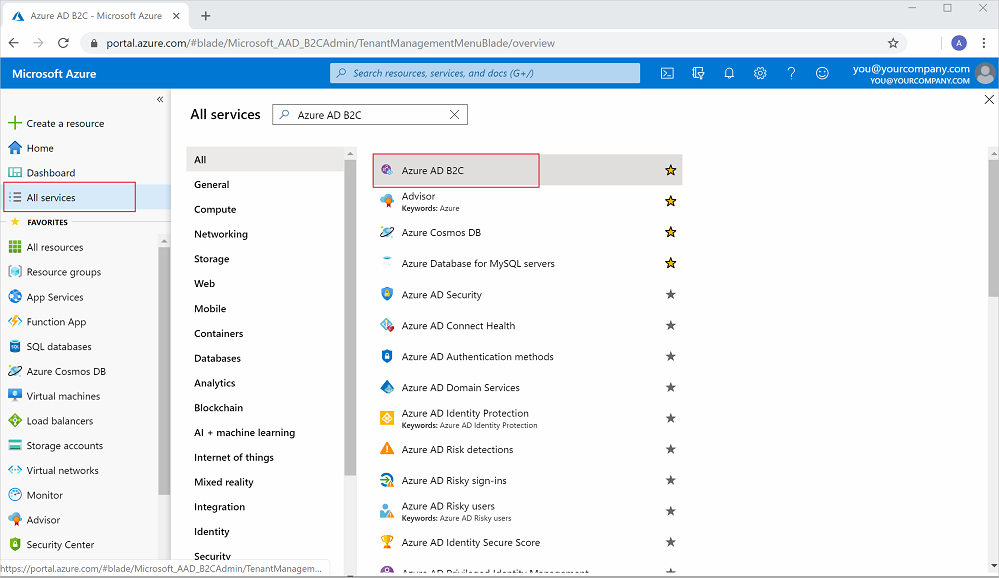

To protect patients' sensitive health data, you were asked to implement a secure identity solution for the healthcare application. 

You used Azure Active Directory B2C (Azure AD B2C) to manage patients' access to healthcare applications. You created a tenant for your users and application, then registered it with the B2C tenant. To protect how sensitive health data is accessed, you enabled multi-factor authentication in a user flow that you configured. Through multi-factor authentication, you ensured a second layer of protection was added to the application.

Without Azure AD B2C, it would be harder to manage patients' access to the healthcare application. Your application will have reduced protection if you don't use multi-factor authentication with Azure AD B2C. If someone acquired a patient's username or password, their data would be compromised.

Azure AD B2C has removed the complexity of managing user authentication for your application, saving the organization time and money. By enabling multi-factor authentication for the Azure AD B2C application, you added further protection for the sensitive data. You've also protected your company's reputation.

## Clean up resources

1. Select **All services**, search for Azure AD B2C and select it.

    

1. Select **Applications**. Select your application then select **Delete**.
  
    

1. Delete your user flow. Select **User flows(policies)**, select your userflow, then select **Delete**.

    

1. Delete your tenant. Select **Azure Active Directory** on the left side of the portal, then select **Delete directory**.

    

1. The Azure portal will check whether you can delete the directory safely. Use the links in the required actions list for each failed check to pass the test and successfully delete the tenant.

    
