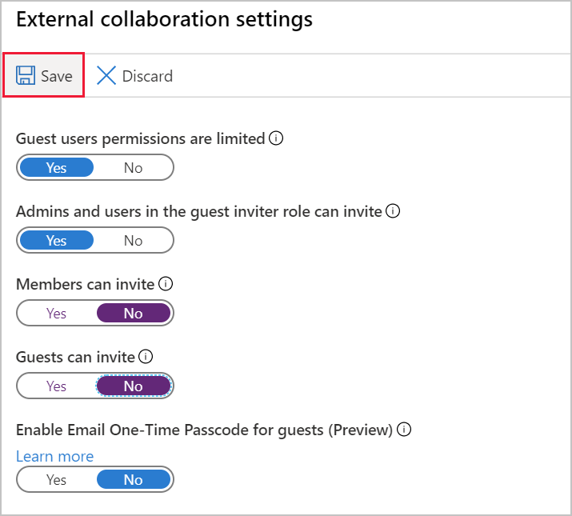
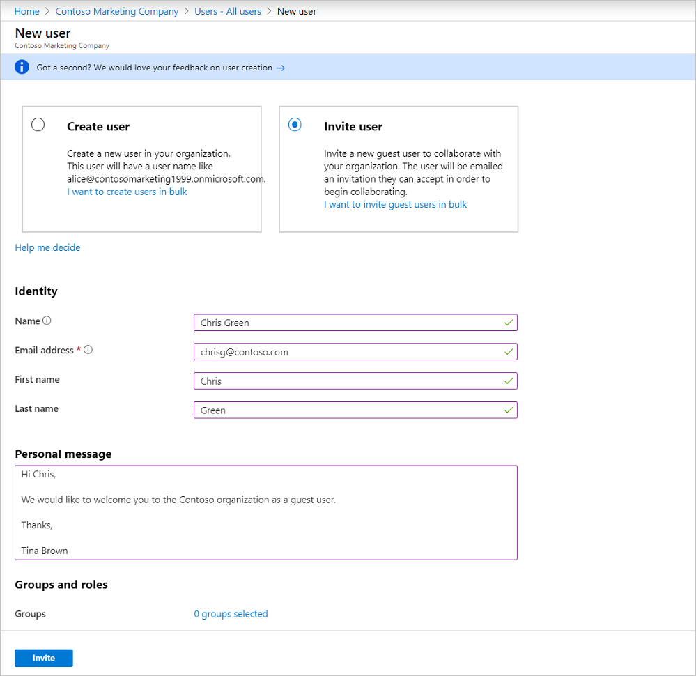
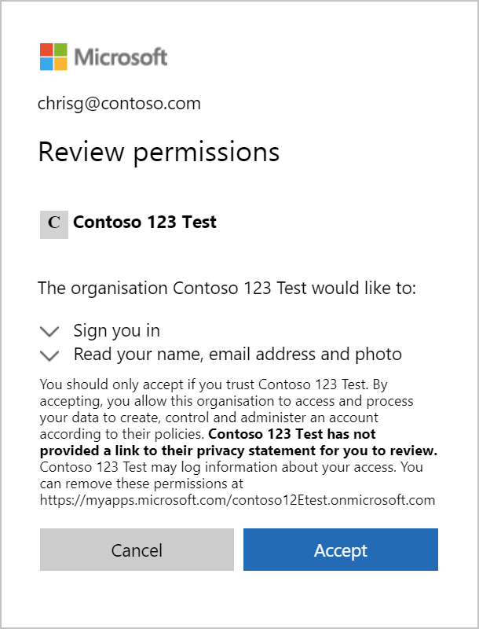
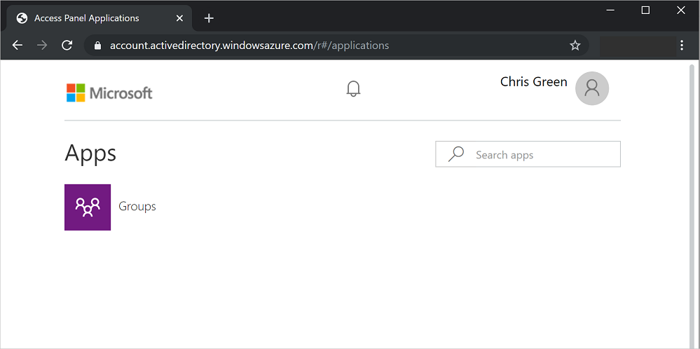
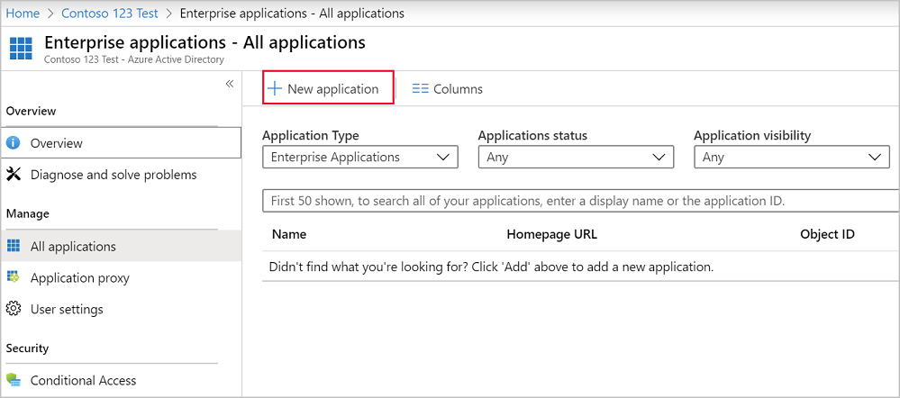

You need to make it possible for clinicians to access the application so that they can securely obtain health records for patients at your facilities. You have to invite them as guest users.

To create a tenant, you'll configure appropriate external collaboration settings for Azure AD B2B. You'll invite guest users, add them to a user group, and provide access to an application.

## Create a new tenant

1. [Sign in](https://portal.azure.com/learn.docs.microsoft.com?azure-portal=true) to the Azure portal as a global administrator. If you're the person who signed up for an Azure subscription, you're automatically the global administrator.
1. Select **Create a resource > Identity**, then select **Azure Active Directory**.
1. Fill in the "Create directory" form as appropriate. Give your Azure AD tenant a name in the **Organization name** field. Use a unique domain name in the **initial domain name** field, and select a country or region of your choice.

    

1. Select **Create** at the bottom of the form.
1. After your directory has been created, select it in the confirmation dialog.

    

## Configure external collaboration settings

By default, all users and guest users can invite external users. Make sure that guest invitations can only be sent by administrators and users in the guest inviter role.

1. On the left, select **Users**, then select **User settings**.

    

1. Select **Manage external collaboration settings**.
1. Select **No** for the **Members can invite** and **Guests can invite** fields.

    

1. Select **Save**.

## Add a guest user to your directory

Invite a guest user to add them to your directory.

1. Select **your directory**.

    

1. Select **Users**. Then select **New Guest user**.

    

1. Use your guest user's email address for the **Email address** field. For this exercise, enter an email address that you can access, but don't use the same one as for your Azure account.

1. For the personal message text area, write your own customized invitation message.

1. Select **Invite** to send your invitation.

1. An invitation email will be sent to the address you've specified. In different internet browser, go to the email inbox, and open the email. Select **Get started**.

    

1. The guest will be asked to review permissions before they are given access.

    

1. Select **Accept**. You'll be forwarded to the access panel where the guest user can access their applications.

    

## Add a guest user to a group

Your guest user can also be made a member of a particular group.

1. Go back to your internet browser instance that's showing your Azure portal. Select the **Show portal menu** button, then select **Azure Active Directory** to go back to your Azure Active Directory pane.

    

1. Select **Groups**.

1. Select **New group** in the groups pane.

1. Fill in the form as appropriate. For **Group type**, select **Security**.

1. Select **Members**.

    

1. In the search field, look for and select your guest user. Then select **Select**.

1. Select **Create**.

## Add a guest user to an application

Now give your guest user access to an application.

1. Go back to your Azure Active Directory pane, select **Enterprise applications**, then select **All applications > New application**.

    

1. In the search box, look for Twitter, select **Twitter** in the returned list, then select **Add**.

    

1. Go to your newly added application. Go back to your Azure Active Directory pane. Select **Enterprise applications > All applications**, then select **Twitter**.

1. On the overview page, select **Assign users and groups**, then select **Add user**.

1. In the Add Assignment form, select **Users**.

    

1. Select your user from the list, then select **Select**.

1. Select **Assign** at the bottom of the form.

## Guest user experience

1. When you've added the guest user to your application, go back to your guest email inbox. Open the invitation email.

1. Select the **Get Started** button in the invitation email.

1. You'll be forwarded to the access panel.

    

1. This panel lists the applications the guest user has been allowed to access. To access an application, select the one you want.
