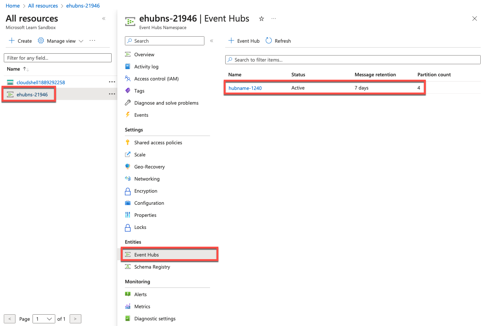

You're now ready to create a new Event Hub. After creating the Event Hub, you'll use the Azure portal to view your new hub.

## Create an Event Hubs namespace

Let's create an Event Hubs namespace using Bash shell supported by Azure Cloud shell.

1. First, set default values for the Azure CLI in Cloud Shell. This will keep you from having to enter these values every time. In particular, let's set the _resource group_ and _location_. Enter the following command into the Azure CLI, and feel free to replace the location with one close to you.

    [!include[](../../../includes/azure-sandbox-regions-first-mention-note.md)]

    ```azurecli
    az configure --defaults group=<rgn>[sandbox Resource Group]</rgn> location=westus2
    ```

1. Create the Event Hubs namespace running the `az eventhubs namespace create` command. Use the following parameters.

    > [!div class="mx-tableFixed"]
    > |Parameter      |Description|
    > |---------------|-----------|
    > |--name (required)      |Enter a 6-50 characters-long unique name for your Event Hubs namespace. The name should contain only letters, numbers, and hyphens. It should start with a letter and end with a letter or number.|
    > |--resource-group (required) | This will be the pre-created Azure sandbox resource group supplied from the defaults. |
    > |--location (optional)     |Enter the location of your nearest Azure datacenter, this will use your default.|
    > |--sku (optional) | The pricing tier for the namespace [Basic / Standard], defaults to _Standard_. This determines the connections and consumer thresholds. |

    Set the name into an environment variable so we can reuse it.

    ```bash
    NS_NAME=ehubns-$RANDOM
    ````

    [!include[](../../../includes/azure-cloudshell-copy-paste-tip.md)]

    ```azurecli
    az eventhubs namespace create --name $NS_NAME
    ```

    > [!NOTE]
    > Azure will validate the name you enter, and the CLI returns **Bad Request** if the name exists or is invalid. Try a different name by changing your environment variable and reissuing the command.

1. Fetch the connection string for your Event Hubs namespace running the following command. You'll need this to configure applications to send and receive messages using your Event Hub.

    ```azurecli
    az eventhubs namespace authorization-rule keys list \
        --name RootManageSharedAccessKey \
        --namespace-name $NS_NAME
    ```

    > [!div class="mx-tableFixed"]
    > |Parameter      |Description|
    > |---------------|-----------|
    > |--resource-group (required)  | This will be the pre-created Azure sandbox resource group supplied from the defaults. |
    > |--namespace-name (required)  | Enter the name of the namespace you created. |

    This command returns a JSON block with the connection string for your Event Hubs namespace that you'll use later to configure your publisher and consumer applications. Save the value of the following keys for later use.

    - **primaryConnectionString**
    - **primaryKey**

## Create an Event Hub

Now let's create your new Event Hub.

1. Sign in to the [Azure portal](https://portal.azure.com/learn.docs.microsoft.com?azure-portal=true) using the same account you activated the sandbox with.

1. Create a new Event Hub by running the `eventhub create` command. It needs the following parameters.

    > [!div class="mx-tableFixed"]
    > |Parameter      |Description|
    > |---------------|-----------|
    > |--name (required)  |Enter a name for your Event Hub.|
    > |--resource-group (required)  |Resource group owner.|
    > |--namespace-name (required)      |Enter the namespace you created.|

    Let's define the Event Hub name in an environment variable first using the Cloud Shell.

    ```azurecli
    HUB_NAME=hubname-$RANDOM
    ```

    ```azurecli
    az eventhubs eventhub create --name $HUB_NAME --namespace-name $NS_NAME
    ```

1. View the details of your Event Hub by running the `eventhub show` command. It needs the following parameters.

    > [!div class="mx-tableFixed"]
    > |Parameter      |Description|
    > |---------------|-----------|
    > |--resource-group (required)  |Resource group owner.|
    > |--namespace-name (required)      |Enter the namespace you created.|
    > |--name  (required)|Name of the Event Hub.|

    ```azurecli
    az eventhubs eventhub show --namespace-name $NS_NAME --name $HUB_NAME
    ```

## View the Event Hub in the Azure portal

Next, let's see what this looks like in the Azure portal.

1. In the Search bar at the top of portal, enter *Event Hubs*. The **Event Hubs** pane appears.

1. Select your namespace to open it.

1. in the left menu pane, under **Entities**, select **Event Hubs**.

    Your Event Hub appears with a status of **Activating**, and default values for **Message Retention** (*7*) and **Partition Count** of (*4*).

    

## Summary

You've now created a new Event Hub, and you've all the necessary information ready to configure your publisher and consumer applications.
