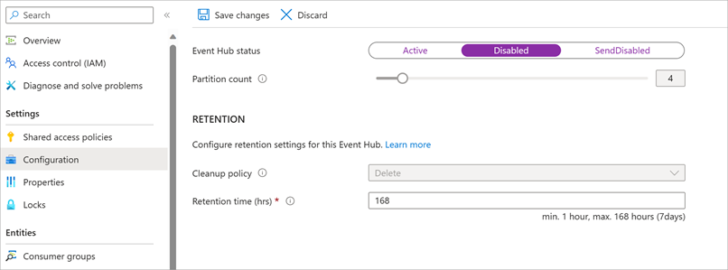

In this unit, you'll use the Azure portal to verify your Event Hub is working and performing according to the desired expectations. You'll also test how Event Hub messaging works when it's temporarily unavailable and use Event Hubs metrics to check the performance of your Event Hub.

## View Event Hub activity

1. Sign into the [Azure portal](https://portal.azure.com/learn.docs.microsoft.com?azure-portal=true) using the same account you activated the sandbox with.

1. Find your Event Hub using the Search bar, and open it as we did in the previous exercise.

1. On the Overview page, view the message counts.

    

1. The SimpleSend and EventProcessorSample applications are configured to send/receive 100 messages. You'll see that the Event Hub has processed 100 messages from the SimpleSend application and has transmitted 100 messages to the EventProcessorSample application.

## Test Event Hub resilience

Use the following steps to see what happens when an application sends messages to an Event Hub while it's temporarily unavailable.

1. Resend messages to the Event Hub using the SimpleSend application. Use the following command:

    ```azurecli
    cd ~
    cd azure-event-hubs/samples/Java/Basic/SimpleSend
    java -jar ./target/simplesend-1.0.0-jar-with-dependencies.jar
    ```

1. When you see **Send Complete...**, press <kbd>ENTER</kbd>.

1. Select your Event Hub in the **Overview** screen - this will show details specific to the Event Hub. You can also get to this screen through the **Event Hubs** entry from the namespace page.

1. Select **Settings** > **Properties**.

1. Under Event Hub state, click **Disabled**. Save the changes.

    

    **Wait for a minimum of five minutes.**

1. Click **Active** under Event Hub state to re-enable your Event Hub and save your changes.

1. Rerun the EventProcessorSample application to receive messages. Use the following command.

    ```azurecli
    cd ~
    cd azure-event-hubs/samples/Java/Basic/EventProcessorSample
    java -jar ./target/eventprocessorsample-1.0.0-jar-with-dependencies.jar
    ```

1. When messages stop being displayed to the console, press <kbd>ENTER</kbd>.

1. Back in the Azure portal, go back to your Event Hub Namespace. If you are still on the Event Hub page, you can use the breadcrumb on the top of the screen to go backwards. Or you can search for the namespace and select it.

1. Click **MONITORING** > **Metrics (preview)**.

    

1. From the **Metric** list, select **Incoming Messages** and click **Add Metric**.

1. From the **Metric** list, select **Outgoing Messages** and click **Add Metric**.

1. At the top of the chart, click **Last 24 hours (Automatic)** to change the time period to **Last 30 minutes** to expand the data graph.

You'll see that though the messages were sent before the Event Hub was taken offline for a period, all 100 messages were successfully transmitted.

## Summary

In this unit, you used the Event Hubs metrics to test that your Event Hub is successfully processing the sending and receiving messages.
