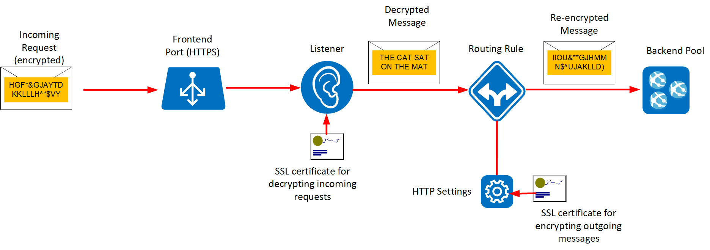

Encrypting your data while it's in transit is an important step to securing your applications. You can purchase TLS certificates from a known reputable provider and use them to encrypt the messages that pass in and out of your servers. This approach prevents unauthorized users from being able to intercept and examine the information in these messages.

In the shipping portal, encryption is important, as we're dealing with shipping customer orders. If someone could get access to the data that is transmitted to and from the shipping portal they might be able to view the customer data, or place false orders on behalf of the customer.

In this unit, you'll learn the benefits of the Application Gateway, and how you can implement transport encryption with Application Gateway.

## Application Gateway and its benefits

Application Gateway allows you to encrypt application traffic. You can protect data in transit by using SSL as far as the gateway, or you can implement end-to-end encryption (E2EE) through the gateway to your backend servers.

The benefits of terminating your SSL connection at the Application Gateway mean you offload the CPU intensive workload of SSL termination from your servers. It also means that you don't need to configure SSL on your servers and install the certificates.

If you require end-to-end encryption, Application Gateway can decrypt the traffic on the gateway using your private key (the same private certificate that you install on your server), and then re-encrypt again with the public key of the service running in the backend pool.

Exposing your website or web application through the Application Gateway also means that you don't directly connect your servers to the web. You're only opening port 80 and port 443, and directing traffic that appears on these ports to your web servers. Your web servers aren't publicly accessible through other ports, reducing vulnerabilities that might exist outside of the Internet traffic on ports 80 and 443.

## Application Gateway components

Application Gateway comprises several components. But the main parts as far as encryption is concerned are the frontend port, listener, and the backend pool.

### Frontend port and listener

Traffic enters the gateway through a frontend port. You can open many ports, and Application Gateway can receive messages on any of these ports. A listener is the first thing that your traffic meets when entering the gateway through a port. It's set up to listen for a specific hostname, and a specific port on a specific IP address. The listener can use an SSL certificate to decrypt the traffic that comes into the gateway. The listener then uses a rule that you define to direct the incoming requests to a backend pool.

### Backend pool

The Backend Pool contains your application servers. Incoming requests can be load-balanced across the servers in this pool. The Backend Pool has an HTTP setting that references a certificate used to authenticate the backend servers. The gateway re-encrypts the traffic using this certificate before sending it to one of your servers in the Backend Pool.

The following image shows how incoming traffic from a client to Application Gateway over SSL is decrypted and then re-encrypted when it is sent to server in the backend pool.

