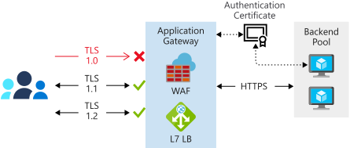

The back-end pool contains the servers that implement the application. Azure Application Gateway routes requests to these servers, and can load balance the traffic across these servers.

In the shipping portal, the application servers in the back-end pool must use SSL to encrypt the data that passes between Application Gateway and the servers in the back-end pool. Application Gateway uses an SSL certificate with a public key to encrypt the data. The servers use the corresponding private key to decrypt the data as it's received. In this unit, you'll see how to create the back-end pool and install the necessary certificates in Application Gateway to help protect the messages that are transmitted to and from the back-end pool.

## Encryption from Application Gateway to the back-end pool

A back-end pool can reference individual virtual machines, a virtual machine scale set, the IP addresses of real computers (either on-premises or running remotely), or services hosted through Azure App Service. All the servers in the back-end pool should be configured in the same way, including their security settings.



If the traffic directed to the back-end pool is protected through SSL, each server in the back-end pool must provide a suitable certificate. For testing purposes, you can create a self-signed certificate. In a production environment, you should always generate or purchase a certificate that a certificate authority (CA) can authenticate.

There are currently two versions of Application Gateway: v1 and v2. They have similar capabilities but have slightly different implementation details. The v2 version provides additional features and performance improvements.

### Certificate configuration in Application Gateway v1

Application Gateway v1 requires that you install the authentication certificate for the servers in the gateway configuration. This certificate contains the public key that Application Gateway can use to encrypt messages and authenticate your servers. You can create this certificate by exporting it from the server. The application server uses the corresponding private key for decrypting these messages. This private key should be stored only on your application servers.

You can add an authentication certificate to Application Gateway by using the `az network application-gateway auth-cert create` command from the Azure CLI. The following example illustrates the syntax of this command. The certificate should be in CER (Claim, Evidence, and Reasoning) format.

```azurecli
az network application-gateway auth-cert create \
    --resource-group <resource group name> \
    --gateway-name <application gateway name> \
    --name <certificate name> \
    --cert-file <path to authentication certificate>
```

Application Gateway provides other commands that you can use to list and manage authentication certificates. For example:

* The `az network application-gateway auth-cert list` command shows the certificates that have been installed.
* The `az network application-gateway auth-cert update` command can be used to change the certificate.
* The `az network application-gateway auth-cert delete` command removes a certificate.

### Certificate configuration in Application Gateway v2

Application Gateway v2 has slightly different authentication requirements. You provide the certificate for the certificate authority that has authenticated the SSL certificate for the servers in the back-end pool. You add this certificate as a trusted root certificate to Application Gateway. Use the `az network application-gateway root-cert create` command from the Azure CLI.

```azurecli
az network application-gateway root-cert create \
      --resource-group <resource group name> \
      --gateway-name <application gateway name> \
      --name <certificate name> \
      --cert-file <path to trusted CA certificate>
```

If your servers are using a self-signed certificate, add this certificate as the trusted root certificate in Application Gateway.

## HTTP settings

Application Gateway uses a *rule* to specify how to direct the messages that it receives on its incoming port to the servers in the back-end pool. If the servers are using SSL, you must configure the rule to indicate:

* That the servers expect traffic through the HTTPS protocol.
* Which certificate to use to encrypt traffic and authenticate the connection to a server. 

You define this configuration information by using an *HTTP setting*.

Define an HTTP setting by using the `az network application-gateway http-settings create` command in the Azure CLI. The following example shows the syntax for creating a setting that routes traffic by using the HTTPS protocol to port 443 on the servers in the back-end pool. If you're using Application Gateway v1, the `--auth-certs` parameter is the name of the authentication certificate that you added to Application Gateway previously.

```azurecli
az network application-gateway http-settings create \
    --resource-group <resource group name> \
    --gateway-name <application gateway name> \
    --name <HTTPS settings name> \
    --port 443 \
    --protocol Https \
    --auth-certs <certificate name>
```

If you're using Application Gateway v2, omit the `--auth-certs` parameter. Application Gateway contacts the back-end server. It verifies the authenticity of the certificate presented by the server against the CAs specified by a list of trusted root certificates. If there's no match, Application Gateway won't connect to the back-end server and will fail with an HTTP 502 (Bad Gateway) error.
