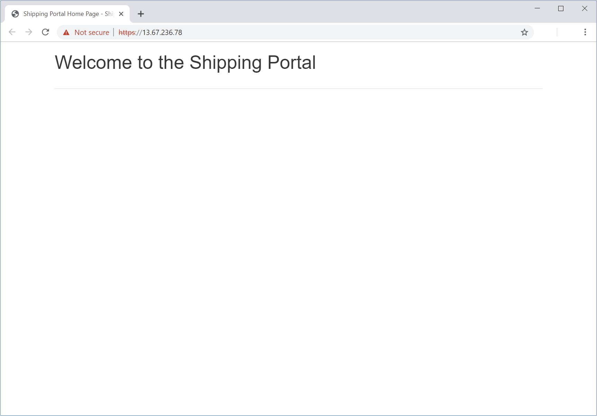

Configuring TLS transport encryption is an important step to ensure your application is secure.

You want to implement end-to-end encryption for the shipping portal application. Encryption will ensure that all data transmitted between your users and your server is encrypted, and that no unauthorized user can intercept and read the data.

In this unit, you'll set up the web application and Application Gateway. Next you'll create some self-signed TLS certificates and enable encryption in your backend pool to secure the traffic from the Application Gateway to your servers.

## Setup

[!include[](../../../includes/azure-sandbox-activate.md)]

1. In the Cloud Shell window on the right, run the following command to download the source code for the shipping portal:

    ```bash
    git clone https://github.com/MicrosoftDocs/mslearn-end-to-end-encryption-with-app-gateway/shippingportal shippingportal
    ```

2. Move to the *shippingportal* folder:

    ```bash
    cd shippingportal
    ```

3. Run the following commands to create a variable named *rgName* that references the sandbox resource group, and execute the setup script to create the virtual machine and Application Gateway

    ```bash
    export rgName=<rgn>[Sandbox resource group]</rgn>
    bash setup-infra.sh
    ```

    > [!NOTE]
    > This script will take several minutes to complete.

## Verify that the web server is configured correctly

1. Run the following commands to display the URL of the web server created by the setup script:

    ```bash
    ipaddress="$(az vm show \
      --name webservervm1 \
      --resource-group $rgName \
      --show-details \
      --query [publicIps] --output tsv)"

    echo https://$ipaddress
    ```

2. In your web browser, navigate to this URL.
  
  You will most likely receive a warning message from your browser similiar to that shown in the following image. This warning occurs because the web server is configured using a self-signed certificate that can't be authenticated:

  

1. The actual warning message may vary, depending on your browser. The image above shows Microsoft Edge. Proceed to the web site anyway (click **Go on to the webpage** if you are using Edge). You should see the home page for the Shipping Portal. This is a dummy app to test that the server is configured correctly. Note that the navigation bar will display a certificate error

  

## Configure backend pools for encryption

1. Return to the Cloud Shell window, and run the following command to get the private IP address of the virtual machine acting as the web server:

    ```bash
    privateip="$(az vm list-ip-addresses \
      --resource-group $rgName \
      --name webservervm1 \
      --query "[0].virtualMachine.network.privateIpAddresses[0]" \
      --output tsv)"
    ```

2. Set up the backend pool for Application Gateway using the private IP address of the virtual machine:

    ```azurecli
    az network application-gateway address-pool create \
      --resource-group $rgName \
      --gateway-name gw-shipping \
      --name ap-backend \
      --servers $privateip
    ```

3. Upload the authorization certificate for the VM in the backend pool to Application Gateway. THis certificate was generated by the setup script and is stored in the *shipping-ssl-crt* file:

    ```azurecli
    az network application-gateway auth-cert create \
      --resource-group $rgName \
      --gateway-name gw-shipping \
      --name shipping-auth-cert \
      --cert-file server-config/shipping-ssl.crt
    ```

4. Configure the HTTP settings to use the certificate:

    ```azurecli
    az network application-gateway http-settings create \
      --resource-group $rgName \
      --gateway-name gw-shipping \
      --name https-settings \
      --port 443 \
      --protocol Https \
      --auth-certs shipping-auth-cert
    ```