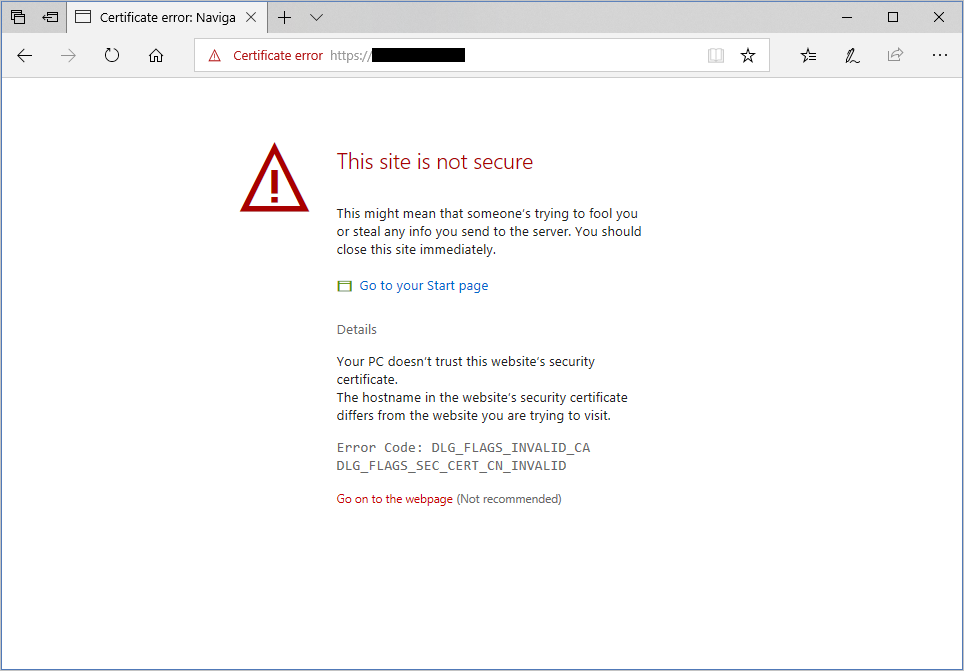

You want to implement end-to-end encryption for the shipping portal application. Encryption will ensure that all data transmitted between your users and your server is encrypted, and that no unauthorized user can intercept and read the data.

In this unit, you'll set up the web application and Application Gateway. Next you'll create some self-signed SSL certificates and enable encryption in your backend pool to secure the traffic from the Application Gateway to your servers.

The following image highlights the elements you'll configure in this exercise. You'll be setting up an Application Gateway v2.


## Deploy virtual machine and Application Gateway

[!include[](../../../includes/azure-sandbox-activate.md)]

1. In Cloud Shell, run the following command to download the source code for the shipping portal.

    ```bash
    git clone https://github.com/MicrosoftDocs/mslearn-end-to-end-encryption-with-app-gateway shippingportal
    ```

1. Move to the *shippingportal* folder.

    ```bash
    cd shippingportal
    ```

1. Run the following commands to create a variable named `rgName` that references the sandbox resource group, and execute the setup script to create the virtual machine, certificates, and Application Gateway.

    ```bash
    export rgName=<rgn>[Sandbox resource group]</rgn>
    bash setup-infra.sh
    ```

    > [!NOTE]
    > This script will take several minutes to complete.

## Verify that the web server is configured correctly

1. Run the following command to display the URL of the web server created by the setup script.

    ```bash
    echo https://"$(az vm show \
      --name webservervm1 \
      --resource-group <rgn>[Sandbox resource group]</rgn> \
      --show-details \
      --query [publicIps] \
      --output tsv)"
    ```

1. In your web browser, navigate to this URL.
  
   You will likely receive a warning message from your browser similar to that shown in the following image. This warning occurs because the web server is configured using a self-signed certificate that can't be authenticated.

   

1. The actual warning message may vary, depending on your browser. The image above shows Microsoft Edge. Proceed to the web site by clicking **Go on to the webpage** or the equivalent. You should see the home page for the shipping portal. This is a sample app to test that the server is configured correctly.

   

## Configure backend pool for encryption

1. Run the following command to get the private IP address of the virtual machine acting as the web server.

    ```bash
    privateip="$(az vm list-ip-addresses \
      --resource-group <rgn>[Sandbox resource group]</rgn> \
      --name webservervm1 \
      --query "[0].virtualMachine.network.privateIpAddresses[0]" \
      --output tsv)"
    ```

1. Next, set up the backend pool for Application Gateway using the private IP address of the virtual machine.

    ```azurecli
    az network application-gateway address-pool create \
      --resource-group <rgn>[Sandbox resource group]</rgn> \
      --gateway-name gw-shipping \
      --name ap-backend \
      --servers $privateip
    ```

1. Upload the certificate for the VM in the backend pool to Application Gateway, as a trusted root certificate. This certificate was generated by the setup script and is stored in the *shipping-ssl.crt* file.

    ```azurecli
    az network application-gateway root-cert create \
      --resource-group <rgn>[Sandbox resource group]</rgn> \
      --gateway-name gw-shipping \
      --name shipping-root-cert \
      --cert-file server-config/shipping-ssl.crt
    ```

1. Configure the HTTP settings to use the certificate.

    ```azurecli
    az network application-gateway http-settings create \
      --resource-group <rgn>[Sandbox resource group]</rgn> \
      --gateway-name gw-shipping \
      --name https-settings \
      --port 443 \
      --protocol Https \
      --host-name $privateip
    ```

1. Run the following commands to set the trusted certificate for the backend pool to the certificate installed on the backend VM.

    ```azurecli
    export rgID="$(az group show --name <rgn>[Sandbox resource group]</rgn> --query id --output tsv)"

    az network application-gateway http-settings update \
        --resource-group <rgn>[Sandbox resource group]</rgn> \
        --gateway-name gw-shipping \
        --name https-settings \
        --set trustedRootCertificates='[{"id": "'$rgID'/providers/Microsoft.Network/applicationGateways/gw-shipping/trustedRootCertificates/shipping-root-cert"}]'
    ```

You now have a virtual machine running the shipping portal site, an Application Gateway, and have configured SSL encryption between Application Gateway and your application server.
