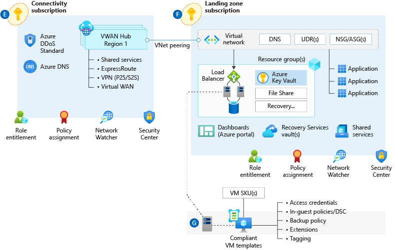
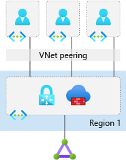

Enterprise network topology with Azure is recommended in two flavors. Either Azure Virtual WAN or the traditional Hub and Spoke model. This unit will explore the design recommendations for both solutions and how to choose which to use.

# Azure Virtual WAN

## Considerations

Azure Virtual WAN is a Microsoft-managed solution where global transit connectivity is provided by default. Virtual WAN hubs eliminate the need to manually configure network connectivity. Azure Virtual WAN is the preferred choice over hub and spoke because there is no need for a customer to deploy and manage some sort of router service in the hub. Virtual WAN also offers communications between on premises locations using the Microsoft Network and ExpressRoute and VPN. A design consideration for any networking in Azure keeps in mind the principle that Azure to Azure traffic should always stay in Azure.

## Recommendations

Deploy a VWAN hub per Azure region and connect them to large offices or data centers with ExpressRoute. Use VPN for smaller locations and point-to-site VPN for remote users. Azure Firewalls can be deployed into the VWAN hub, but third party firewalls have to be deployed into a spoke VNet. There's no need to build a transit network on top of VWAN. VWAN is the transit network. Azure Virtual WAN is limited to two thousand virtual machines per spoke. If the deployment will be higher than this, consider hub and spoke. 

# Hub and spoke

## Considerations

Use the hub and spoke model if there are no requirements for branch to branch communications, there is no need for SD-WAN integrated solutions, when highly granular routing control is required or when over 2000 virtual machines will be deployed per hub.

When multiple ExpressRoute circuits are connected to the same VNet, connection weights or BGP techniques must be used to ensure an optimal path for traffic between on-premises and Azure. If connection weights are used, BGP AS prepending is ignored. 

# Recommendations

Each Azure region should have a hub, firewalls and ExpressRoute/VPN gateways should be deployed in that hub so that all spoke virtual networks can route through the hub or use shared services like DNS deployed there.  Use multiple Expressroute circuits for a few reasons. First for resiliency, in different peering locations and different providers if possible. Next, for dedicated bandwidth to projects or to production to avoid 'noisy neighbor problems'.

# Recommendations for the largest deployments
For network architectures with multiple hub and spoke topologies across Azure regions, use global VNet peering to connect landing zone VNets when a small number of landing zones need to communicate across regions, this is simpler and has lower latency than bringing the traffic back to on premises. Do not create more than 200 peering connections per central hub VNet. While VNets support up to 500 peering connections, ExpressRoute with private peering only supports advertising up to 200 prefixes from Azure to on-premises. Also, note that this limit is 10,000 with Virtual WAN. 