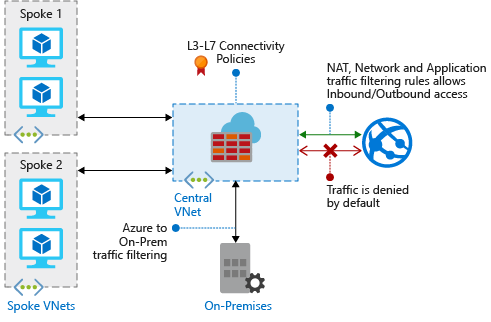

This unit will look at connectivity to Azure, to the internet and to PaaS services with design considerations and prescriptive recommendations for the enterprise.

# Connectivity to Azure

ExpressRoute is private dedicated connectivity to Azure and the preferred approach for the enterprise over VPN. VPNs can be used as a source of backup. Because VPNs use the internet, latency can be very inconsistent. Select ExpressRoute Direct or a provider by matching your requirements for peering locations. Connect to the Microsoft network with as little latency as possible. If more than 10Gb is required or multiple circuits totalling over 10GB, consider ExpressRoute direct. ExpressRoute direct is a layer 2 connection from your hardware to Microsoft's inside a peering location and goes up to 100Gbps. Ensure the right SKU is used for the ExpressRoute/VPN gateways based on bandwidth and performance requirements, otherwise you will either be paying too much or not getting full throughput. Be sure to deploy zone redundant gateways where possible. When throughput from on-premises to Azure must be greater than 10 Gbps, or latency minimized, enable FastPath to bypass the ExpressRoute gateway from the data path. Proactively monitor ExpressRoute circuits using Network Performance Monitor, use multiple ExpressRoute peering locations for resiliency and do not use the same ExpressRoute circuit to connect multiple environments that require isolation or dedicated bandwidth to avoid noisy-neighbor risks.

# Connectivity with the public Internet

Azure-native network security services such as Azure Firewall, Azure Web Application Firewall (WAF) on Azure Application Gateway, and Azure Front Door are fully managed services, so you don't incur the operational and management costs associated with infrastructure deployments, which can become complex at scale. However, the enterprise-scale architecture is fully compatible with third-party Network Virtual Appliances (NVAs), should your organization prefer to use NVAs or for situations where native services don't satisfy your organization's specific requirements. When using Azure Firewall, use Firewall Manager with Virtual WAN to deploy and manage Azure Firewalls across Virtual WAN hubs or in hub VNets. Firewall Manager is now in general availability (GA) for both Virtual WAN and regular VNets. Firewall Manager allows for Azure Firewall to managed at scale. Create a global Azure Firewall policy to govern security posture across the global network environment and assign it to all Azure Firewall instances

When using Azure Front Door and Azure Application Gateway to protect HTTP/S apps, use WAF policies in Azure Front Door and lock down Azure Application Gateway to receive traffic only from Azure Front Door. Use Azure DDoS Protection Standard protection plans to protect all public endpoints hosted within your VNets. DDoS Standard provides SLA backed DDoS protection and log telemetry. Also, use Azure NAT Gateway to or a third party NVA to control what IP addresses Virtual Machines use to access the Internet. Do not replicate on-premises perimeter network concepts and architectures into Azure. Similar security capabilities are available in Azure, but the implementation and architecture must be adapted to the cloud. This is a very common architecture mistake that leads to lowered performance and resiliency. 

# Connectivity to PaaS services

Private Link provides dedicated access using private IP addresses to Azure PaaS instances, or custom services behind an Azure Load Balancer standard. VNet injection provides dedicated private deployments for supported services. But management plane traffic flows through public IP addresses. Privatelink is the preferred solution to secure PaaS services.

