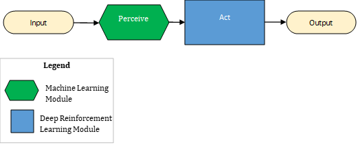

The perception pattern contains one or more modules that perceive and one or more modules that act.

In the above brain design, the perception pattern is depicted as a flow chart. The flowchart is read from left-to-right. The yellow oval labeled as “input” contains the sensor that defines the state of the environment. It passes the information to the green hexagon labeled as “Perceive”. This is a Machine Learning (ML) module that processes sensor information into perception. Examples of perception are vision, hearing, prediction, classification, and filtering. Perception modules transform the raw data into the metrics of interest towards decision making, such as transforming images into shape and size features. The green “Perceive” hexagon flows into the blue rectangle implemented with DRL, labeled “Act”. In this part of the diagram, the brain receives the perception transformed features and decides on the values of the control actions to control the system. The control actions are included in the yellow oval labeled “output”.

Perception and action are different skills in separate modules because:

- Learning perception and decision-making simultaneously (although possible) is hard. We’re forcing the AI to learn what it’s looking at, and what it should do at the same time.
- Separating perception and action provides explainability. You get visibility into what the AI perceives and what decisions it makes, separately.
Separating perception and action facilitates troubleshooting. A ML black box is hard to troubleshoot, but separate perception and decision modules make it easier to tell whether the problem lies with bad perception or bad decisions.
