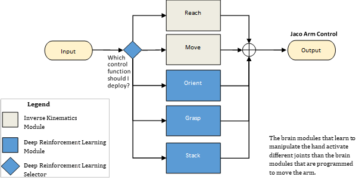
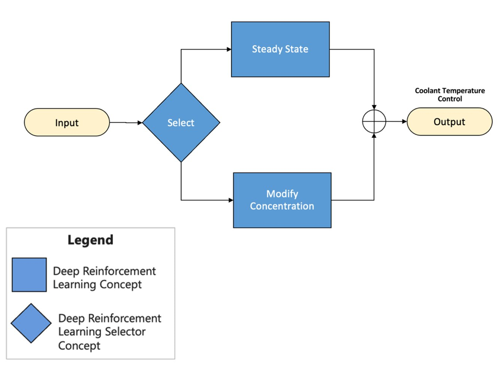

The functional pattern separates control actions into groups. For example, you might decide to control the accelerator and brake pedals of a car separately from the steering wheel. If so, you can use the functional design pattern to organize the skills in your AI brain.

In the above brain design, the functional pattern is depicted as a flow chart. The flowchart is read from left-to-right. The yellow oval labeled as “input” contains the sensor that defines the state of the environment. It passes the information to the selector diamond that selects the best control function. In the legend, white represents programmed Inverse Kinematics modules, the blue represents Deep Reinforcement Learning modules. Based on the status of the environment and the objective at hand, the selector decides on the strategy to execute, which will determine the control actions to control the system. The control actions are the “output” of the brain.

Another example of functional decomposition is the optimization of the oil refining process. Oil refining, like any chemical manufacturing processes, is continuous, which means that the inputs are constantly flowing in, and the outputs are constantly flowing out, as opposed to a discrete process where you're making individual products.  Each stage of the oil refinery process is interdependent. What you do in one part of the process affects everything downstream. And typically, you need to make hundreds of decisions.

While it appears that there are hundreds of decisions to be made, in practice, based on expert knowledge, these decisions are partitioned into groups which are functionally independent. Functionally independent means that they depend on each other, but practically you can treat them separately. The stages of the process are separated by buffers - for example, storage tanks act as buffers from one stage to another. Functional decomposition allows you to separate each group of actions in the oil refinery that are separated by the physical buffer of the tanks into a separate skill or concept. Instead of a brain with one skill that takes hundreds of actions throughout the end-to-end process, you now have a smaller set of skills that focus on a subset of the process. Each module takes now a more manageable number of actions. We validate this decomposition through the knowledge of subject matter experts.

If we had three chemical reactors, the brain design would look like this:

