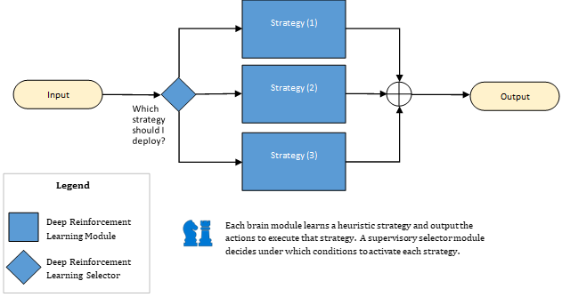

The strategy pattern activates different skills in different scenarios using the same control actions.

While the functional decomposition paradigm separates different actions into different skills, the strategy decomposition paradigm uses the same actions for all skills, but instead, it separates skills by scenarios where each strategy is most effective.

Consider the analogy of chess.  The chess opening or the first phase of chess has the goal of surviving and moving on to the next phase. The mid game has a goal of gaining advantage over the opponent. The end game has a goal of check-mating, which is trapping or pinning the opponent's king.

Because each of these scenarios has different goals, each of these phases has a different set of strategies that are used during each scenario. Typically, you would use opening strategies for the opening phase, mid game strategies for the mid game, and check-mating strategies for the end game. Each strategy shares the same control actions, i.e. moving the chess pieces on the chess board.

The strategies are heuristic because they match scenarios with evidence from learned experience.  For example, you slow down the car (control action) before you drive into a sharp turn (scenario).

Heuristics strategies are important to discover from subject matter experts as they'll be the skills or modules of your brain design.

An easy method to interview subject matter experts and ask the right questions to extract their expertise as heuristic strategies that you can build into your AI brain designs is called the three-column exercise. The first column describes the scenario when you should use the strategy. The second column describes what the expert operator thinks it means when the scenario happens. The third column lists the strategy or action to take in that particular scenario.

The following table includes a few examples of the three-column exercise.

| Customer | When the environment looks like this..                   | It means this..                                            | Do this..                                                    |
| -------- | -------------------------------------------------------- | ---------------------------------------------------------- | ------------------------------------------------------------ |
| Steel    | The steel is narrow and the coating is tick              | Zinc coating is likely to be uneven                        | Adjust the air knives (skew clockwise or counter-clockwise). |
| Airlines | Bags need to be delivered quickly to departing flight   | The bags are in danger of missing their flights            | Run those bags through the tail to tail method.              |
| Rail     | The yard is "dirty" with misplaced containers            | Trains can't be loaded until containers are moved         | Allocate more hostlers to move containers within the yard    |
| Rail     | The containers are well placed in relation to the train  | Trains can be loaded immediately                           | Allocate more hostlers to load containers on trains          |
| HVAC     | If energy is expensive or temperatures are extreme        | Heating cold air or cooling hot air will be more expensive | Recycle more air                                             |
| HVAC     | If occupancy is or will be high or energy is inexpensive | Air quality is priority, heating/cooling is inexpensive    | Let in fresh outside air                                     |