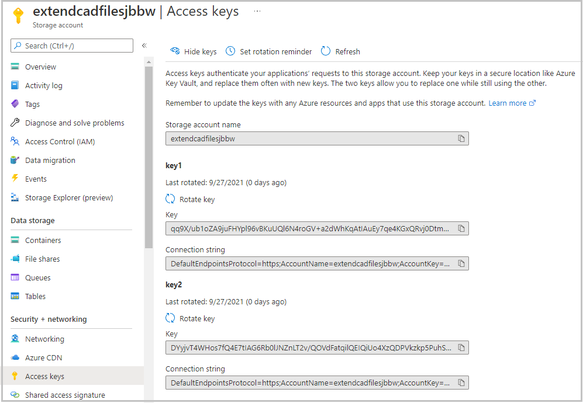
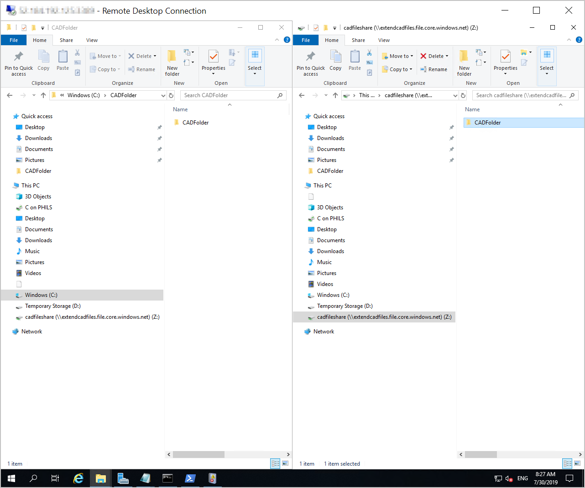

Azure File Sync provides multiple ways to monitor and diagnose sync problems. Tools are provided in the sync group and are on the Windows Server computer. You can also set up alerts in Azure Monitor. 

You've deployed Azure File Sync and configured both the Azure and on-premises environments. Now you need to troubleshoot a rogue file that's not syncing. You'll use the tools provided by Microsoft.

In this exercise, you'll first check that file sync is working correctly. Then you'll generate a file with invalid characters. You'll see how to diagnose sync problems and resolve them. The following video walks you through the process. Complete the steps in this exercise to continue following along in your Azure subscription.

> [!VIDEO https://channel9.msdn.com/Shows/Learn-Azure/Azure-File-Sync-Unit10/player?format=ny]

## Find your connection details

1. Sign in to the [Azure portal](https://portal.azure.com?azure-portal=true). 
1. Go to the storage account. Select **All resources** > **extendcadfiles**.
1. Under **Settings**, select **Access keys**.

   

1. Under **key1**, copy the **Key** value. You'll use this key to set up the mapped drive.

## Create a mapped drive to the Azure file share

1. If you closed your Remote Desktop connection, use these steps to connect to the VM:
    1. Sign in to the [Azure portal](https://portal.azure.com?azure-portal=true). Use the account you used when you activated the sandbox.
    1. Go to **Virtual machines** > **FileServerLocal**.
    1. Select **Connect** > **Download RDP File**, and then open the RDP file.
    1. In the **Windows Security** window, select **More choices** > **Use a different account**.
    1. Enter the user name **learnadmin** and the password you used when you created the VM.
1. On the toolbar, select **File Explorer**, and then select **This PC**.
1. In the menu at the top of the window, select **Computer** > **Map network drive**.
1. In the **Folder** box, enter **\\\extendcadfiles.file.core.windows.net\cadfileshare**.
1. Select **Connect using different credentials**.
1. Select **Finish**.
1. For the user name, enter **AZURE\extendcadfiles**.
1. For the password, paste in the key you copied in the previous section.
1. Select **OK**.

## Check the file sync

1. Open a new File Explorer window.
1. Put the two File Explorer windows side by side, with D:\CADFolder on the left and the mapped cadfileshare on the right:

    

1. In the left window, below **CADFolder**, right-click and select **New** > **Text Document**.
1. Rename the file to **test**.
1. Confirm that the file replicates to the Azure file share in the right window.

## Create an invalid file

1. Go to the **CADFolder** folder in both windows.
1. Open **create-bad-file.js** in the left window.
   
   A new file named **invalid╘«nameÉ.txt** will be created.
   
   This file won't replicate into the Azure file share.

## Troubleshoot file synchronization

You can troubleshoot on your on-premises server or in the Azure portal. Syncing to the portal can take some time, so start troubleshooting locally.

### View the file sync issue on Windows Server

1. Right-click **Start** and select **Windows PowerShell (Admin)**.
1. In the console, move to the File Sync folder:

    ```powershell
    cd 'C:\Program Files\Azure\StorageSyncAgent\'
    ```
1. Run the error report script:

    ```powershell
    .\FileSyncErrorsReport.ps1
    ```

    

1. View the output of the command. The `ErrorDescription` field describes what's wrong. The `ItemPath` field gives the location of the problematic file.

1. Verify that the error is `0x8007007b` and that it refers to the invalid file you generated.

### View the file sync problem in the Azure portal

1. On your local computer, return to the Azure portal.
1. Go to the sync group. Select **All resources** > **CADSyncService** > **CADFiles**.
1. Under server endpoints, select **FileServerLocal**.
1. Next to **Transient**, select **1 files**. It might take a few minutes for the file to show up.

    

1. Under **Remediation**, Azure provides advice on how to resolve the problem.

Because the file sync problems just started, they're listed as transient. If the file remained in the folder with the invalid characters for more than 24 hours, the status would change to persistent.

### Resolve the file sync

1. Return to the Remote Desktop connection.
1. Remove the invalid characters from the file name. In the left File Explorer, rename the **invalid╘«nameÉ.txt** file to **valid-name**.
1. The file should now sync. Confirm the sync works by running this command again:

    ```powershell
    .\FileSyncErrorsReport.ps1
    ```

    
