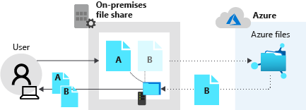

Azure File Sync allows you to extend your on-premises file shares into Azure. It works with your existing on-premises file shares to expand your storage capacity and provide redundancy in the cloud. It requires Windows Server 2012 R2 or later. You can access your on-premises file share with any supported file sharing protocol that Windows Server supports, like SMB, NFS, or FTPS.

You're researching the tools available to extend your on-premises file share capacity into Azure. You want to understand Azure File Sync, how it works, and how it can help increase your file share capacity.

In this unit, you'll explore what Azure File Sync is, how it works, and what you need to do to support it.

## Extend storage capacity

Azure File Sync uses your on-premises file server as a local cache for your Azure file share. With cloud tiering, you can cache the files your organization uses the most locally on your file serve. The files that are used less frequently are accessible from the same local share, but only a pointer to the data is stored there. When a user goes to open the file, the rest of the file data is pulled from Azure Files.

The following diagram shows what happens when a user requests two files. File A is used frequently, so the entire file is available on the local file share. File B isn't used often, so the file is retrieved from the Azure file share.

With cloud tiering, you're storing a smaller set of file data locally. So you have more local storage space for the files your organization uses more often.

By default, cloud tiering is off. You enable it when you create the server endpoint.

## Terminology

These are some terms you need to understand to use Azure File Sync.

- *Storage Sync Service* is the high-level Azure resource for Azure File Sync. The service is deployed to Azure resource groups. Within a Storage Sync Service, you can create sync groups. .

- A *sync group* outlines the replication topology for an Azure file share. All server endpoints located in the same sync group are kept in sync with each other. If you have multiple Azure file shares that must be in sync and managed with Azure File Sync, you would create two sync groups and different endpoints.

- A *registered server* represents the trust relationship between the on-premises server and the Storage Sync Service. You can register multiple servers to a single Storage Sync Service. But a server can be registered with only one Storage Sync Service at a time.

- *Azure File Sync agent* is a downloadable package that enables Windows Server to be synced with an Azure file share. The agent has three components: 

   - *FileSyncSvc.exe*. Service that monitors changes on endpoints.
   - *StorageSync.sys*. Azure file system filter driver.
   - PowerShell management cmdlets.

- A *server endpoint* represents a specific location on a registered server, like a folder on a local disk. Multiple server endpoints can exist on the same volume as long as their paths don't overlap.

- The *cloud endpoint* is the Azure file share that's part of a sync group. There can only be one cloud endpoint per sync group. Azure File Sync keeps the cloud endpoint and server endpoints in that sync group in sync. An Azure file share can be a member of only one sync group at a time.

- *Cloud tiering* is an optional feature of Azure File Sync that allows frequently accessed files to be cached locally on the server and less frequently accessed files to be tiered to the cloud. Files are cached or tiered according to the cloud tiering policy you create.

## How does it work?

Azure File Sync uses a software-based agent that's installed on the on-premises server that you want to replicate. This agent communicates with the Storage Sync Service.

Azure File Sync uses Windows USN journaling on the Windows Server computer to automatically start a sync session when files change on the server endpoint. So, changes made to the on-premises file share are immediately detected and replicated to the Azure file share.

Azure Files doesn't have change notification or journaling yet. So Azure File Sync has a scheduled job called a *change detection job*. This job is initiated every 24 hours. So, if you change a file in the Azure file share, you might not see the change on the on-premises file share for at least 24 hours.

## Deployment process

The following steps describe the high-level process you use to set up Azure File Sync.

1. *Evaluate your on-premises system*:  Run the evaluation cmdlet on your on-premises server to check whether your OS and file system are supported.
1. *Create Azure resources*: You need a storage account to contain a file share, a Storage Sync Service, a sync group, and a cloud endpoint. Create the resources in that order. If you create a sync group via the Azure Portal, it will create a cloud endpoint at the same time.
1. *Install the Azure File Sync agent*: Install the agent on each Windows file server that's taking part in replication to the Storage Sync Service.
1. *Register the Windows Server with the Storage Sync Service*: After you install the sync agent, you're prompted to register the server with the Storage Sync Service.
1. *Create the server endpoint*: After the server is registered, you add it as a server endpoint in the sync group.

We'll cover these steps in the following units.
