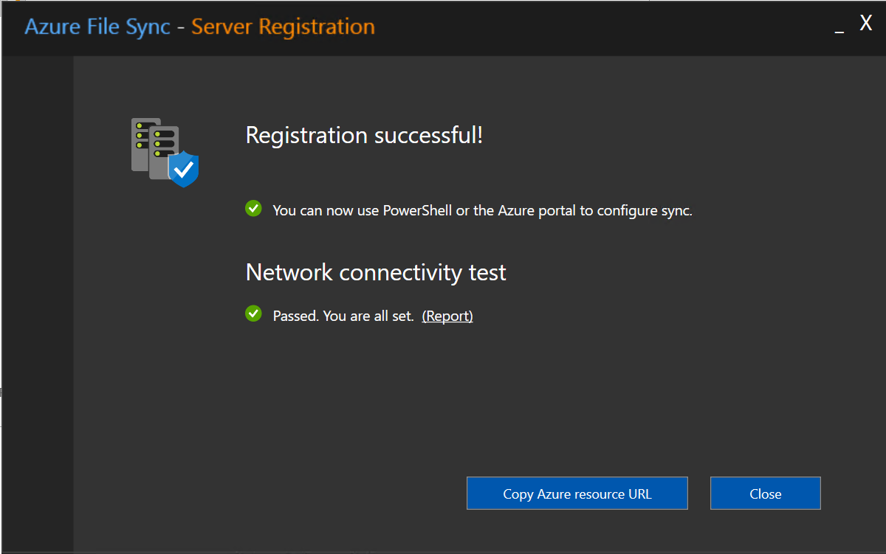

With all of the Azure resources deployed, you need to register your on-premises Windows File Server with the sync group. Then, you connect to your Windows Server and install the Azure File Sync Agent. With your server registered, you add it as a server endpoint in your Azure subscription.

In this exercise, you'll change the security setting to allow you to download the Azure File Sync Agent. You'll then install and run the agent to register the server with the Azure sync group.

### Disable IE Enhanced security configuration

1. If you closed your Remote Desktop Connection, use the following steps to connect to the virtual machine (VM).
    1. Sign into the [Azure portal](https://portal.azure.com/learn.docs.microsoft.com?azure-portal=true) using the same account you activated the sandbox with.
    1. Go to **Virtual machines** > **FileServerLocal**.
    1. Select **Connect** > **Download RDP File** > open the RDP file.
    1. In the **Windows Security** window, select **More choices** > **Use a different account**.
    1. Enter the username **learnadmin** and the password you used when you created the VM.
1. In your Remote Desktop Connection, on the toolbar, select **Server Manager** > **Local Server**.
1. On the **Properties** pane, go to **IE Enhanced Security Configuration** and select the **On** link.
    
1. Select **Off** for **Administrators** and **Users**.

### Install the Azure File Sync agent

1. From the toolbar in the VM, open **Internet Explorer**.
1. Open the **Microsoft Download Center**  page for Azure File Sync by going to **https://go.microsoft.com/fwlink/?linkid=858257**.
1. Select **Download**.
1. Choose **StorageSyncAgent_WS2019.msi** and **Next**.
1. Allow the pop-up and select **Run**.
1. In the **Storage Sync Agent Setup**, accept the defaults to complete the setup.
1. The agent automatically runs and shows the **Azure File Sync - Agent Update** window. Complete any updates that are necessary. 

### Register the Windows Server

1. On **Azure File Sync - Server Registration**, select **Sign in**. If the server registration process doesn't start automatically, open the app from C:\Program Files\Azure\StorageSyncAgent\ServerRegistration.exe.
1. To sign in, use the same account that you activated the sandbox with.
1. Use the following values:

   |Field |value  |
   |---------|---------|
   |Azure Subscription     |  Concierge Subscription       |
   |Resource Group    |  **<rgn>[sandbox resource group name]</rgn>**       |
   |Storage Sync Service     |  CADSyncService       |

1. Select **Register**.
1. You should see that the registration is successful. Select **OK** to close the window.
    
1. Leave your Remote Desktop Connection open for the next exercise.

### Add the server endpoint

1. On your local machine, sign into the [Azure portal](https://portal.azure.com/learn.docs.microsoft.com?azure-portal=true) using the same account you activated the sandbox with.
1. Go to the sync group CADFiles. Select **All resources** > **CADSyncService** > **CADFiles**.
1. Select **Add server endpoint**.
1. Use the following values:

    

   |Field |value  |
   |---------|---------|
   |Registered Server    | FileServerLocal        |
   |Path    |    D:\CADFolder     |

1. For **Cloud Tiering**, select **Enabled**.
1. Accept the defaults for the rest of the values.
1. Select **Create**.
1. When the endpoint is created, the file sync process begins. This process may take a couple of minutes.

    
