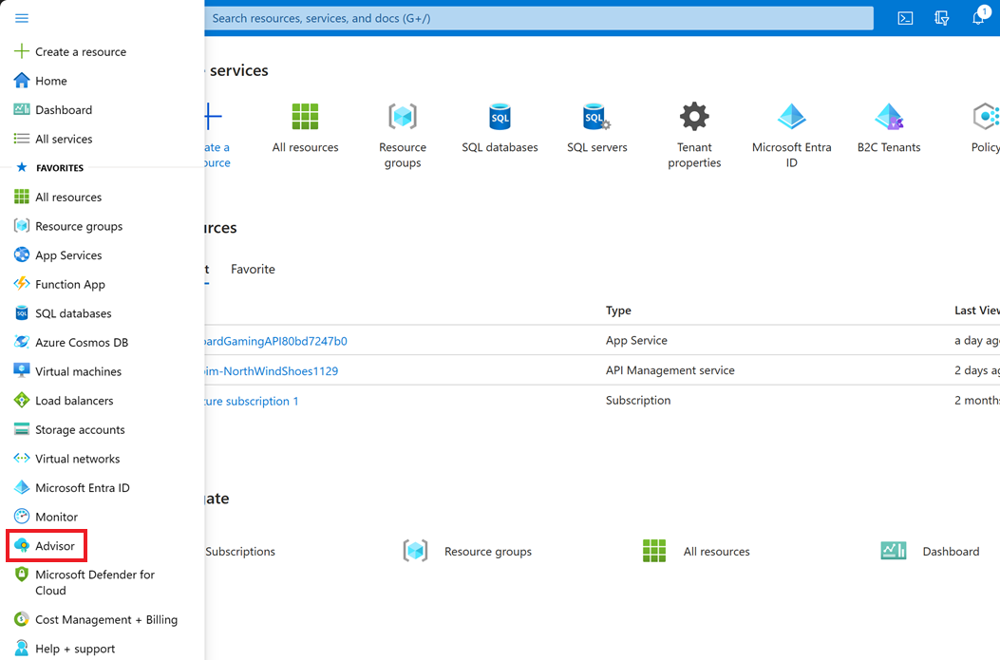
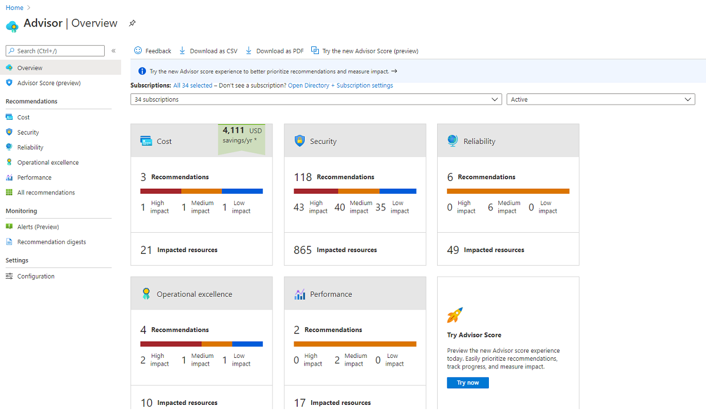

## Where can I find Advisor?

Advisor is available on the [Azure portal.](https://portal.azure.com/?azure-portal=true). Here are a few different ways you can get to it:

- Type "advisor" in the search bar at the top of the portal. Then select **Advisor** from the list of services.

   > [!div class="mx-imgBorder"]
   > 

- Select **Advisor** from the left pane of the portal.

   > [!div class="mx-imgBorder"]
   > 

- Select **All services** from the left pane of the portal. Then select **Advisor** under **Management + governance**

   > [!div class="mx-imgBorder"]
   > 

After you do any one of these three, the Advisor dashboard is displayed.

> [!div class="mx-imgBorder"]
> 

### Areas where Advisor can help

As you'll notice in the image above, Advisor gives you recommendations for the five categories that are the basis of the Azure Well-Architected Framework:

| Category | Description |
|---------|---------|
| **Cost** | Helps optimize and reduce your overall Azure spend by identifying idle and underutilized resources. |
| **Security** | Integrates with [Azure Security Center](https://docs.microsoft.com/azure/security-center/security-center-recommendations?azure-portal=true) to identify potential vulnerabilities that can lead to security breaches. |
| **Reliability** | Helps to ensure and improve the continuity of your business-critical applications. |
| **Operational excellence** | Makes recommendations for process and workflow efficiency, resource manageability, and deployment best practices. |
| **Performance** | Helps improve the speed and responsiveness of your business-critical applications. |

## How does Advisor work?

Think of Azure Advisor as your personalized cloud consultant. It gives you messages that provide information on best practices to optimize the setup of your Azure services.

Advisor analyzes your *resource configuration* and *usage telemetry* and then gives you actionable recommendations  that can help you improve the cost effectiveness, performance, reliability, and security of your Azure resources, as well as your operational excellence.

### Examples of Advisor recommendations

Advisor gives you several recommendations for each of these categories. Here are just a few examples for each category, most of which are fairly self-explanatory:

#### Cost

- Resize or shut down underutilized virtual machine instances
- Eliminate unprovisioned ExpressRoute circuits
- Delete or reconfigure idle virtual network gateways

#### Reliability

- Ensure application gateway fault tolerance
- Enable backup to protect your virtual machine data from accidental deletion
- Configure Traffic Manager endpoints for resiliency

#### Operational excellence

- Create Azure Service Health alerts to be notified when Azure problems affect you
- Design your storage accounts to prevent reaching the maximum subscription limit
- No validation environment enabled

#### Performance

- Improve App Service performance and reliability
- Use managed disks to prevent disk I/O throttling
- Improve MySQL connection management

#### Security

Advisor integrates with [Azure Security Center](https://docs.microsoft.com/azure/security-center/security-center-recommendations?azure-portal=true) to provide security recommendations on the Advisor dashboard Security tab.

Security Center periodically analyzes the security state of your Azure resources to identify potential security vulnerabilities, such as overdue system updates. Security Center then creates recommendations, and Advisor guides you through the process of resolving them.

## Remediating issues found by Advisor recommendations

Now that you've learned a little about your Advisor recommendations, we'll show you the typical process you follow to resolve them:

First, on your Advisor dashboard, you can select a category that shows recommendations to resolve. You can also choose to see **All recommendations**, which shows a list of every Advisor recommendation across all five categories.

You'll notice that each of the five category tiles shows:

- The number of Advisor recommendations
- The number of impacted resources
- Their impact level: low, medium, or high.

> [!div class="mx-imgBorder"]
> 

After you make your selection, a new page opens showing details about the recommendations for the chosen category. Under a summary of the recommendations, you'll see a table that provides more information, such as:

- A linked description of each recommendation
- The impact level of each recommendation
- The potential annual savings for fixing each issue
- The number of resources impacted

In addition, on the left side of the page under **Recommendations**, you can select a different category (or **All recommendations**) to quickly open a page where you can see the Advisor recommendations for that  selection.

> [!div class="mx-imgBorder"]
> 

After you select a linked description for a recommendation, a window opens showing some suggestions for actions you can take. At this point in the flow, you have several options for how you want to handle the recommendation.

- You can select a linked **Recommended action** and another page opens that lets you take the necessary steps to resolve the issue.
- If you choose to deal with the recommendation later on, you can select **Postpone**. Advisor removes it from the list, but will recommend it again if it sees that the issue hasn't been resolved.
- Or if you know this is an issue you don't want to resolve, you can just select **Dismiss** and Advisor will remove it from the list and will no longer show it as a recommendation for that resource.

   > [!div class="mx-imgBorder"]
   > 
