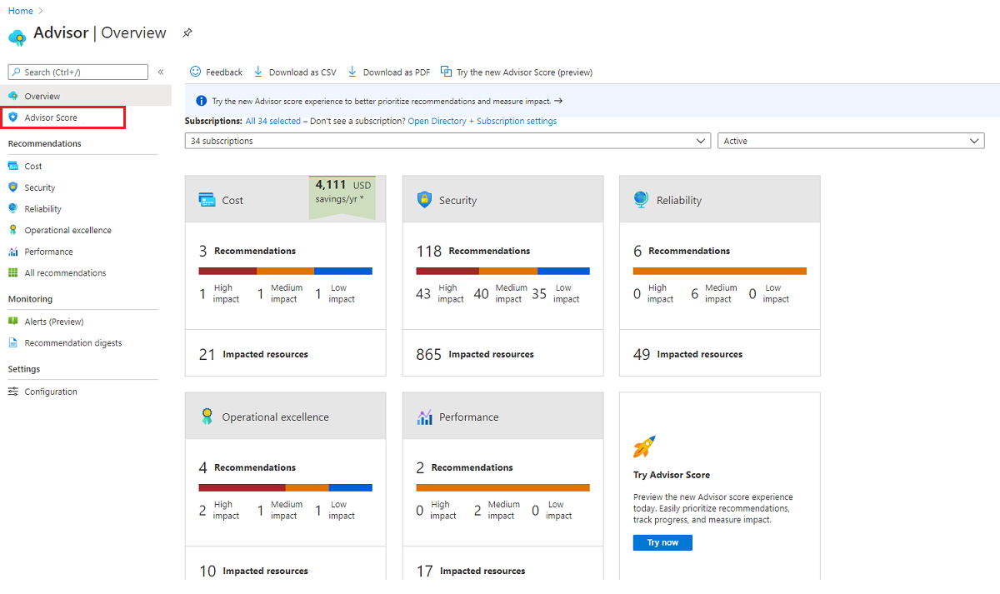
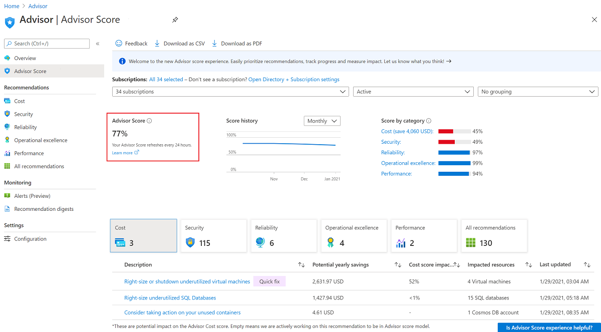
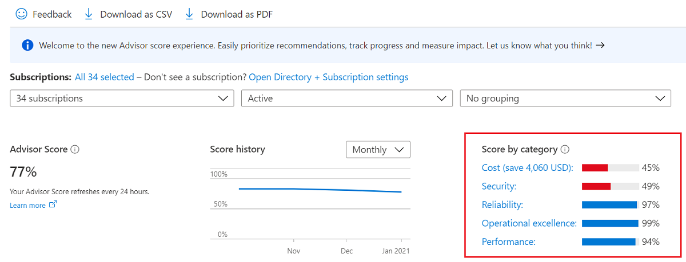
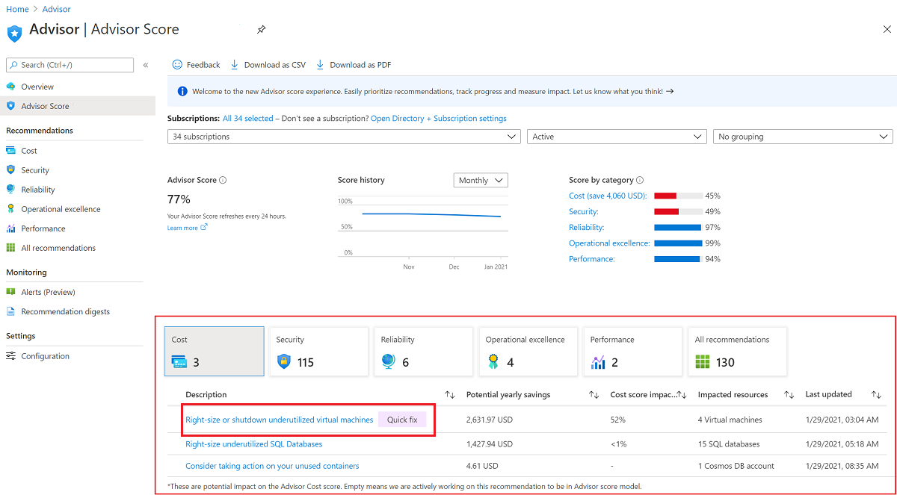

Now that you have a basic understanding of how Advisor Score can help you optimize your workloads, let's run through an example of how you would use it in your environment. Here we've got step-by-step actions that take you to your Azure subscription where you can review your Advisor Score and identify the best actions to take.

If you've still got your Advisor dashboard open, you can skip ahead to step 3.

1. First, log in to the [Azure portal](https://portal.azure.com/?azure-portal=true).
1. Go to your Advisor dashboard by typing "advisor" in the search bar and then selecting **Advisor** from the list of services.
1. In the left panel, select **Advisor Score (preview)**.

    > [!div class="mx-imgBorder"]
    > 

    The Advisor Score page opens showing your overall Advisor Score as well as individual category scores. Remember, your dashboard will look different from the screenshots in this exercise because Advisor is personalized for you.

1. Notice your overall Advisor Score.

    > [!div class="mx-imgBorder"]
    > 

    Your personal Advisor Score will likely be different than what's shown in our example. The important thing to know is that it gives you a quick snapshot of how much your entire workload is in line with documented best practices for optimization.

    You'll also notice that right next to the overall **Advisor Score** is your **Score history**. This is a valuable graphical representation of how your score is changing over a period of time. You can select the time period you want to analyze by selecting it from the drop down above the chart.

1. Now let's look over at the Advisor category scores.

    > [!div class="mx-imgBorder"]
    > 

    One thing you'll notice right away is that even though the Advisor Score in this example might be considered pretty good, there are a couple of category scores that are below 50% and really could use some attention.

1. Go ahead and select the category with the lowest score. For our example, we're going to look at **Cost** since it is showing a score of 45%. But you might see in your environment that you have a different category you want to address.

    The area at the bottom of the Advisor Score page shows recommendations for the category you chose.

    > [!div class="mx-imgBorder"]
    > 

    You'll be familiar with some of the fields shown in the table, such as **Potential yearly savings** and **Impacted resources**. But you'll also notice a new field called **Cost score impact**. This is the **Category score impact** for the **Cost** category. It shows you at a quick glance how much the corresponding recommendation will impact the category score when you address it – the higher the percentage, the greater benefit it will have. This lets you focus on those recommendations that will improve your Advisor Score the most.

1. Select a recommendation from the **Description** list to review it in more detail and to see ways in which you can remediate the issue that was flagged. For this exercise, we are looking at the recommendation for **Right-size or shutdown underutilized virtual machines** because its **Cost score impact** is greatest. But feel free to select any active recommendation you see.

    After making your selection, a more detailed page opens showing the resources affected and recommended actions you can take to resolve the issues. You can work on resolving the issues right now, or if you’re not ready to take action during this exercise, simply close the Azure portal and no changes will be made to your subscriptions or resources.

When you do apply any of the recommendations, your Advisor Score will improve! It can take up to 24 hours for the score to change, so check back in a day or so to see how much higher it is.

We recommend that you use Advisor Score as a way to set goals for how closely you want to align with Azure best practices and then track your progress in achieving those goals over time.
