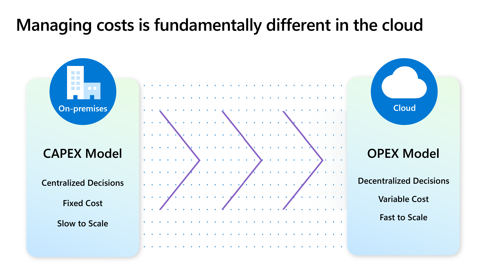

## The shift from CapEx to OpEx model

Running business workloads in cloud platforms helps organizations maintain and improve reliability, performance, and cost of the computing, storage, and other services they use. Currently, Software-as-a-Service (SaaS) cloud offerings, such as Microsoft 365, present the largest segment in end-user spending, but cloud infrastructure as a service (IaaS) and platform as a service (PaaS) are rapidly growing.

For organizations transitioning from on-premises to the cloud or managing their current workloads in the cloud, the shift from the traditional CapEx model (Capital Expenditure) to the more flexible OpEx model (Operational Expenditure) represents a fundamental change. This shift carries significant implications for both the financial and operational aspects of a business.

In an on-premises environment, companies typically invest significant upfront capital in physical hardware, data centers, and infrastructure. These assets represent a substantial one-time expenditure that is usually depreciated over several years. Organizations bear the costs of purchasing, maintaining, and upgrading their hardware, which often results in high initial expenses. Moreover, making changes or scaling resources in on-premises environments can be a time-consuming process. This slow time to make changes can hinder an organization's ability to respond quickly to market dynamics and emerging opportunities.

On the other hand, when a company embraces cloud services, it moves away from the traditional CapEx model as costs are restructured into an OpEx model. Instead of large upfront investments, organizations pay for cloud services on an ongoing, pay-as-you-use basis. This means they can scale their resources up or down as needed, without being tied to the constraints of owning assets. Cloud providers take on the responsibility of maintaining, upgrading, and securing the infrastructure, relieving organizations of those operational burdens. It allows greater agility and scalability. This flexibility enables companies to adjust their resources in near real-time, whether they need to scale up during peak demand or scale down during quieter periods. This dynamic allocation of resources supports rapid adaptation to evolving business requirements and ensures optimal cost management.

While the OpEx model offers several benefits, it also can present some challenges that organizations must consider. One significant challenge is the potential for overspending, particularly when there is a lack of control or accountability over expenses. Therefore, implementing robust controls and accountability measures is essential to ensure financial stability and efficiency.

Moving from CapEx to OpEx is a business-critical transformation that requires detailed planning and operational changes.   To capitalize on the benefits of the cloud, organizations need to go through an organizational and cultural transformation that enables their teams to take advantage of the OpEx model. The FinOps framework provides an operating model to guide you on this journey.
