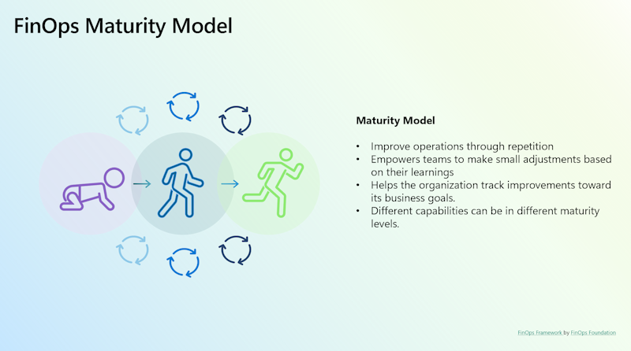

The FinOps Maturity Model serves as guidance for evaluating and steering an organization's progress in FinOps capabilities. It presents a structured method to comprehend and enhance cloud management practices. The model delineates various stages, each signifying increasing levels of maturity and proficiency in cloud management. Let's delve into the stages within the FinOps Maturity Model:

## Crawl

Characteristics:

- Very little reporting and tooling
- Measurements only provide insight into the benefits of maturing the capability
- Basic KPIs set for the measurement of success
- Basic processes and policies are defined around the capability
- Capability is understood but not followed by all the major teams within the organization
- Plans to address "low hanging fruit"

## Walk

Characteristics:

- Capability is understood and followed within the organization
- Difficult edge cases are identified but decision to not address them is adopted
- Automation and/or processes cover most of the Capability requirements
- Most difficult edge cases (ones that threaten the financial well-being of the organization) are identified and effort to resolve has been estimated
- Medium to high goals/KPIs set on the measurement of success

## Run

Characteristics:

- Capability is understood and followed by all teams within the organization
- Difficult edge cases are being addressed
- Very high goals/KPIs set on the measurement of success
- Automation is the preferred approach

The FinOps Maturity Model offers organizations a roadmap to progress from basic cloud management to highly sophisticated, efficient practices. It aids in assessing their current state and setting goals for improvement. However, it's important to note that the goal of FinOps isn't to mandate every organization to reach the "Run" stage. It varies based on each organization's objectives and the business value it seeks to derive.

For more information, see the <a target="_blank" href="https://www.finops.org/framework/">FinOps Framework</a> by the <a target="_blank" href="https://www.finops.org/">FinOps Foundation</a>.
