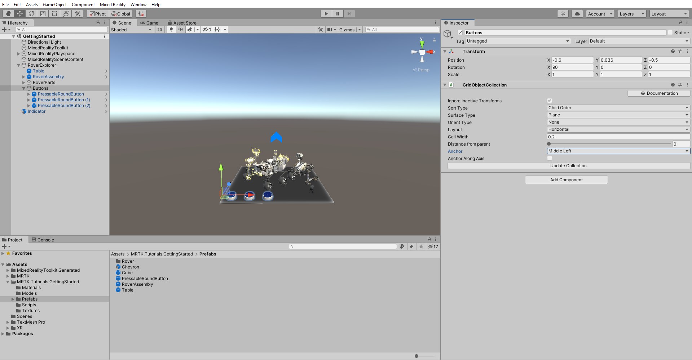
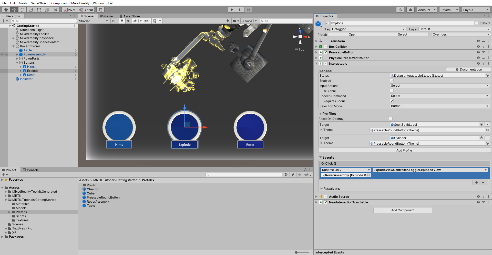
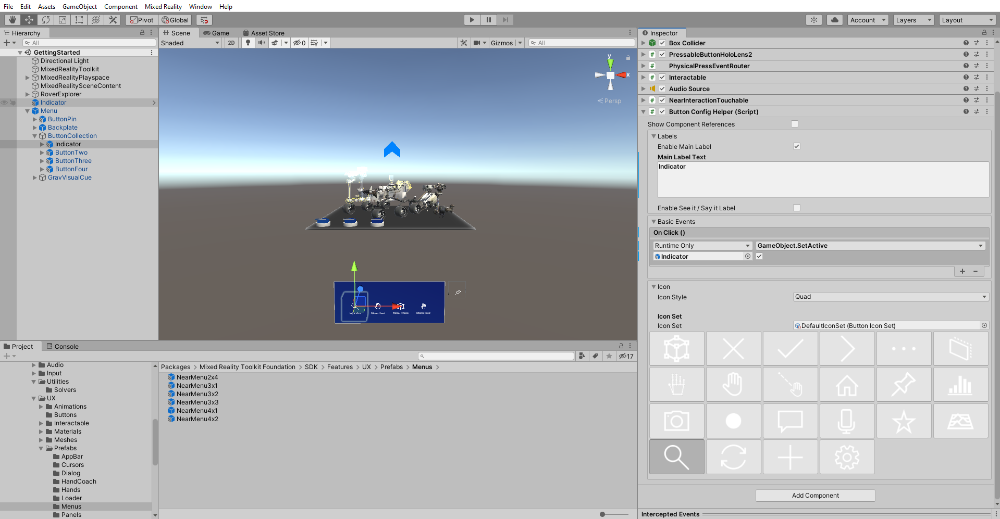

## Exercise - Include Panel of Buttons and Dynamic Menu

There are several ways of providing inputs. Inputs are given to trigger certain events and perform some changes. UI components assist the users in interacting with the holograms on the scene.

## Create a static panel of buttons

1. In the Hierarchy window, right-click on the **RoverExplorer** object and select **Create Empty** to add an empty object as a child of the RoverExplorer, name the object **Buttons**, and configure the **Transform** component as follows:
    * **Position**: X = -0.6, Y = 0.036, Z = -0.5
    * **Rotation**: X = 90, Y = 0, Z = 0
    * **Scale**: X = 1, Y = 1, Z = 1

    

2. In the Project window, navigate to the **Assets** > **MRTK.Tutorials.GettingStarted** > **Prefabs** folder, click-and-drag the **PressableRoundButton** prefab on to the **Buttons** object, then right-click on the PressableRoundButton and select **Duplicate** to create a copy, repeat until you have a total of three PressableRoundButton objects:

    

3. In the Hierarchy window, select the **Buttons** object, then in the Inspector window, use the **Add Component** button to add the **GridObjectCollection** component and configure it as follows:

    * **Sort Type**: Child Order
    * **Layout**: Horizontal
    * **Cell Width**: 0.2
    * **Anchor**: Middle Left

    Then click the **Update Collection** button to update the position of the Buttons object's child objects:

    

4. In the Hierarchy window, name the buttons **Hints**, **Explode**, and **Reset**.For each button, select the **SeeItSayItLabel** > **TextMeshPro** child object, then in the Inspector window, change the respective **TextMeshPro - Text** component text to match the button names:

    

5. Once done, collapse the Buttons object's child objects.In the Hierarchy window, select the **Hints** button object, then in the Inspector window, configure the **Interactable.OnClick ()** event as follows:

    * Assign the **RoverAssembly** object to the **None (Object)** field
    * From the **No Function** dropdown, select **PlacementHintsController** > **TogglePlacementHints ()** to set this function as the action to be executed when the event is triggered

    

6. In the Hierarchy window, select the **Explode** button object, then in the Inspector window, configure the **Interactable.OnClick ()** event as follows:
    * Assign the **RoverAssembly** object to the **None (Object)** field
    * From the **No Function** dropdown, select **ExplodedViewController** > **ToggleExplodedView ()** to set this function as the action to be executed when the event is triggered

    

7. Press the Play button to enter Game mode, then press-and-hold the space bar button to activate the hand and use the mouse to press the **Hints** button to toggle the visibility of the placement hint objects:

    

8. **Explode button** will toggle the exploded view on and off:

    

## Create a dynamic menu that follows the user

1. In the Project window, navigate to the **Packages** > **Mixed Reality Toolkit Foundation** > **SDK** > **Features** > **UX** > **Prefabs** > **Menus** folder, click-and-drag the **NearMenu4x1** prefab into the Hierarchy window, set its Transform **Position** to X = 0, Y = -0.4, Z = 0 and configure it as follows:
    * Verify that the **SolverHandler** component's **Tracked Target Type** is set to **Head**
    * Check the checkbox next to the **RadialView** Solver component so it's enabled by default

    

2. In the Hierarchy window, rename the object to **Menu**, then expand its **ButtonCollection** child object to reveal the four buttons:

    

3. Rename the first button in the ButtonCollection to Indicator, then in the Inspector window, configure the Button Config Helper (Script) component as follows:

    * Change the **Main Label Text** to match the name of the button
    * Assign the Indicator object that looks like a chevron, to the None (Object) field
    * From the **No Function** dropdown, select **GameObject** > **SetActive (bool)** to set this function as the action to be executed when the event is triggered
    * Verify that the argument checkbox is **checked**
    * Change the **Icon** to the 'search' icon

    

4. To disable the chevron Indicator object, in the Hierarchy window, select the Indicator object that looks like chevron, then in the Inspector window:

    * Uncheck the checkbox next to its name to make it inactive by default
    * Use the **Add Component** button to add the **Directional Indicator Controller (Script)** component

    

5. Rename the second button to **TapToPlace**, then in the Inspector window, configure the **Button Config Helper (Script)** component as follows:

    * Change the **Main Label Text** to match the name of the button
    * Assign the RoverExplorer > **RoverAssembly** object to the **None (Object)** field
    * From the **No Function** dropdown, select **TapToPlace** > **bool Enabled** to update this property value when the event is triggered
    * Verify that the argument checkbox is **checked**
    * Change the **Icon** to the 'hand with ray' icon

    

6. In the Hierarchy window, select the **RoverAssembly** object, then in the Inspector window, configure the **Tap To Place (Script)** component as follows:
    * Uncheck the checkbox next to its name to make it inactive by default
    * In the On **Placing Stopped ()** event section, click the + icon to add a new event:
    * Assign the **RoverExplorer** > **RoverAssembly** object to the **None (Object)** field
    * From the **No Function** dropdown, select **TapToPlace** > **bool Enabled** to update this property value when the event is triggered
    * Verify that the argument checkbox is **unchecked**

    
