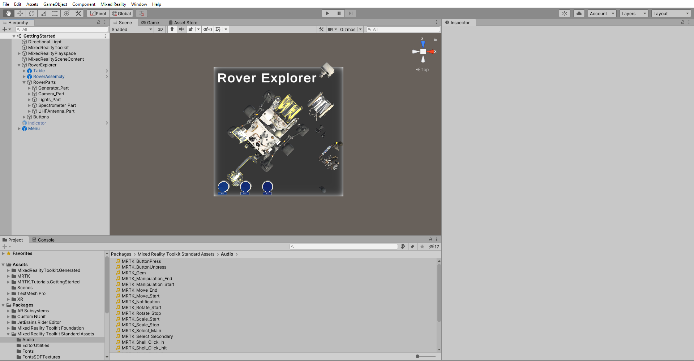
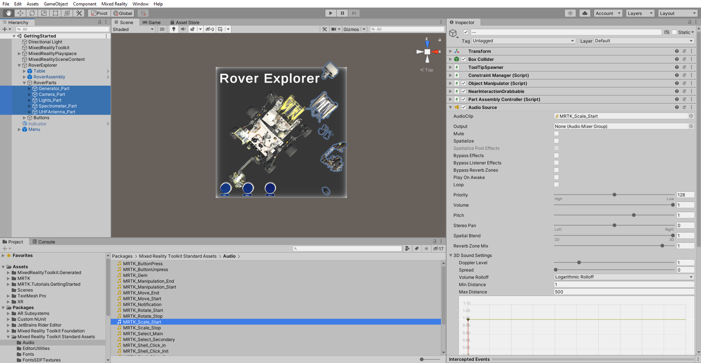
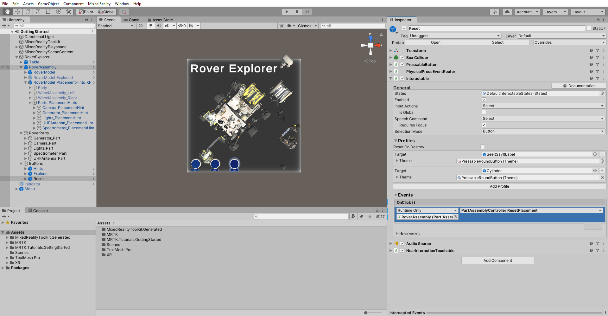
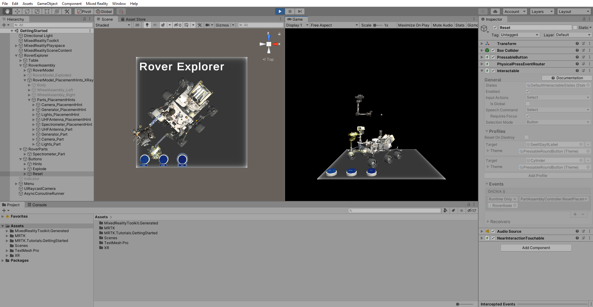
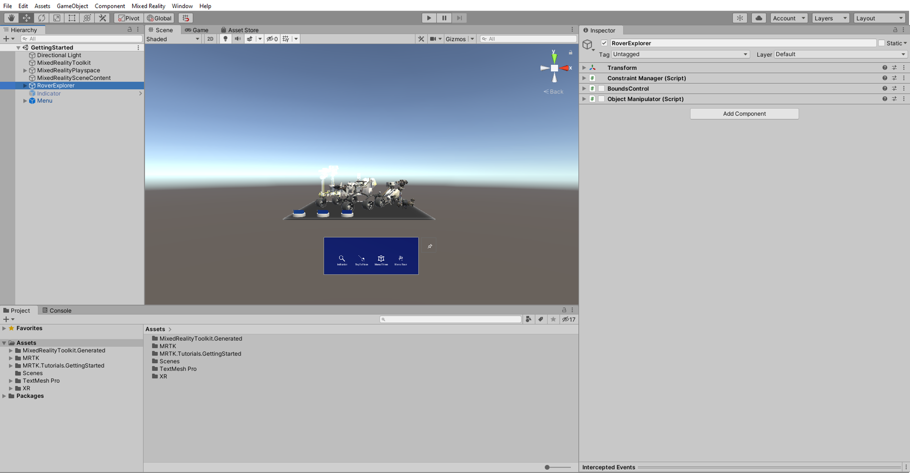

## Manipulate 3D objects

1. Additionally, you'll configure the Rover Explorer so that you can place the rover parts on to the Rover to make it a complete rover assembly.In the Hierarchy window, expand the RoverExplorer > **RoverParts** object and select all its child rover part objects and the **RoverAssembly** object, then in the Inspector window, use the **Add Component** button to add the following components to all the selected objects:

    * **Object Manipulator (Script)** component
    * **NearInteractionGrabbable** component
    * **Part Assembly Controller (Script)** component

    

2. With all the rover part objects and the RoverAssembly object still selected, in the Inspector window, configure the **Object Manipulator (Script)** component as follows:
    * From the **Two Handed Manipulation Type** dropdown, uncheck the Scale, so only **Move** and **Rotate** is enabled

    

3. In the Project window, navigate to **Packages** > **Mixed Reality Toolkit Standard Assets** > **Audio** folder to locate the audio clips:

    

4. In the Hierarchy window, reselect all the **rover part objects**, then in the Inspector window, use the **Add Component** button to add the **Audio Sources** component and configure it as follows:

    * Assign the **MRTK_Scale_Start** audio clip to the **AudioClip** field
    * Uncheck the **Play On Awake** checkbox
    * Change **Spatial Blend** to **1**

    

5. In the Hierarchy window, expand the RoverAssembly > RoverModel_PlacementHints_XRay > **Parts_PlacementHints** object to reveal all of the placement hint objects, then select the first rover part, RoverParts > **amera_Part**, and configure the **Part Assembly Controller (Script)** component as follows:
    * Assign the **Camera_PlacementHint** object to the **Location To Place** field

    

6. **Repeat** this step for each of the remaining rover part objects and the RoverAssembly object to configure the **Part Assembly Controller (Script)** component as follows:
    * For the **Generator_Part**, assign the **Generator_PlacementHint object** to the **Location To Place** field
    * For the **Lights_Part**, assign the **Lights_PlacementHint object** to the **Location To Place** field
    * For the **UHFAntenna_Part**, assign the **UHFAntenna_PlacementHint object** to the **Location To Place** field
    * For the **Spectrometer_Part**, assign the **Spectrometer_PlacementHint** object to the Location To Place field
    * For the **RoverAssembly**, assign the object itself, that is, the same **RoverAssembly object**, to the **Location To Place** field

7. In the Hierarchy window, select the RoverExplorer > Buttons > **Reset** button object, then in the Inspector window, configure the Interactable **OnClick ()** event as follows:
    * Assign the **RoverAssembly** object to the **None (Object)** field
    * From the **No Function** dropdown, select **PartAssemblyController** > **ResetPlacement ()** to set this function as the action to be executed when the event is triggered

    

8. If you now enter Game mode, you can use near or far interaction to place the rover parts on to the Rover. Once the part is close to the corresponding placement hint, it will snap into place and become part of the Rover. To reset the placements, you can press the Reset button:

    

## Add Bounds Control

1. In the Hierarchy window, select the **RoverExplorer** object, then in the Inspector window, use the **Add Component** button to add the following components:
    * **BoundsControl** component
    * **Object Manipulator (Script)** component
    Then **uncheck** the checkbox next to all the components to make them **disabled** by default:

    

2. In the Hierarchy window, expand the Menu > **ButtonCollection** object to reveal the four buttons and rename the third button to **BoundsControl_Enable**, then in the Inspector window, configure the **Button Config Helper (Script)** component as follows:

    * Change the **Main Label Text** to **Enable**
    * Assign the **RoverExplorer** object to the **None (Object)** field
    * From the **No Function** dropdown, select **BoundsControl** > **bool Enabled** to update this property value when the event is triggered
    * Verify that the argument checkbox is **checked**
    * Click the small **+** icon to add another event
    * Assign the **RoverExplorer** object to the **None (Object)** field
    * From the **No Function** dropdown, select **ObjectManipulator** > **bool Enabled** to update this property value when the event is triggered
    * Verify that the argument checkbox is **checked**
    * Leave the **Icon** as the 'cube with bounds control' icon

    

3. Rename the forth and last button to **BoundsControl_Disable**, then in the Inspector window, configure the **Button Config Helper (Script)** component as follows:

    * Change the **Main Label Text** to **Disable**
    * Assign the **RoverExplorer** object to the **None (Object)** field
    * From the **No Function** dropdown, select **BoundsControl** > **bool Enabled** to update this property value when the event is triggered
    * Verify that the argument checkbox is **unchecked**
    * Click the small **+** icon to add another event
    * Assign the **RoverExplorer** object to the **None (Object)** field
    * From the **No Function** dropdown, select **ObjectManipulator** > **bool Enabled** to update this property value when the event is triggered
    * Verify that the argument checkbox is **unchecked**
    * Change the **Icon** to the 'cube with bounds control" icon

    

4. If you now enter Game mode and enable the Bounds Control by clicking the Enable button, you can use near or far interaction to move, rotate, and scale the Bounds Control, and use the Disable button to disable the Bounds Control again:

    
