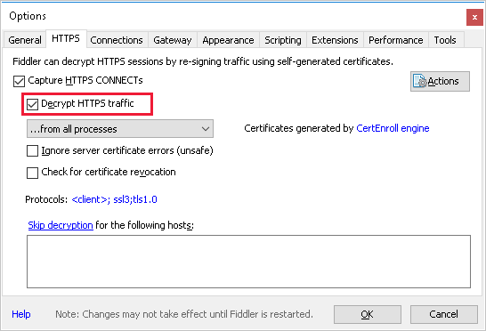
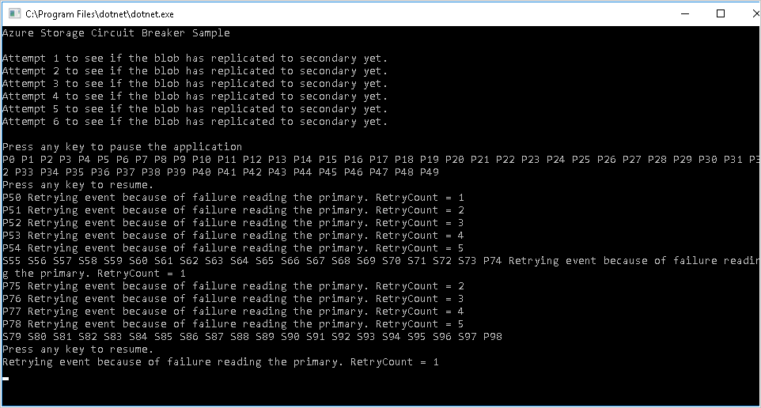

As the Solution Architect for EasyHealthCare, you now want to start implementing the design to deploy a highly available application. As a first step, you're going to download and install Fiddler that will be used run the steps to deploy and test the application.

In the EasyHealthCare application, if there's a failure connecting to the primary region holding your data in Azure storage, the application should automatically fail over and use the storage accounts at the secondary location.  The circuit breaker should force the application to behave in this manner and when the primary location is back online, it should reroute the application back to the primary region. Before committing to full-blown development of the EasyHealthCare application, you want to test this approach using a sample application with dummy data.

In this exercise, you’ll run an application that shows how you can use the Circuit Breaker pattern with an RA-GRS storage account.  The application switches to the secondary storage account when a problem is detected, and fails back to the primary location when it's available again. The application uploads a file to blob storage, it then loops, repeatedly downloading the same file. If there's an error reading the storage account from the primary location, the application retries the operation.  If the retry fails after a number of repeated attempts, the application switches to the storage account at the secondary location. The application reads the data from the secondary location until the number of reads has exceeded a specified threshold. The application then attempts to switch back to the primary location, but returns to the secondary location if the primary location is still unavailable.


## Install Fiddler

The Fiddler tool is a third-party tool, which is used to help you debug applications, in particular web applications.  It captures network traffic between computers, and based on the result, uses its event-based scripting subsystem to halt connections.  In this exercise, you'll use Fiddler to monitor the connection to the storage account for the EasyHealthCare application. When the application detects that consultants are no longer able to download blobs from storage, it will initiate failover to the secondary storage account.  When it detects that the primary connection is available again, it will redirect the connections to the primary location. You'll see the traffic being directed to the different storage account endpoints in Fiddler.

- If you don't have Fiddler installed already, download it and install from the [Telerik Fiddler home page](https://www.telerik.com/fiddler).

## Install Visual Studio and download the sample code

The application code runs locally on your desktop. You require Visual Studio to build the application.

1. If you don't already have Visual Studio 2019 installed, you can download a free version from the [Visual Studio 2019 home page](https://visualstudio.microsoft.com/vs/).

2. Open a Git command prompt window, and run the following command to download the CircuitBreaker sample application to your computer. Replace *\<folder>* with a convenient location on your hard drive:

    ```Command Prompt
    git clone https://github.com/Azure-Samples/storage-dotnet-circuit-breaker-ha-ra-grs <location>
    ```

## Connect to the storage account

1. Switch to the Cloud Shell window in the browser, and run the following command to obtain the connection string for the storage account you created in the previous exercise:

    ```azurecli
    az storage account show-connection-string \
        --name $STORAGEACCT \
        --resource-group [sandbox resource group]
    ```

1. Copy the output connection string to the clipboard.

1. Start Powershell on your local computer

1. Run the following command. This command creates an environment variable that the sample application will use to connect to your storage account. Paste in the connection string you copied from step 1:

    ```Powershell
    setx storageconnectionstring <connection string>
    ```

## Configure Fiddler

1. Start Fiddler.

1. On the **Tools** menu, click **Options**.

1. In the **Options** dialog box, click the **HTTPS** tab.

1. On the **HTTPS** tab, select **Decrypt HTTPS traffic**. If you're prompted to install additional certificates from Fiddler, accept them, then close Fiddler and restart it.

    

## Test the application and trigger a failover

1. Start Visual Studio, and open the *CircuitBreaker.sln* solution that you downloaded from GitHub. This application implements the Circuit Breaker pattern to manage connections to a replicated Azure storage account. The circuit breaker detects whether the connection to the primary location is available, and if not, switches to the secondary account for a short while before retrying the primary location again.

1. On the **Debug** menu, click **Start Debugging** to run the application.

    The application starts by uploading a file to your Azure storage account. The application waits until the file has been replicated to the secondary storage account location, and then loops, downloading the file repeatedly. The application displays a message with an iteration number, and a prefix indicating that file was downloaded from the primary location. For example, *P0* for the first iteration, *P1* for the second iteration, and so on.

    

1. While the app is running, switch to Fiddler. Fiddler shows the HTTP traffic uploading the file to your storage account and then downloading the data again. The left-hand pane should display a list of requests sent to your storage account, similar to the following image:

    

1. Return to the application window and press any key to pause it.

1. In Fiddler, on the **Rules** menu, click **Customize Rules**.

1. Search for the **OnBeforeResponse** function. Add the following code to this function, after the existing statements in this function. Replace *\<storage account name\>* with the name of the storage account you created in the previous exercise:

    ```JavaScript
    if (oSession.hostname == "<storage account name>.blob.core.windows.net") {
        oSession.responseCode = 503;
    }
    ```

    The JavaScript code you added to the Fiddler **OnBeforeResponse** function returns an HTTP 503 (Service Unavailable) error for requests to the primary storage account location, to simulate the storage endpoint being unaccessible. The circuit breaker code in the sample application should detect this failure and fail over to using the secondary storage location. The data was previously replicated from the primary to the secondary storage location by Azure, so the data should be accessible.

1. On the **File** menu, click **Save**.

1. Return to your application and press any key to continue running it.

1. In Fiddler, you'll see HTTP 503 errors being generated against the primary location. The application window will display the message *Retrying event because of error reading the primary*. After five retries, the circuit breaker in the application switches to the secondary location and starts reading from there instead. You'll see messages with the "S" prefix (for secondary) rather than "P". After reading from the secondary account for a short period, the circuit breaker will attempt to switch back to the primary location. This will fail, so the circuit breaker will revert to the secondary location for another period. This process will continue until the primary location becomes available again:

    

1. Press a key to pause the application once again.

1. In Fiddler, remove the code that you added earlier to the **OnBeforeResponse** function, and save the script.

1. Return to your application and press any key to continue running it. You'll see that the application now successfully reverts to the primary storage account location.

1. Close the application, close Fiddler, and then Visual Studio.

You've verified that data uploaded to Azure storage is replicated across a storage account in different regions. You've seen how an application can use the Circuit Breaker pattern to handle connection failures, and switch from the primary to secondary storage account locations. The application can revert back to the primary location when the connection becomes available again.