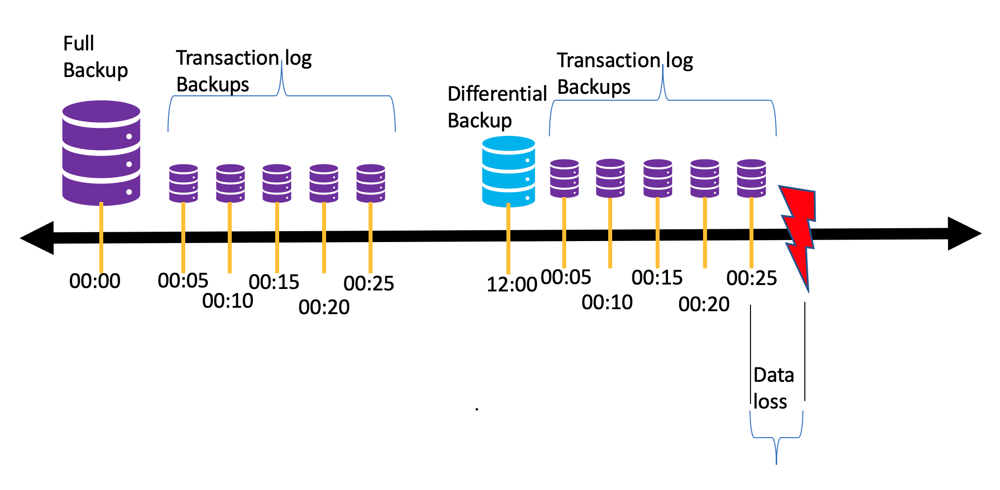

## Point-in-time Restore

Azure Arc-enabled SQL Managed Instance (MI) has a built-in automatic backup feature that is enabled to reduce the administration overhead needed to manage and maintain the Arc-enabled SQL MI. The built-in automatic backups create and schedule full backups, differential, and transaction log backups of every database added to an Arc-enabled SQL MI to assist in providing recoverability of your data. All database backups are stored locally on the storage class specified during deployment.

Currently, full backups are taken once a week, differential backups every 12 hours, and transaction log backups every 5 minutes.

Point-in-time restore (PITR) allows the restoration of a database to a point in time from a database backup within the configured retention period to the same Arc-enabled SQL MI on which the backup was taken.

The example above shows the initial full backup, some of the transaction log backups taken every 5 minutes over a 12-hour period before the first differential backup, followed by the remaining transaction log backups taken every 5 minutes up to the point in time an issue is experienced.  

The PITR process allows the recovery to any point in time that you choose within the set of backups held locally inside the configured retention period. You can complete this process using either the [`az sql midb-arc restore`](/cli/azure/sql/midb-arc?view=azure-cli-latest&preserve-view=true) CLI command or Azure Data Studio.

The retention period for the automated Azure SQL MI backups is configurable, allowing you to determine the duration you need to retain the automated backups. The retention period is configurable using this CLI command [`az sql mi-arc update`](/cli/azure/sql/mi-arc?view=azure-cli-latest&preserve-view=true#az-sql-mi-arc-update) with the parameter --retention-days with the following values:

-   0; disable automatic backups.
-   1-35 days (7 is the default)

## Implementing Disaster Recovery with Azure Failover Groups

Implementing Azure Failover Groups requires a complete duplicate of resources to be provisioned on both sites:

- 2 * Kubernetes clusters
- 2 * storage capacity requirements
- 2 * CPU capacity requirements
- 2 * Memory capacity requirements

The **General Purpose Tier** of Arc-enabled SQL MI provides the same resource limits as SQL Server Standard Edition. It deploys a single replica in which to run the SQL Server container image. Implementing Azure Failover Groups to provide Disaster Recovery requires a single replica to be deployed in the secondary site.

The **Business Critical Tier** of Arc-enabled SQL MI provides the same resource limits as Enterprise Edition. It deploys up to 3 replicas, each with its own dedicated persisted storage, CPU, and Memory resources. Implementing Azure Failover Groups to provide Disaster Recovery requires the same number of replicas to be deployed in the secondary site.

For example, if the deployment has 3 replicas in site 1, the Kubernetes cluster in site 2 must be deployed with 3 replicas.

Capacity resource planning is required to ensure both environments have duplicate capacity configured and available.

The failover process from the primary site to the secondary site is achieved via a **[manual failover](/azure/azure-arc/data/managed-instance-disaster-recovery#manual-failover-from-primary-to-secondary-instance)** using the `az sql instance-failover-group-arc update` CLI command. This process allows for a gracious failover from the primary site to a secondary site ensuring all remaining transactions from the primary site are replicated and applied to the secondary site.

If a gracious failover is not an option due to the primary site Arc-enabled SQL MI not being available, a **[forced failover](/azure/azure-arc/data/managed-instance-disaster-recovery#forced-failover)** is required, using the same CLI command with the `force-primary-allow-data-loss` command option. This has the potential for some data loss as the primary site is unavailable at the time of the failover.
