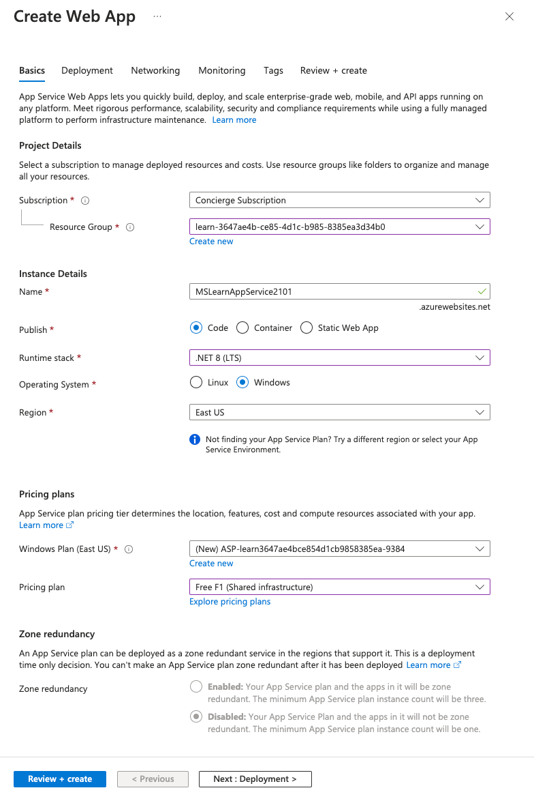
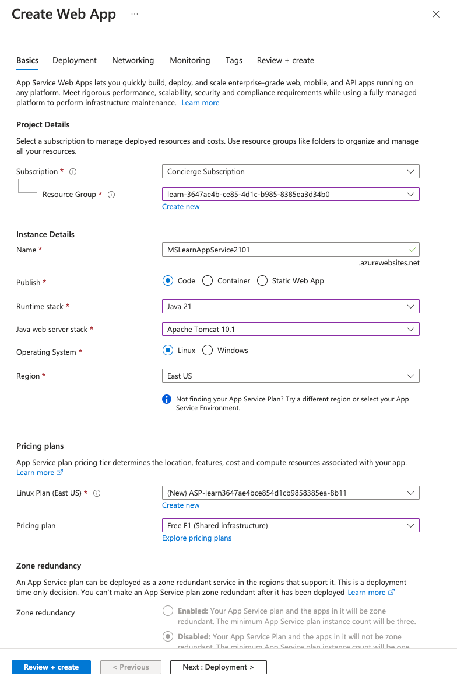
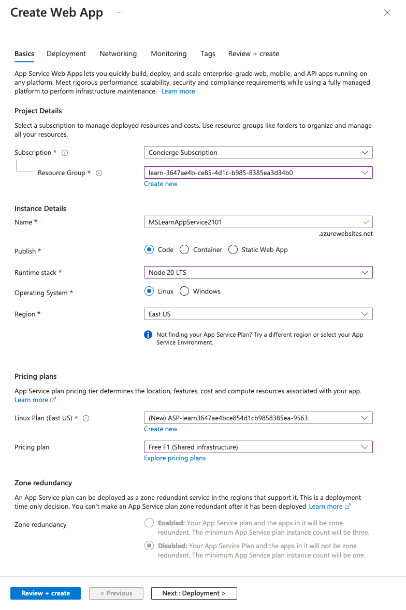
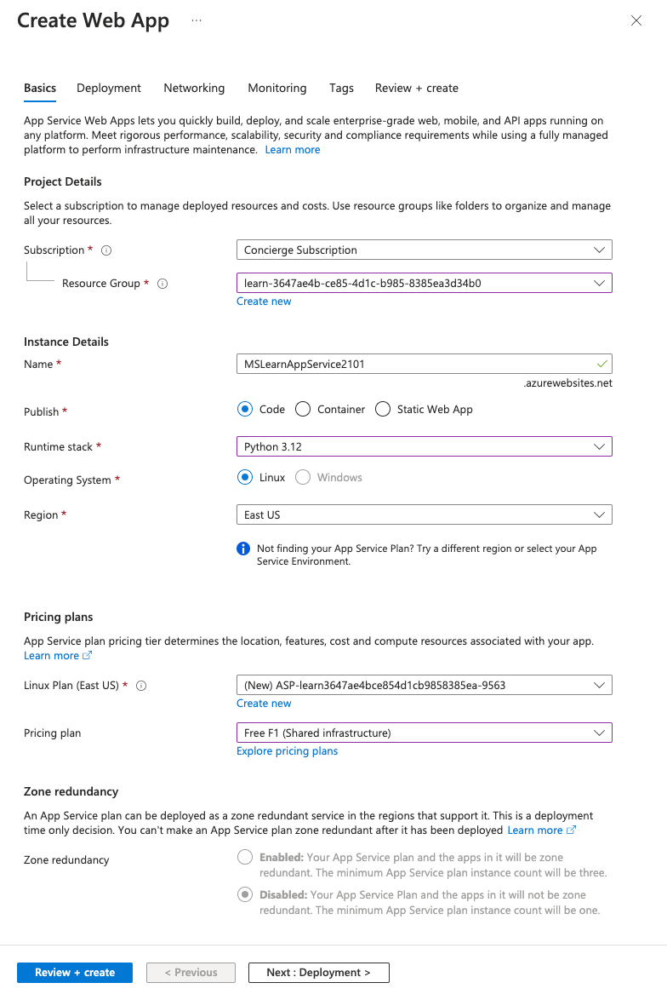
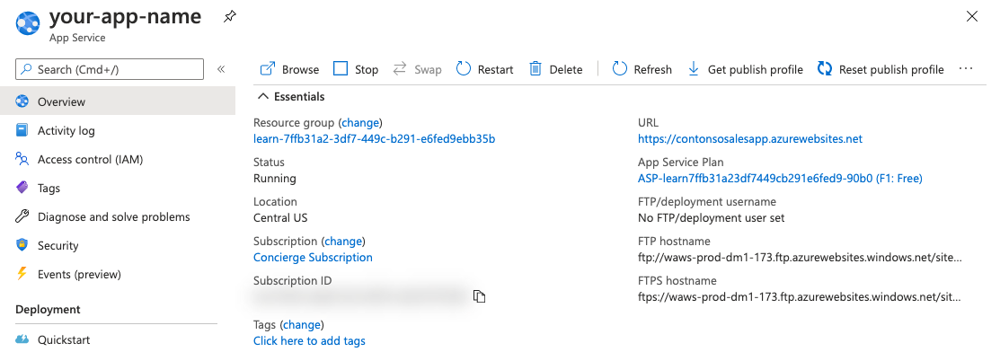

In this unit, you will use the Azure portal to create a web app.

## Create a web app

Sign into the [Azure portal](https://portal.azure.com/learn.docs.microsoft.com?azure-portal=true) using the same account you activated the sandbox with.

::: zone pivot="csharp"

1. On the Azure portal menu or from the **Home** page, select **Create a resource**. Everything you create on Azure is a resource.

1. The portal navigates you to the **Marketplace** page. From here, you can search for the resource you want to create or select one of the popular resources that people create in the Azure portal.

1. Select **Web** > **Web App** to display the web app creation wizard.

1. Fill out the wizard with the following values:

    | Field | Value | Details |
    |---|---|---|
    | **Subscription** | Concierge Subscription | The web app you are creating must belong to a resource group. Here, you select the Azure subscription to which the resource group belongs (or will belong, if you are creating it within the wizard). |
    | **Resource Group** | Select <rgn>[Sandbox resource group]</rgn> from the menu | The resource group to which the web app will belong. All Azure resources must belong to a resource group. |
    | **Name** | *Enter a unique name* | The name of your web app. This name will be part of the app's URL: *appname*.azurewebsites.net.  The name you choose must be unique among all Azure web apps. |
    | **Publish** | Code | The method you will use to publish your application. When publishing your application as code, you also must configure **Runtime stack** to prepare your App Service resources to run your app. |
    | **Runtime stack** | .NET Core 3.1 (LTS) | The platform on which your application runs. Your choice may affect whether you have a choice of operating system - for some runtime stacks, App Service supports only one operating system. |
    | **Operating System** | Linux | The operating system used on the virtual servers that run your app. |
    | **Region** | Central US | The geographical region from which your app will be hosted. |
    | **Linux Plan** | *Leave default* | The name of the App Service plan that will power your app. By default, the wizard will create a new plan in the same region as the web app. |
    | **Sku and size** | F1 | The pricing tier of the plan being created. This determines the performance characteristics of the virtual servers that power your app, and the features it has access to. To select the F1 tier, select **Change size** to open the Spec Picker wizard. On the **Dev / Test** tab, select **F1** from the list, then select Apply. |

    

::: zone-end

::: zone pivot="java"

1. On the Azure portal menu or from the **Home** page, select **Create a resource**. Everything you create on Azure is a resource.

1. The portal navigates you to the **Marketplace** page. From here, you can search for the resource you want to create or select one of the popular resources that people create in the Azure portal.

1. Select **Web** > **Web App** to display the web app creation wizard.

1. Fill out the wizard with the following values:

    | Field | Value | Details |
    |---|---|---|
    | **Subscription** | Concierge Subscription | The web app you are creating must belong to a resource group. Here, you select the Azure subscription to which the resource group belongs (or will belong, if you are creating it within the wizard). |
    | **Resource Group** | Select <rgn>[Sandbox resource group]</rgn> from the menu | The resource group to which the web app will belong. All Azure resources must belong to a resource group. |
    | **Name** | *Enter a unique name* | The name of your web app. This name will be part of the app's URL: *appname*.azurewebsites.net.  The name you choose must be unique among all Azure web apps. |
    | **Publish** | Code | The method you will use to publish your application. When publishing your application as code, you also must configure **Runtime stack** to prepare your App Service resources to run your app. |
    | **Runtime stack** | Tomcat 9.0 | The platform on which your application runs. Your choice may affect whether you have a choice of operating system - for some runtime stacks, App Service supports only one operating system. |
    | **Operating System** | Linux | The operating system used on the virtual servers that run your app. |
    | **Region** | Select *West US* or *Central US* | The geographical region from which your app will be hosted. |
    | **Linux Plan** | *Leave default* | The name of the App Service plan that will power your app. By default, the wizard will create a new plan in the same region as the web app. |
    | **Sku and size** | F1 | The pricing tier of the plan being created. This determines the performance characteristics of the virtual servers that power your app, and the features it has access to. To select the F1 tier, select **Change size** to open the Spec Picker wizard. On the **Dev / Test** tab, select **F1** from the list, then select Apply. |

    

::: zone-end

::: zone pivot="node"

1. On the Azure portal menu or from the **Home** page, select **Create a resource**. Everything you create on Azure is a resource.

1. The portal navigates you to the **Marketplace** page. From here, you can search for the resource you want to create or select one of the popular resources that people create in the Azure portal.

1. Select **Web** > **Web App** to display the web app creation wizard.

1. Fill out the wizard with the following values:

    | Field | Value | Details |
    |---|---|---|
    | **Subscription** | Concierge Subscription | The web app you are creating must belong to a resource group. Here, you select the Azure subscription to which the resource group belongs (or will belong, if you are creating it within the wizard). |
    | **Resource Group** | Select <rgn>[Sandbox resource group]</rgn> from the menu | The resource group to which the web app will belong. All Azure resources must belong to a resource group. |
    | **Name** | *Enter a unique name* | The name of your web app. This name will be part of the app's URL: *appname*.azurewebsites.net.  The name you choose must be unique among all Azure web apps. |
    | **Publish** | Code | The method you will use to publish your application. When publishing your application as code, you also must configure **Runtime stack** to prepare your App Service resources to run your app. |
    | **Runtime stack** | Node LTS | The platform on which your application runs. Your choice may affect whether you have a choice of operating system - for some runtime stacks, App Service supports only one operating system. |
    | **Operating System** | Linux | The operating system used on the virtual servers that run your app. |
    | **Region** | Select *West US* or *Central US* | The geographical region from which your app will be hosted. |
    | **Linux Plan** | *Leave default* | The name of the App Service plan that will power your app. By default, the wizard will create a new plan in the same region as the web app. |
    | **Sku and size** | F1 | The pricing tier of the plan being created. This determines the performance characteristics of the virtual servers that power your app, and the features it has access to. To select the F1 tier, select **Change size** to open the Spec Picker wizard. On the **Dev / Test** tab, select **F1** from the list, then select Apply. |

    

::: zone-end

::: zone pivot="python"

1. On the Azure portal menu or from the **Home** page, select **Create a resource**. Everything you create on Azure is a resource.

1. The portal navigates you to the **Marketplace** page. From here, you can search for the resource you want to create or select one of the popular resources that people create in the Azure portal.

1. Select **Web** > **Web App** to display the web app creation wizard.

1. Fill out the wizard with the following values:

    | Field | Value | Details |
    |---|---|---|
    | **Subscription** | Concierge Subscription | The web app you are creating must belong to a resource group. Here, you select the Azure subscription to which the resource group belongs (or will belong, if you are creating it within the wizard). |
    | **Resource Group** | Select <rgn>[Sandbox resource group]</rgn> from the menu | The resource group to which the web app will belong. All Azure resources must belong to a resource group. |
    | **Name** | *Enter a unique name* | The name of your web app. This name will be part of the app's URL: *appname*.azurewebsites.net.  The name you choose must be unique among all Azure web apps. |
    | **Publish** | Code | The method you will use to publish your application. When publishing your application as code, you also must configure **Runtime stack** to prepare your App Service resources to run your app. |
    | **Runtime stack** | Python 3.7 | The platform on which your application runs. Your choice may affect whether you have a choice of operating system - for some runtime stacks, App Service supports only one operating system. |
    | **Operating System** | Linux | The operating system used on the virtual servers that run your app. |
    | **Region** | Select *West US* or *Central US* | The geographical region from which your app will be hosted. |
    | **Linux Plan** | *Leave default* | The name of the App Service plan that will power your app. By default, the wizard will create a new plan in the same region as the web app. |
    | **Sku and size** | F1 | The pricing tier of the plan being created. This determines the performance characteristics of the virtual servers that power your app, and the features it has access to. To select the F1 tier, select **Change size** to open the Spec Picker wizard. On the **Dev / Test** tab, select **F1** from the list, then select Apply. |

    

::: zone-end

Select **Review and Create** to navigate to the review page, then select **Create** to create the app.

> [!NOTE]
> It can take a few seconds to get your web app created and ready for your use.

The portal will display the deployment page, where you can view the status of your deployment. Once the app is ready, navigate to the new app in the Azure portal:

1. On the Azure portal menu or from the **Home** page, select **All resources**.

1. Select the App Service for your web app from the list. Make sure to select the App Service, and not the App Service plan.

    

    The portal displays the web app overview page.

    

1. To preview your new web app's default content, select its **URL** at the top right. The placeholder page that loads indicates that your web app is up and running and ready to receive deployment of your app's code.

::: zone pivot="csharp"

Leave the browser tab with the new app's placeholder page open. You'll come back to it after you've deployed your app.

::: zone-end

::: zone pivot="java"

::: zone-end

::: zone pivot="node"

::: zone-end

::: zone pivot="python"

::: zone-end
