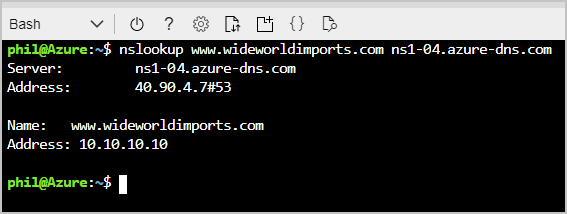

In the previous unit, we described setting up and configuring the wideworldimports.com domain to point to your Azure hosting on Azure DNS.

In this unit, you'll:

- Set up an Azure DNS and create a public DNS zone.
- Create an A record.
- Verify that the A record resolves to an IP address.

## Create a DNS zone in Azure DNS

Before you can host the wideworldimports.com domain on your servers, you need to create a DNS zone. The DNS zone holds all the configuration records associated with your domain.

To create your DNS zone:

1. Sign in to the [Azure portal](https://portal.azure.com/learn.docs.microsoft.com?azure-portal=true) with the account you used to activate the sandbox.

1. Select **Create a resource**.

1. Search for and select **DNS zone**. The **DNS zone** pane appears.

1. Select **Create**.

    

1. On the **Basics** tab, enter the following values for each setting.

    |Setting  |Value |
    |---------|---------|
    | **Project details** |
    |Subscription  |  Concierge subscription  |
    |Resource group  |  <rgn>[sandbox resource group]</rgn> |
    | **Instance details** |
    |Name  |   The name needs to be unique in the sandbox. Use `wideworldimportsXXXX.com` where you replace the Xs with letters or numbers. |

    

1. Select **Review + create**.

1. After validation passes, select **Create**. It will take a few minutes to create the DNS zone.

1. Select **Go to resource**.

   By default, the NS and SOA records are automatically created. The NS record defines the Azure DNS name spaces and contains the four Azure DNS record sets. You use all four record sets when you update the registrar.

   The SOA record represents your domain, and is used when other DNS servers are searching for your domain.

1. Make a note of the NS record values. You need them in the next section.

## Create a DNS record

Now that the DNS zone exists, you need to create the necessary records to support the domain.

The primary record to create is the A record. This record contains the pairing between the IP address and the domain name. The A record can have multiple entries, called record sets. In record sets, the domain name remains constant, while the IP addresses are different.

1. On the **wideworldimportsXXXX.com - DNS zone** pane, in the upper menu bar, select **Record set**.

    

1. The **Add record set** pane appears. Enter the following values for each setting.

    |Setting  |Value |Description  |
    |---------|---------|---------|
    |Name     |   www      | The host name that you want to resolve to an IP address. |
    |Type    |     A    |  The A record is the most commonly used. If you're using IPv6, select the **AAAA** type.     |
    |Alias record set    | No   | This can only be applied to A, AAAA, and CNAME record types.  |
    |TTL     |      1  | The time-to-live period, which specifies how long each DNS server caches the resolution before it's purged.        |
    |TTL unit     |    Hours     |  This value can be seconds, minutes, hours, days, or weeks. Here, you're selecting hours.  |
    |IP Address    |    10.10.10.10     |  The IP address the record name resolves to. In a real-world scenario, you would enter the public IP address for your web server. |

    

1. Select **OK** to add the record to your zone.

Note that it's possible to have more than one IP address set up for your web server. In that case, you add all the associated IP addresses as part of a record set. You can update the record set after it's created with additional IP addresses.

## Verify your global Azure DNS

In a real-world scenario, after you create the public DNS zone, you update the NS records of the domain-name registrar, to delegate the domain to Azure.

Even though we don't have a registered domain, it's still possible to verify that the DNS zone works as expected, by using the nslookup tool.

### Use nslookup to verify the configuration

Here's how to use `nslookup` to verify the DNS zone configuration.

1. Use Cloud Shell to run the following command. Replace the DNS zone name with the zone you created. Also replace the name server address with one of the NS values you copied after you created the DNS zone.

    ```bash
    nslookup www.wideworldimportsXXXX.com <name server address>
    ```

   The command should look something like the following:

    ```bash
    nslookup www.wideworldimportsXXXX.com ns1-07.azure-dns.com
    ```

1. You should see that your host name `www.wideworldimportsXXXX.com` resolves to 10.10.10.10.

   

You have successfully set up a DNS zone and created an A record.
