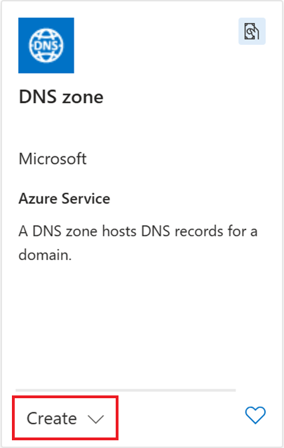
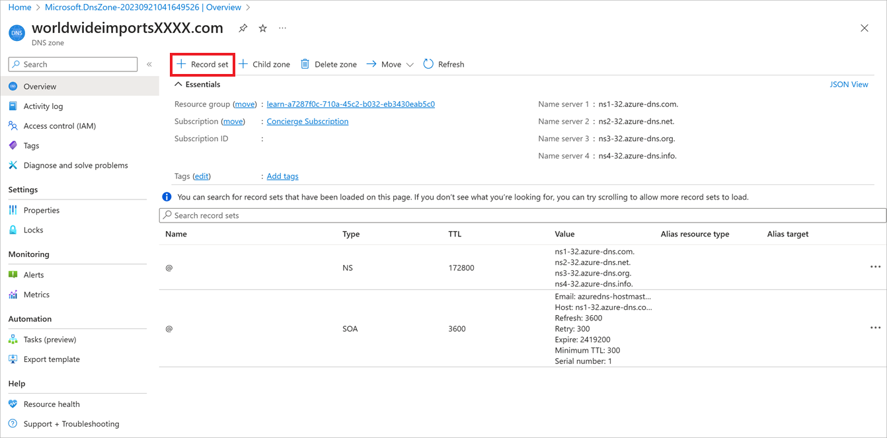

In the previous unit, we discussed how you might go about setting up and configuring the widewworldimports.com domain to point to your Azure hosting on Azure DNS.

In this unit, you'll:

- Set up an Azure DNS and create a public DNS zone
- Create an A Record
- Verify the A record resolves to an IP address

[!include[](~/includes/azure-sandbox-activate.md)]

## Create a DNS Zone in Azure DNS

Before you can host the wideworldimports.com domain on your servers, you need to create a DNS zone. The DNS zone holds all the configuration records associated with your domain.

To create your DNS zone, follow these steps:

1. Sign in to the [Azure portal](https://portal.azure.com/learn.docs.microsoft.com?azure-portal=true) with the account you used to activate this sandbox.
1. Select the **+ Create a resource**.
1. In the search area type: **DNS zone**, then select search.
1. When presented with the Azure DNS page, select **Create**.

    
1. From the create DNS zone page:

    
    
    - Under Project details, for the **Resource group** select the created resource group.
    - Under Instance details, enter **wideworldimports.com** for the **Name**.
    - Choose a Resource group location close to you.

1. Select **Review + create**.
1. Select **Create**.

It will take a few moments to create the DNS zone.

By default the NS and SOA records are automatically created. The NS record defines the Azure DNS name spaces. These records will be used to update the domain registrar's NS record so that it points to the Azure DNS. The NS record contains the four Azure DNS recordsets. When updating the registrar, use all four.

The SOA record, or start of authority represents your domain, and is used when other DNS servers are searching for your domain.

Make a note of the NS record values as you'll need them next.

## Create a DNS record

Now the DNS zone exists, you will need to create the necessary records to support the domain.

The primary record to create is the A record. This record contains the pairing between the IP address and the domain name. The A record can have multiple entries, called recordsets. When using recordsets, the domain name remains constant, while the IP address will be different.

1. On the Azure portal, select **All Resources**.
1. Either locate or search for **wideworldimports.com**.

    

1. Select the **+ Record set** from the navigation strip at the top of the page. This allows you to create a new record for the DNS zone.
1. You'll be presented with the Add record set page. Enter the following details:

    

    - **Name** - is the host name that will get resolved. Lets allow FQDN support. Type: **www**
    - **Type** - Select **A**. The A record is, by far, the most commonly used. If you are using IPv6, you would select the **AAAA** type.
    - **Alias record set** - can only be applied to A, AAAA, and CNAME record types. Accept the default of: **No**
    - **TTL** - is the time-to-live period. Which specifies how long each DNS server will cache the resolution before it is purged. Type: **1**
    - **TTL unit** - allows you to specify the TTL unit, which can be: Seconds, Minutes, Hours, Days, and Weeks. Accept the default value of: **hours**.
    - **IP Address** - Since we are setting up this domain to point to your website this must be the IP address of the server hosting your website. Type: **10.10.10.10**

1. Select **OK** to add the record to your zone.

> [!NOTE]
> In a real-world scenario, you may well have more than one IP address set up for your webserver. In which cause you would add all the associated IP addresses as part of a recordset. Which can be done before or after you press the OK button to create the record.

## Verify your public Azure DNS

In a real-world scenario, once you have created the public DNS zone you will update the domain name registrar NS records with the Name Space settings from the Azure DNS zone. By delegating the domain to Azure, you are enabling public internet access to the domain.

Even though we don't have a registered domain, it is still possible to verify the DNS zone is working as expected. You will use the nslookup tool.

If you made a note of the DNS zone name server values, you can skip over the next section.

### Get the Azure DNS zone name space values

1. On the Azure portal, use the resource group and find myResourceGroup.
  
1. Open the  wideworldimports.com DNS zone.
1. Select one of the Name Servers from either the summary or from the NS record entry.

### Use nslookup to verify the configuration

In this step, you will use `nslookup` to verify the DNS zone configuration.

1. Using the Cloud Shell on the right.
1. Use `nslookup` to check the DNS record.

    ```bash
    nslookup www.wideworldimports.com <name server address>
    ```

Replace the name server address with you the name server you got in the previous step. For example, ns1-09.azure-dns.com.

When this command is executed, you will see the host name `www.wideworldimports.com` resolves to `10.10.10.10` as expected.


You have successfully setup a DNZ zone and created an A record.
