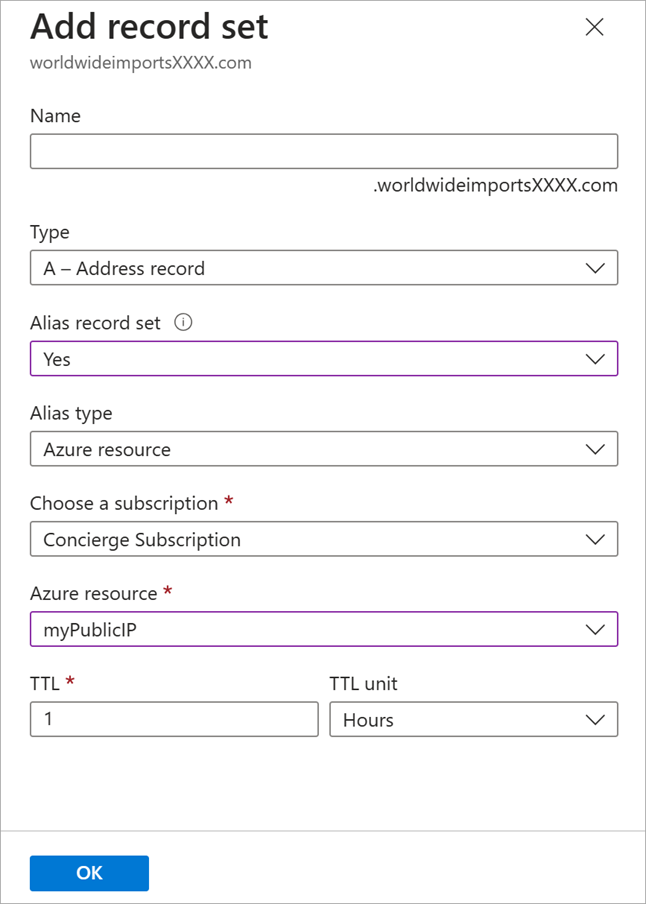

The deployment of your new website has been a huge success. Usage volumes are much higher than anticipated and the single web server it's running on is showing signs of strain. The solution is to increase the number of servers and distribute the load using a load balancer.

You now know you can use an Azure alias record to provide a dynamic, auto refreshing, link between the zone apex and the load balancer.

In this unit, you'll:

- Set up a virtual network with two VMs and a load balancer.
- Learn how to configure an Azure alias at the zone apex to direct to the load balancer.
- Verify the domain name resolves to one or either of the VMs on your virtual network

## Set up a virtual network, Load balancer, and VMs in Azure

Manually creating a virtual network, load balancer, and two VMs will take some time. To improve set up time, you can use a Bash setup script, which is available on GitHub. Follow these instructions to create a test environment for your alias record.

1. Using the Cloud Shell, clone the setup script.

    <!-- Replace with new repo - script.sh and cloud-init.txt in resources folder -->
    ```bash
    git clone https://github.com/MicrosoftDocs/mslearn-host-domain-azure-dns.git
    ```

1. To run the set-up script, type these two commands:

    ```bash
    cd mslearn-host-domain-azure-dns
    chmod +x setup.sh
    ./setup.sh
    ```

    The setup script is going to take a few minutes to run. The script will:

    - Creates a network security group
    - Create two NIC's and two VMs
    - Create a virtual network and assign the VMs
    - Create a public IP address and update the configuration of the VMs
    - Create a load balancer referencing the VMs, including load balancer rules.
    - Link the NICs to the load balancer

    Once the script is completed, it will show you the public IP address for the load balancer. Make a note since we will use it later.

## Create an alias record in your zone apex

Now that you've created a suitable test environment, you're ready to set up the Azure alias record in your zone apex.

1. On the Azure portal, navigate the <rgn>[Sandbox resource group.
1. From the list of resources available in this resource group, select **myPublicIP**.
1. Find and make a note of the IP address.
   
1. Return to the resource groups list and select **myResourceGroup**.
1. Select the **wideworldimports.com** DNS zone.
1. Select **+ Record set**.
1. Use the following settings to create an alias record.

    | Field | Setting |
    | ---- | ---- |
    | Name | Leave the name blank. By leaving it blank, it indicates the DNS zone for wideworldimports.com |
    | Type | **A**. Even though we're creating an alias, the base record type still needs to either: A, AAAA or CNAME |
    | Alias record set | **Yes** |
    | Alias type | You can select either Azure resource or Zone record set. In this case, select the **Azure resource** |
    | Azure Resource | From the drop-down list of resource, select the **myPublicIP** resource |

    When you're done, it should look like this.

    

1. Select **OK** to add the record to your zone.

When the new alias record is created, it should look something like this:


## Verify alias is resolving to the load balancer

Now you need to verify the alias record has been correctly set up.  In a real world scenario, you'll have an actual domain and you would have completed the domain delegation to the Azure DNS.  In that instance, you would use the registered domain name.  Since this unit assumes there's no registered domain, you'll use the public IP address:

1. In a web browser, open a new page.
1. In the URL address line, type in the public IP address you copied above.
1. You'll now see a basic web page, showing the name of the first VM the load balancer sends the request to.

The aim of this test is to check that the alias record is correctly pointing to the load balancer.
