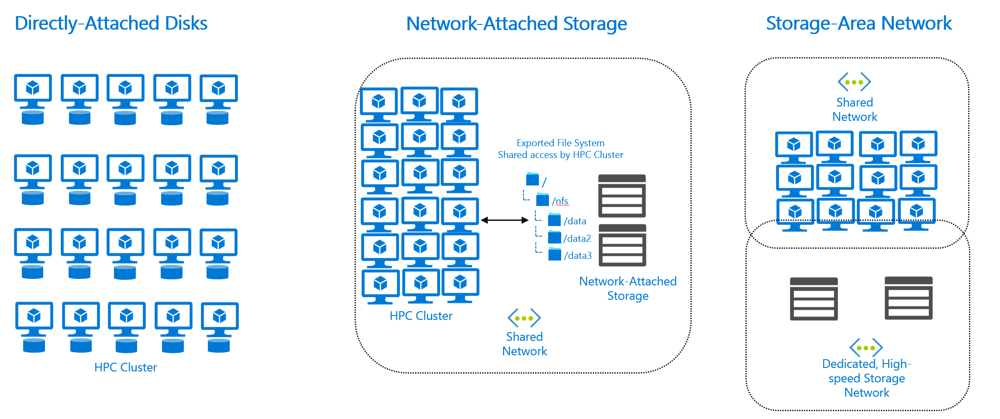

Storage access is an important part of planning for HPC workload performance. You need to make sure that the required data gets to the HPC cluster machines at the right time. You also need to make sure results from those individual machines are quickly saved and available for further analysis.

Files can include different kinds of data, including:

- Unstructured data, like images, documents, or media files.
- Time series data from various sources.
- Pricing data (like stock-price history).
- Assets used for computational analysis, like genomic data, radiological imagery, or weather simulation.

The data is assumed to be in one or more storage solutions in your local environment. Storage architectures in this context include:

- Directly attached disks. That is, each machine in the HPC cluster has its own local storage disks.
- Storage area network (SAN) solutions.
- Network-attached storage (NAS) solutions.

The data might be created locally by analysts, artists, researchers, or scientists. It might also be periodically acquired from third parties and deposited in your local storage solution.

## Types of file access

The general file-access use cases we'll discuss in this module are limited to these activities:

- Loading and running job code, libraries, and/or toolchains on the HPC cluster machines.
- Reading source data for a job. For example, daily pricing data, genomic data, or satellite data.
- Intermediate,  or *scratch*, writes. Certain jobs require that initial data be processed and the output of that processing become new input for downstream activity.
- Writing out the results of a job. This use case involves placing the data in a desirable location for further consumption. For example, rendering a video and placing the rendered results in a shared volume for use.

## How do HPC machines get working set data?

Machines in the HPC cluster access files either through a directly attached disk or through a network export or share. In both cases, the files are presented in a local path (for example, /mnt/data).

The code and scripts that make up the actual HPC job assume the files are accessible on this file system and use the machine's file-access capabilities to obtain the files. For example, a machine running Linux that needs to access a file located on a NAS would use the Network File System (NFS) protocol and NFS client packages installed as part of the operating system.

## Understand file metadata

A file stores actual data (for example, an image or lines of text) and additional information known as *metadata*. This metadata exists either within the file data or in a directory. It's important to understand this metadata in the context of HPC file-system performance.

Metadata is a set of values that describes attributes of data but that isn't part of the data. For example, metadata tells you when a file was created and modified, who created the file, and who has permissions to access it.

When a file is created, there are metadata operations that allocate the structures and update directory entries for the file. These operations happen before data is written to the file.
