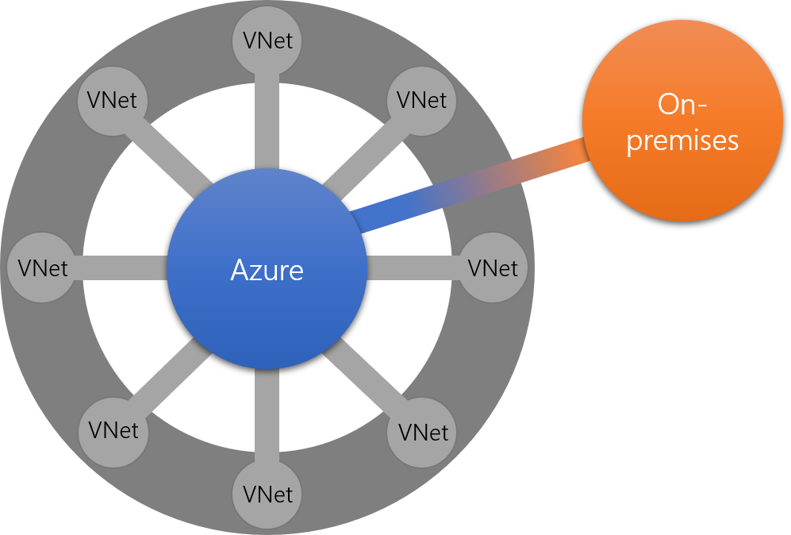
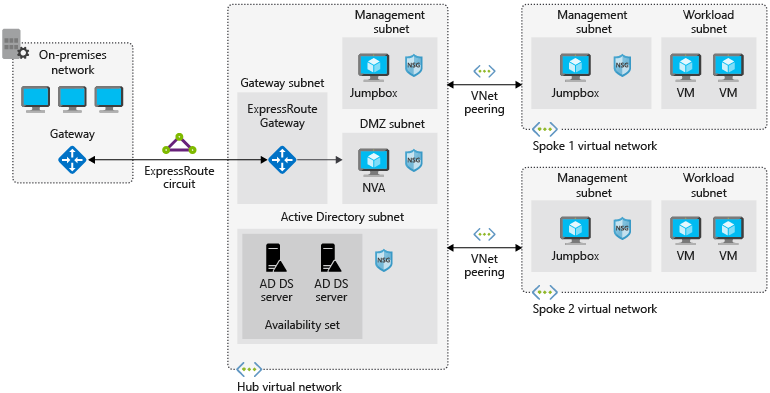

By using Virtual Networks, Networking Security Groups, Virtual Network peering, and ExpressRoute in Azure you can create different network topologies hosted in the cloud.

Your company is planning a migration of your on-premises resources to Azure. Your headquarters host the companies central data center, which will eventually migrate completely to Azure. Initially you've been asked to move some of your satellite offices into the cloud, while also maintaining the connectivity to your headquarters. The ultimate goal for the migration is to host all your computing resources on Azure.

In this unit, you'll explore the hub and spoke architecture, the topology, the components that are needed in Azure, and how to plan implementing infrastructure using this model.

## Hub and spoke architecture foundations

A hub and spoke consists of a centralized architecture (a hub) connecting to multiple points (spokes). When drawn, it looks similar to a wheel, with a hub at the center and spokes connected to it. This model in Azure organizes your network infrastructure into multiple connected virtual networks (VNets). This architecture provides an efficient way to manage common communication, security requirements, and potential subscription limitations.

Implementing a hub and spoke architecture can have the following benefits:

- A centrally managed connection to your on-premises environment.
- Integration of separate working environments into a central location for shared services.
- Traffic routing through the central hub, so workloads can be managed centrally.

## Introduction to the hub-spoke topology

Hub-spoke networks are commonly used for hybrid cloud architectures. As it's simpler to implement and maintain in the longer term. The hub is a virtual network that acts as a central location for managing external connectivity, and hosting services used by multiple workloads. The hub coordinates all communications to and from the spokes. Traffic can be inspected, routed, and managed centrally by IT rules or processes like security. The spokes are virtual networks that host workloads and connect to the central hub through virtual network peering.

Hub and spoke topologies offer several business benefits:

- Increased business agility by standardizing on network connections. Organizations can adapt to changing markets, adding a new branch in a different geopolitical region, or a new business channel, as spokes.
- Liability reduction by maintaining a consistent architecture. As the business grows, or traffic volumes increase, it's simple to add more systems. The implementation is that much easier as it's a repeat of previously completed work.
- Greater visibility into the business, with data flowing through the same place. The hub is the core of the business and provides the foundations for deeper business insights, as it processes every piece of information belonging to the organization.
- Shares centralized services by multiple workloads into a single location, and gives the ability to minimize redundant resources or effort to manage them.

## Walk-through of architectural components

A reference architecture for a hub-spoke topology is explained in the Azure documentation. The image above shows the proposed architecture of a pattern to extend your on-premises environment to Azure. 

The hub is a Virtual Network in Azure that's the center point for your businesses' connectivity. Shared services are hosted in their own subnets for sharing with the spokes, and a DMZ subnet to act as a security appliance. 

The spokes are also VNets in Azure used to isolate individual workloads. The traffic flow between the on-premises headquarters and Azure is connected through an ExpressRoute that's in its own gateway subnet. The VNets from the spokes to the hub are peered together.

The hub, and each spoke, can be implemented in separate subscriptions, or resource groups, and peered together. These subscriptions, or resource groups, then share the central services (AD DS Server) providing management for shared services in the hub but decentralizing each workload.

The components included in this architecture are:

- **Azure Virtual Networks**: Azure Virtual Networks (**VNets**) are a representation of your own IT network but contained within the cloud, logically isolating dedicated organizational resources in your subscriptions.
- **Azure VPN Gateway**: Azure VPN Gateway is the bridge between your on-premises network and Azure.  VPN gateways are a special type of Virtual Network gateway that sends encrypted traffic between the two networks over the internet.
- **Azure ExpressRoute**: Azure ExpressRoute is a different service you use to extend on-premises networks to Azure. ExpressRoute is a service in Azure that allows you to extend on-premises networks over a private connection.
