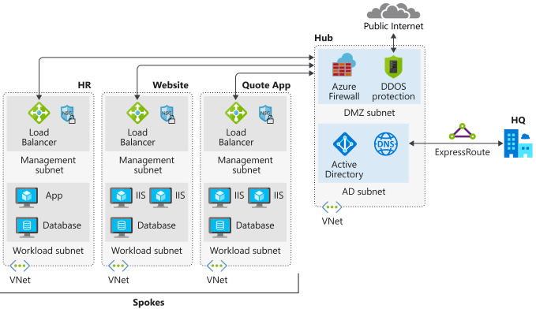

You need to deploy your network infrastructure in a hub and spoke configuration for your resources. Additionally, your internal HR department wants to host a new internal HR system that shouldn't be accessible from the internet. The system should be accessible to everyone in the company, whether they work at headquarters or in a satellite office.

In this exercise, you'll deploy your network infrastructure, and then create a new virtual network to host the servers for your company's new HR system.



## Environment setup

This deployment will create the Azure network resources matching the preceding diagram. With these resources in place, you can add the new HR virtual network.

First, create the virtual networks and subnets for your server resources. Run the following command:

```azurecli
az group deployment create \
    --resource-group <rgn>[sandbox resource group name]</rgn> \
    --template-uri https://raw.githubusercontent.com/MicrosoftDocs/mslearn-hub-and-spoke-network-architecture/master/azuredeploy.json
```

## Create a new spoke in your virtual network

You can create a virtual network with the Azure portal, Azure CLI, or Azure PowerShell. Let's do the rest of this exercise through the Azure portal.

1. Sign in to the [Azure portal](https://portal.azure.com/learn.docs.microsoft.com?azure-portal=true) by using the same account you used to activate the sandbox.

1. Select **Create a Resource** in the upper left of the Azure portal.

1. In the search box, enter **Virtual Network**, and then select the link with the same title in the list.

1. Select **Create** to start configuring the virtual network.

## Configure the virtual network settings

The resource creation experience on the portal is a wizard that walks you through the initial configuration for the virtual network.

1. Use the values below to create the virtual network:

    |Property name | Field property  |
    |---------|---------|
    |Name                   | **HRappVnet**     |
    |Address Space          | **10.10.0.0/16**  |
    |Subscription           | **Concierge subscription**         |
    |Resource Group         | **<rgn>[sandbox resource group name]</rgn>** |
    |Subnet – Name          | **HRsystems**   |
    |Subnet – Address Range | **10.10.1.0/24** |
    |DDoS Protection        | **Basic**        |
    |Service Endpoints      | **Disabled**     |
    |Firewall               | **Disabled**     |

    

1. Select **Create** to start provisioning the virtual network.

## Configure the hub virtual network peering

Now that you've created the third spoke, you need to configure the virtual network peering between the hub and spokes.

1. In the resources menu on the left, select **Virtual Networks**. You should see the **HubVNet**, **WebVNet**, **QuoteVNet**, and **HRappVnet** virtual networks.

1. Select **HubVNet**.

1. Select the **Peerings** blade in the settings menu on the left.

1. On the **Peerings** blade, select **Add**, and fill in the fields as follows:

    |Property name | Field property  |
    |---------|---------|
    |Name of the peering from hubVnet to HRappVnet     | **gwPeering_hubVNet_HRappVnet**      |
    |Peer Details     | **Resource Manager**        |
    |Subscription     | **Concierge subscription**        |
    |Virtual Network     |  **HRappVnet**       |
    |Name of the peering from HRappVnet to hubVnet     | **gwPeering_HRappVnet_hubVNet**      |
    |Allow virtual network access from hubVnet to HRappVnet  |   **Enabled**  |
    |Allow virtual network access from HRappVnet to hubVnet  |   **Enabled**  |
    |Allow forwarded traffic from HRappVnet to hubVnet  |   **Disabled**     |
    |Allow forwarded traffic from hubVnet to HRappVnet  |   **Disabled**     |
    |Configure gateways transit settings         |   **Unchecked**    |

1. Select **OK** to create the peering.

1. Close the **hubVNet** blade.

You've now peered the hub virtual network to the spoke virtual network. You've allowed traffic to be forwarded from the hub to the spoke, by using a VPN gateway in the configuration.

## Create a network security group for the virtual network

To configure traffic flow, create a network security group.

1. Select **Create a Resource** in the upper left corner of the Azure portal.

1. In the search box, enter **network security group**, and then select the link with the same title in the list.

1. Select **Create** to start configuring the virtual network.

1. Enter **HRNsg** for the name. Then select the **<rgn>[sandbox resource group name]</rgn>** resource group and the same location as **HRappVnet**.

1. Select **Create** to provision the network security group.

You've created a network security group that can be assigned to each of the virtual networks.

## Associate the network security group to the new HR virtual network

Now you associate the network security group to the virtual network.

1. Select **All services** in the upper left corner of the Azure portal.

1. In the search box, type **Network security group**, and then select **Network security groups**.

1. In the **Network security groups** blade, you should see the network security groups you created.

1. Select the network security group you created for the spoke, **HRNsg**.

1. Select the **Subnets** menu.

1. On the **Subnets** blade, select **Associate**.

1. Select the **HRappVnet** virtual network.

1. Select the **HRsystems** subnet.

1. Select **OK** to associate the network security group.

## Configure the network security group rule to stop inbound internet traffic

You have a security requirement to meet for the HR application to be hosted on HRappVnet. There shouldn't be any inbound internet traffic from the spoke, because only internal employees need access. Configure the network security group rule to meet this requirement.

1. On the **HRNsg** blade, select **Inbound security rules** in the menu.

1. On the **Inbound security rules** blade, select **Add**.

    |Property name | Field property  |
    |---------|---------|
    |Source             | Any  |
    |Source port ranges | *   |
    |Destination        | VirtualNetwork     |
    |Destination port ranges |  80,443  |
    |Protocol  | Any      |
    |Action    | Deny     |
    |Priority  | 100      |
    |Name      | Block-Inbound-HTTP-HTTPS |

1. Select **Add** to add the rule.

You've now blocked inbound internet access from the spoke on port 80.

In this scenario, you created a spoke Azure virtual network, and then peered it with an existing hub virtual network. You then secured the traffic from this spoke by blocking inbound internet access on port 80, while ensuring it can connect via the hub.