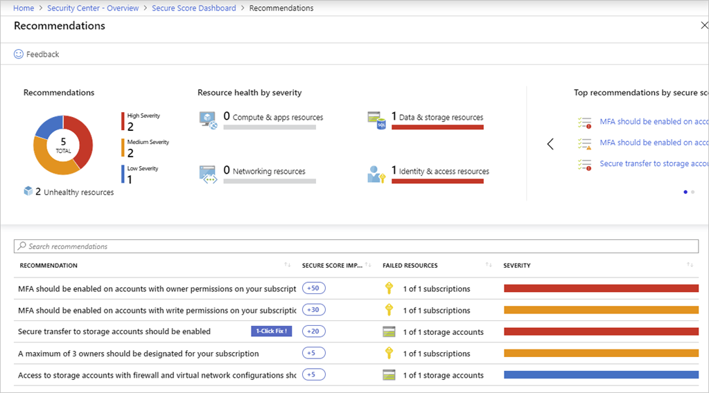
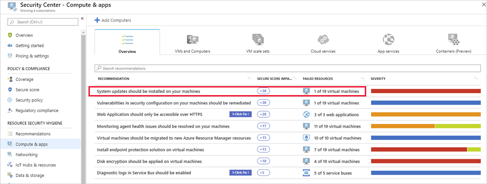
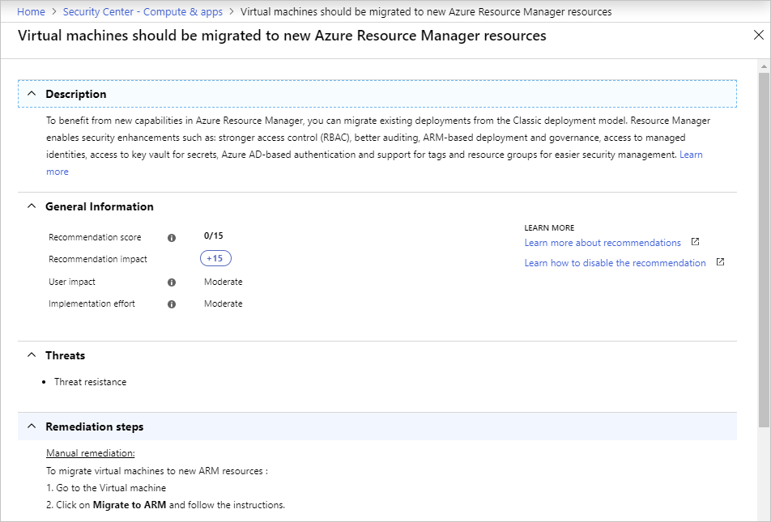
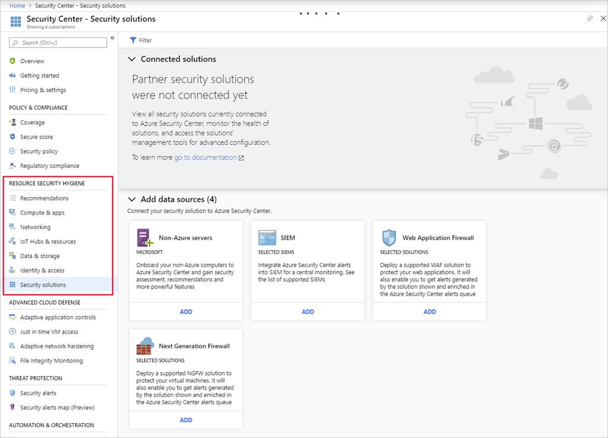
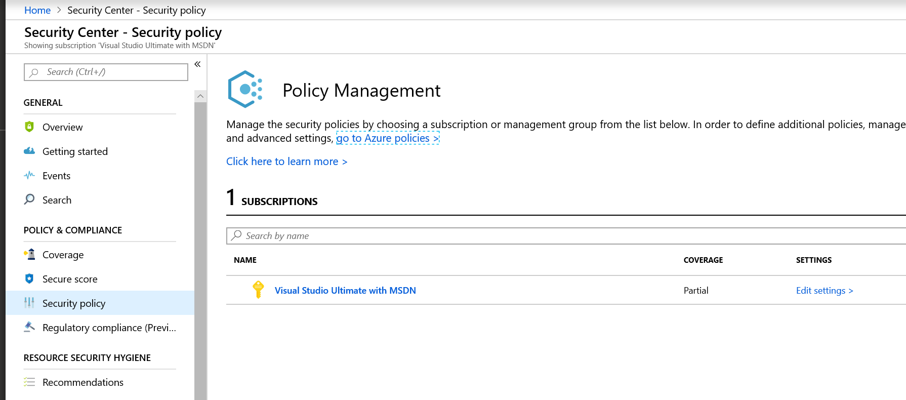
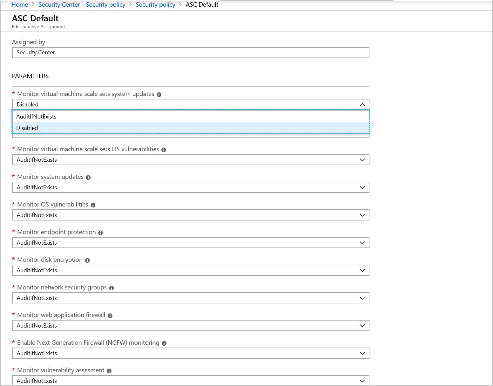

The assigned security policies create security recommendations. These recommendations can help to identify the current security state of your created workloads in Azure. Security Center reviews your security recommendations across all workloads, uses algorithms to determine how critical each recommendation is, and calculates a **Secure Score** which appears on the Overview page. The recommendation Secure Score is a calculation based on the ratio between your healthy resources and your total resources.

You can select the **Review your secure score >** link to get more information about each subscription, and the recommendations to improve your score.

Here you can identify the severity of the issue, and get help on correcting each violation. In some cases, Security Center can even fix the issue for you through the **1-Click Fix** tag as previously shown.

## View recommendations by category

Under the **RESOURCE SECURITY HYGIENE** header in Security Center, you can examine specific recommendations based on category. For example, the **Compute & apps** section of Azure Security Center provides recommendations for Azure VMs, non-Azure computers (standard-tier), App Services, Containers, and VM scale sets.

As in the secure score screen, some recommendations can be fixed directly from the Security Center dashboard while other issues require you to perform some steps on the resource. For example, in the previous image, the **System updates should be installed on your machines** will only give you the list of computers that need updates. To address this issue you would use a solution such as Windows Update Services (WSUS).

Each recommendation can be selected to get more details. For issues which need manual remediation, you will get a list of steps to perform. For example, selecting the **Virtual machines should be migrated to new Azure Resource Manager resources** will show the following screen.

VMs are particularly important to protect as they often have a broader attack surface than other compute resources. Azure Security Center helps you safeguard your VMs in Azure by providing visibility _into_ the security settings on each VM. As previously shown, Security Center can examine OS-level settings through the use of a _monitor_ service that it installs into each Windows and Linux VM. With this feature enabled, Security Center can provide several safeguards, including:

- OS security settings with the recommended configuration rules.
- System security updates and critical updates that are missing.
- Endpoint protection recommendations.
- Disk encryption validation.
- Vulnerability assessment and remediation.
- Threat detection.

### Other categories

Security Center lists similar sections for Networking, IoT Hubs, Data & storage, Identity & access, and other security products such as the Next Generation Firewall and Web Application Firewall.

Try selecting each item in the **RESOURCE SECURITY HYGIENE** section to see examples of recommendations Security Center makes for each area.

### Disable security recommendations

It's recommended to leave all the security policies enabled; however, sometimes a recommendation will be generated that isn't relevant to your environment. You can turn it off by disabling the security policy that is sending the recommendation.

1. In the **Policy & Compliance** section, select **Security policy**.

    

1. Select the subscription or management group that shouldn't show the recommendation.

    > [!NOTE]
    > Remember that a management group applies its policies to its subscriptions. Therefore, if you disable a subscription's policy, and the subscription belongs to a management group that still uses the same policy, you will continue to receive the policy recommendations. The policy will still be applied from the management level, and the recommendations will still be generated.

1. Select the assigned policy.

    

1. In the **PARAMETERS** section, locate the policy that sends the recommendation you want to disable, and from the dropdown list, select **Disabled**.

    

1. Select **Save** to persist your changes. The change can take up to 12 hours to replicate through the Azure infrastructure.
