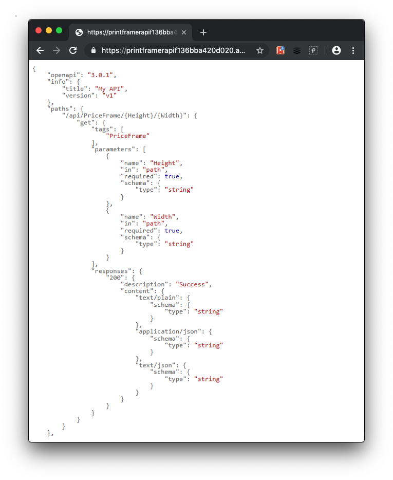

<!-- NOTE - All code for this module can be found at https://github.com/MicrosoftDocs/mslearn-improve-api-developer-experience-with-swagger -->

Your company has an API called **PrintFramerAPI** that calculates the cost of a picture frame based on the size of the frame dimensions. Internally, your small team knows how to use the API. However, to have the API adopted by third parties and therefore drive business, you need to document it. The APIT is an ASP.NET Core API, so you decide to expose the API documentation through OpenAPI.

In this exercise, you document an ASP.NET Core Web API with OpenAPI and try out Swagger UI and Swashbuckle in a real-world example. First, let's create an ASP.NET Core Web API project.

> [!NOTE]
> This module uses the [.NET CLI (Command Line Interface)](/dotnet/core/tools) and [Visual Studio Code](https://code.visualstudio.com/) for local development. After completing this module, you can apply its concepts using a development environment like Visual Studio (Windows), Visual Studio for Mac (macOS), or continued development using Visual Studio Code (Windows, Linux, & macOS).

## Download the sample web API project to Visual Studio Code

1. Open a new instance of Visual Studio Code.
1. Select **View**, then select **Terminal** to open the terminal window.
1. (Optional) Change to a directory you want to copy the files to, such as `c:\MyProjects`.
1. To clone the sample Web API Project from GitHub, run the following `git clone` command in the terminal window.

   ```bash
   git clone https://github.com/MicrosoftDocs/mslearn-improve-api-developer-experience-with-swagger  && cd mslearn-improve-api-developer-experience-with-swagger/PrintFramerAPI
   ```

1. Open the project in Visual Studio Code with the following terminal command.

    ```bash
    code -a .
    ```

## Run the web API for the first time

1. Type the following command in the Visual Studio Code terminal window:

    ```bash
    dotnet run
    ```

1. Once the output from the command is complete, navigate to: http://localhost:5000/api/priceframe/6/17

    When you navigate to the address in the browser, it should respond with the message `The cost of a 6x17 frame is $20.00`.

Because you created the API, you knew its shape, but an external developer who wants to consume this API wouldn't be so fortunate. You can help those developers by exposing some documentation about the API with the help of OpenAPI using Swashbuckle, an open-source version of the Swagger tooling.

## Add the Swagger library to the solution

1. Add Swashbuckle to your project by running the `dotnet add package` command.

    ```bash
    dotnet add package Swashbuckle.AspNetCore
    ```

1. Open the **Startup.cs** file.

1. At the top of the file, add another *using* entry:

    ```csharp
    using Microsoft.OpenApi.Models;
    ```

1. To add the Swagger generator to the services collection, replace the method `ConfigureServices(IServiceCollection services)` with the following implementation.

    ```csharp
    public void ConfigureServices(IServiceCollection services)
    {
        services.AddControllers();

        services.AddSwaggerGen(c =>
        {
            c.SwaggerDoc("v1", new OpenApiInfo { Title = "My API", Version = "v1" });
        });
    }
    ```

1. In the `Configure` method in **Startup.cs**, enable  middleware for the Swagger UI by adding `useSwagger` and `useSwaggerUI`, as shown in the following code snippet.

    ```csharp
    public void Configure(IApplicationBuilder app, IWebHostEnvironment env)
    {
        app.UseSwagger();
        app.UseSwaggerUI(c =>
        {
            c.SwaggerEndpoint("/swagger/v1/swagger.json", "My API V1");
        });

        if (env.IsDevelopment())
        {
            app.UseDeveloperExceptionPage();
        }

        app.UseHttpsRedirection();

        app.UseRouting();

        app.UseAuthorization();

        app.UseEndpoints(endpoints =>
        {
            endpoints.MapControllers();
        }); 
    }
    ```

1. Save your changes in the editor.

1. To see your changes, run the ASP.NET application locally. Type the following command in the terminal window in Visual Studio Code:

    ```bash
    dotnet run
    ```

1. In a browser, navigate to `http://localhost:5000/swagger/v1/swagger.json`.

   The response in the browser this time is a document describing the endpoints of the API, similar to the following response.

    
