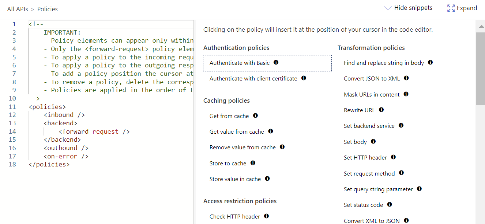
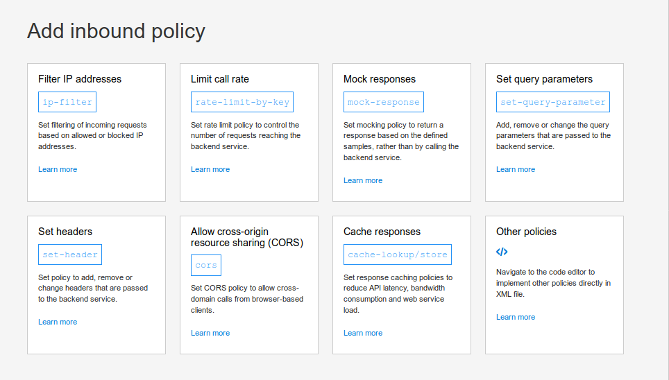
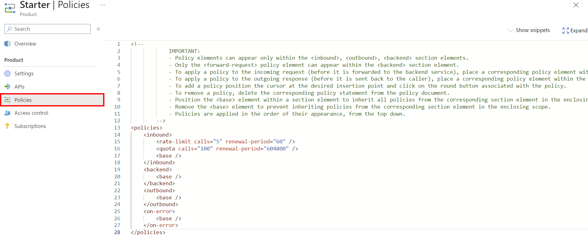
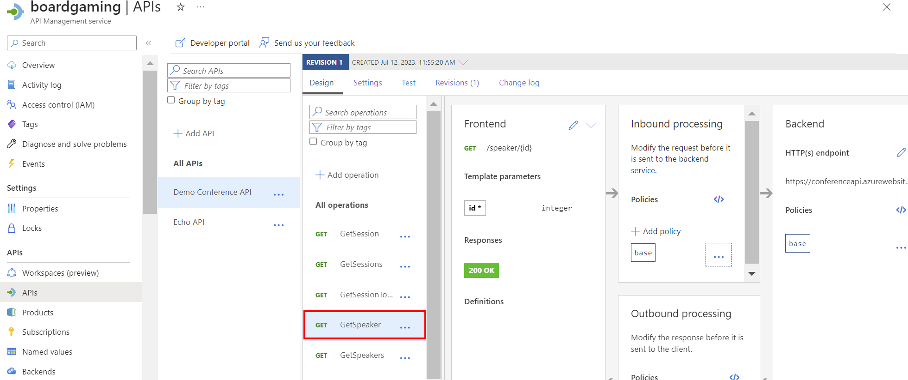

You can use API Management policies to control the behavior of a deployed API without rewriting its code.

In your board game company, you have a set of APIs that enable partner organizations to obtain price estimates, staff members to check stock levels, and customers to place orders. You want to address a particular issue with performance and investigate what else it is possible to achieve with policies.

First let's look at what you can use policies to do.

## What are policies?

In Azure API Management, administrators can use policies to alter the behavior of APIs through configuration. The primary functionality and behavior of an API is fixed by the developers who write the code, but administrators can use policies to set limits, convert response formats, or enforce security requirements. In this module, we will concentrate on using policies to set up and control a cache.

Policies are formed of individual statements, which are executed in order. The policy documents are XML structures, which contain elements that you can use to control the behavior of the API.

## When do policies execute?

In Azure API Management, policy elements execute at four different times:

- **Inbound**. These elements execute when a request is received from a client.
- **Backend**. These elements execute before a request is forwarded to a managed API.
- **Outbound**. These elements execute before a response is sent to a client.
- **On-Error**. These elements execute when an exception is raised.

In the policy XML, there is a separate tag for each of these execution times:

```xml
<policies>
    <inbound>
        <base />
        <check-header name="Authorization" failed-check-httpcode="401" failed-check-error-message="Not authorized" ignore-case="false">
        </check-header>
    </inbound>
    <backend>
        <base />
    </backend>
    <outbound>
        <base />
        <json-to-xml apply="always" consider-accept-header="false" parse-date="false" />
    </outbound>
    <on-error>
        <base />
    </on-error>
</policies>
```

In this example, you can see that the policy checks in-bound requests for a header named **Authorization**. If such a header is not present, the policy displays an error message.

This policy also translates any out-bound responses in JSON format into XML.

## Policy Scopes

A policy's scope determines how broadly it will be applied. There are four possible scopes that you can choose from.

### The global policy scope

Policies applied at the global scope affect all APIs within the instance of API Management.

To use the global scope, in the resource page for the API Management instance, click **APIs** and then click the **All APIS** menu item. You can open the XML editor by clicking on the tag symbol **</>** in the **Inbound processing**, **Outbound processing**, or **Backend** sections:


The policy editor that appears contains with default XML content. On the left, you can see shortcuts that add policy elements:



To create policy, you can manually edit the XML in the policy editor. Alternatively, on the **All APIs** page, you can click on **+ Add policy** to start a wizard that helps you to add policy elements with the correct syntax:



### The product policy scope

In API Management, you can assemble one or more APIs into a single product and then manage access to that product as a single entity. Policies applied at the product scope affect all the APIs in that product. APIs in other products are unaffected. When you manage a product in the Azure portal, click the **Policies** page to bring up the XML policy editor:



### The API policy scope

Policies applied at the API scope affect only a single API. To set a policy at the API scope, in the API Management home page, click **APIs** and then click the API you want to manage. Then click the **All operations** option:


### Operation policy scope

Policies applied at the operation scope affect only one operation within the API. In the example below, the administrator has selected the **GetSpeaker** operation within the **Demo Conference API** and can set inbound, outbound, or backend policy elements that apply only to that operation:



## Which order are policies applied in?

You can use the `<base />` tag to determine when policies from a higher scope are applied. For example, consider this policy, applied at the API scope:

```xml
<policies>
    <inbound>
        <base />
        <find-and-replace from="game" to="board game" />
    </inbound>
</policies>
```

Because the `<base>` tag appears above the `<find-and-replace>` tag, Azure applies policies from the global and product scopes first, and then executes the find-and-replace policy.

## Common elements in API Management policy

Let's examine some things you can do with policy elements in API Management:

### Elements used for restricting access

There are several policies that you can use to prevent or limit access to an API or its operations:

- Use the **Check HTTP header** policy to check for a property in an HTTP Header. If the property is not found, Azure drops the request.
- Use the **Limit call rate by subscription** element to restrict the number of calls that can come from a single API subscription. This policy can ensure that users from one subscription do not use all your bandwidth.
- Use the **Limit call rate by key** element to restrict the number of calls that arrive with a single access key.
- Use the **Restrict caller IP's** element to allow or deny calls from specific IP addresses or ranges of IP addresses.

## Elements for Authentication

Several policies enable you to control authentication:

- Use the **Authenticate with Basic** element to enable authentication in plain text. Remember that this kind of authentication should be protected with SSL encryption.
- Use the **Authenticate with client certificate** element to enable clients to authenticate by supplying a client certificate.

## Cross domain policies elements

Cross domain requests are considered a security threat and denied by browsers and APIs. However, for specific operations they can be desirable and API Management policies enable you to permit them in a secure manner:

- Use the **Allow cross-domain calls** element to permit calls from Adobe Flash and Silverlight.
- Use the **CORS** element to permit Cross-Origin Resource Sharing (CORS).
- Use the **JSONP** element to add JSON with padding to allow calls across domains from JavaScript browser-based clients.

## Transformation policies

It's often helpful to change the format or content of a response from a managed API. You can do that with several policies:

- Use the **Convert JSON to XML** and **Convert XML to JSON** elements to convert to and from JSON and XML.
- Use the **Find and replace string in body** to execute a string substitution.
- Use the **Mask URLs in content** element to rewrite any links in the response body so that they point to a different location.
- Use the **Set body** element to set the message text for incoming and outgoing requests.
- Use the **Set HTTP header** element to add items to an existing response or request header.
- Use the **Set query string parameter** element to add or replace a query string parameter.
- Use the **Rewrite URL** element to convert a request URL from its public form to a form a private destination.
- Use the **Transform XML** element to use an XSLT template to transform some XML text.

## Advanced elements

These policy elements can be of use in scenarios when you want non-standard behavior:

- Use the **Control flow** element to apply policy statements based on a Boolean expression.
- Use the **Forward request** element to send on or forward a request to a backend server.
- Use the **Retry** element to retry the policy statements enclosed until a condition is met. Execution will repeat at the specified time intervals up until the retry count value is reached.
- Use the **Send one-way request** element to send a request to a URL without waiting for a response.
- Use the **Set variable** element to persist a value in a named variable within the context.