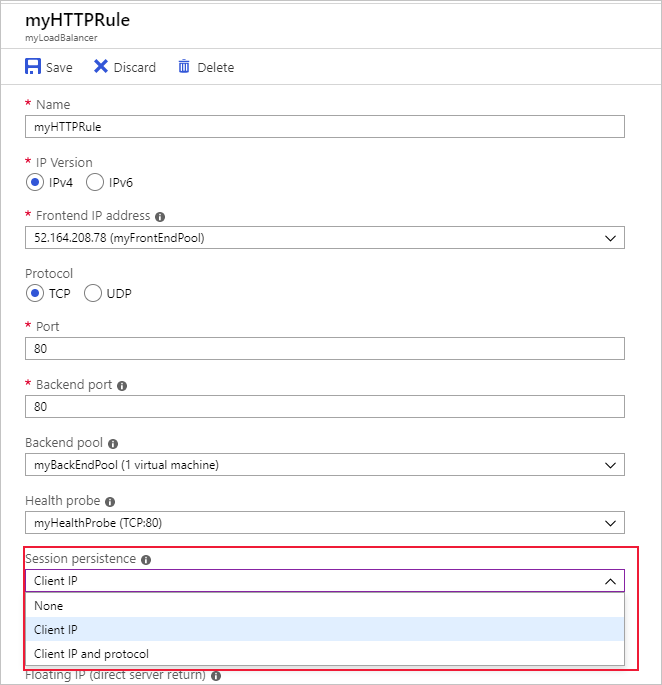

## Configure public load balancer

As the solution architect for the healthcare portal. You would like to distribute the load from the client browsers over the virtual machines within your web farm. You will need to setup a load balancer and configure the virtual machines to be balanced

A public Load Balancer maps the public IP address and port number of incoming traffic to the private IP address and port number of a virtual machine in the backend pool. The responses from that virtual machine are then returned to the client. You can distribute specific types of traffic across multiple virtual machines or services, by applying load-balancing rules.

### Distribution Modes

By default, Azure Load Balancer distributes network traffic equally among virtual machine instances. The following distribution modes are also possible if different behavior is required:

| Distribution Mode | Details |
|-------------------|---------|
| **5-tuple hash** | The default distribution mode for Azure Load Balancer is a 5-tuple hash. The tuple is composed of the source IP, source port, destination IP, destination port, and protocol type. Load is distributed according to health and availability of the virtual machines  |
| **Source IP affinity** | This distribution mode is also known as session affinity, client IP affinity or sticky sessions. The mode uses a 2-tuple (source IP and destination IP) or 3-tuple (source IP, destination IP, and protocol type) hash to map traffic to the available servers. This provides a sticky session with the virtual machine behind the load balancer  |

<-- An image similar to this, taken from: https://www.imperva.com/learn/wp-content/uploads/sites/13/2019/01/session-stickiness-diagram.jpg - Replace sticky session headers with the headers from above table-->


## Choose Distribution Mode

Using the healthcare portal example. Imagine that a developer requirement of the presentation tier is to use in memory sessions to store the profile of the logged in user whilst they are interacting with the portal. In this scenario the load balancer must provide source IP affinity to maintain a users session as the profile will only be stored on the initial virtual machine the client first connected to. When we create the load balancer endpoint we must specify the distribution mode this can easily be done using the PowerShell example below.

```Powershell
    $lb = Get-AzLoadBalancer -Name MyLb -ResourceGroupName MyResourceGroup
    $lb.LoadBalancingRules[0].LoadDistribution = 'sourceIp'
    Set-AzLoadBalancer -LoadBalancer $lb
```

To add session persistence through the Azure portal:

1. Sign into the [Azure portal](https://portal.azure.com/learn.docs.microsoft.com?azure-portal=true) using the same account you activated the sandbox with.
1. In the left menu, click **All Resources**, and then select your load balancer.
1. Under **Load balancing rules**, click **myHTTPRule**.
1. Change the **Session persistence** value to **Client IP**



### Problems with session persistence

As a consideration, ensure that your developers understand that by having this requirement, the load balancer cannot be as effective, it is better to create a stateless solution where state is managed in a separate shared resource away from the virtual machine. If you do decide to use sticky sessions it is worth understanding two main drawbacks of this design approach

| Problem | Reason |
| ------- | ------ |
| **Load Balancing** | A load balancer is required to keep a load fairly evenly distributed between servers in a backend pool.  Sticky sessions can interfere, as depending on user activity, the load can become unbalanced. Eventually an individual server may become overused and unresponsive.  Then the load balancer detects this, it will begin rerouting some traffic destined for one server to another.  It keeps the application up, but the user will experience a glitch. |
| **Maintenance** | Occasionally, a server has to come down to perform maintenance.  This might be patches to the operating system or updates to the application. In which case you must plan to take servers down from time to time. When this happens, the load balancer will move traffic to remaining servers automatically. Again, the user experiences a glitch as they will lose their session.
