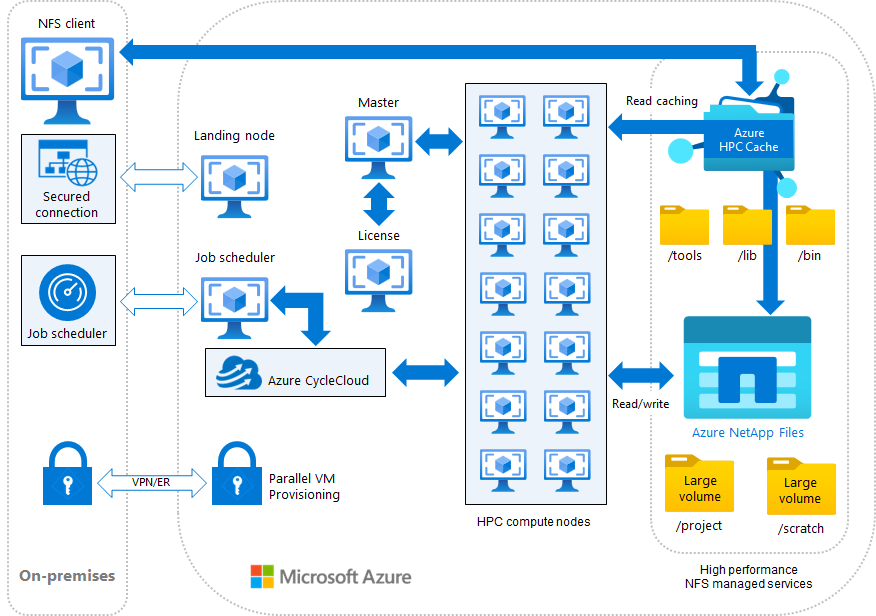

In this module, we introduce performance suggestions for reference architecture, client VMs, and network when you're running your EDA applications on Azure NetApp Files.

## Understanding your EDA workload by reviewing a reference architecture

The simulation processes for EDA tools and chips might have different reference architectures. The following reference architecture illustrates a generic case for how you can use Azure NetApp Files for EDA workloads in both cloud-bursting (hybrid) and fully on Azure scenarios.



## Suggestions for virtual networks, accelerated networking, and client updates

When possible, put your client VMs and Azure NetApp Files in the same region and availability zone, as well as the same virtual network. Having the compute and the data resources close to one another can help to reduce network latency in between, which improves overall performance.

Enable accelerated networking on your client VMs if it's supported, to provide up to 30 gigabits per second (Gbps) total in networking throughput. For information on the Azure NetApp Files volume throughput numbers, see: 

- [Azure NetApp Files performance benchmarks for Linux](/azure/azure-netapp-files/solutions-benefits-azure-netapp-files-electronic-design-automation)
- [Azure NetApp Files large volumes performance benchmarks](/azure/azure-netapp-files/performance-benchmarks-linux)

Accelerated networking helps lower the latency from client VMs to Azure NetApp Files, whicho boosts overall performance, especially on the distributed multi-scenario analysis (DMSA) type of simulation.

You should run the latest patch version available for the operating system. You should also update the Network File System (NFS) utilities to their latest releases,to get the newest bug fixes and feature functionality. These updates help ensure optimal performance and system stability.

For example, run these commands when using yum as your repository (such as RedHat):

```bash
sudo yum update
sudo yum update nfs-utils
```

## Large volumes for EDA workloads

EDA workloads are mostly comprised of a high number of metadata calls, high file counts, and parallel operations. To properly address those types of workloads, the underlying storage service should be able to parallelize operations to help reduce the time-to-completion of business critical EDA simulations. In EDA workloads, time is money.

Azure NetApp Files offers large volumes (up to 500 TiB) that enable EDA workloads to perform at a higher level than regular volumes by providing greater capacity, parallel compute, and even distribution of files and folders across multiple storage resources at low latency in Azure cloud deployments. Large volumes also provide the opportunity to lower costs in high metadata workloads by allowing workloads that require lower throughput with higher IOPS to leverage lower service levels. For instance, if your EDA workload doesn’t require 1 0GiB/s but does need parallel processing of write metadata operations, a large volume at Premium service level might do the job that would normally require Ultra service levels on regular volumes.

If you are deploying EDA in Azure NetApp Files, you should strongly consider using large volumes for the best possible performance experience.


## Quotas to control capacity usage of Azure NetApp Files volumes

Azure NetApp Files provides user and group quotas, which can set size limits on volumes or assign limits to users and groups below the size assigned to the volume itself. When a quota limit is reached, no new writes are allowed until the used capacity is reduced or the quota is increased. 

EDA workloads can create a large amount of data, which can use up massive amounts of capacity. Since capacity in the cloud can create unwanted costs, controlling the used capacity with quotas can help keep costs down.