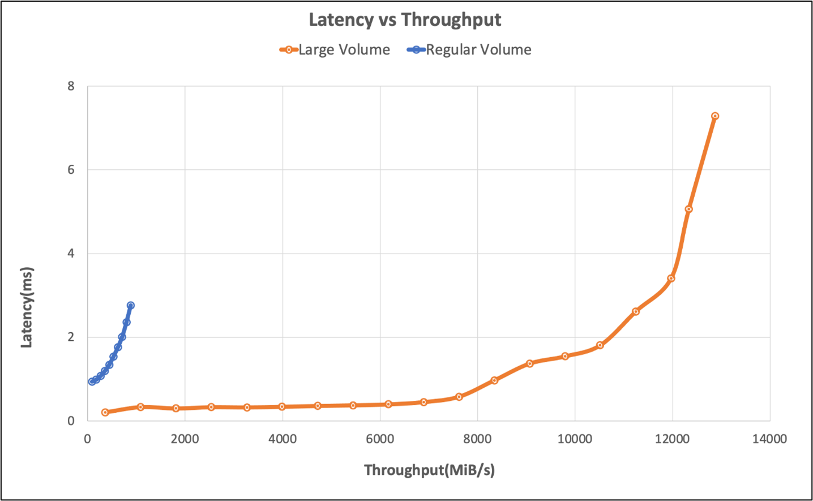

Now, we examine benchmark results to verify the performance tips that we discussed in the previous unit. Specifically, we focus on using the SPEC SFS benchmark suite to spawn multiple threads that simulate EDA production-like workloads. Also, we show FIO results to examine some performance practices.

## Overview of the two benchmark tools

The [SPEC SFS suite](https://www.spec.org/) is a standard industry benchmark for EDA. A typical EDA workload consists of functional and physical phases. The functional phase drives mostly random I/O and file-system metadata operations. The physical phase drives large-block sequential reads and writes.

[FIO](https://fio.readthedocs.io/en/latest/fio_doc.html) is an I/O tool that can generate consistent random or sequential read/write loads to benchmark IOPS and throughput of a storage target.

## Volume types in Azure NetApp Files

Azure NetApp Files provides two types of volumes that can be provisioned for cloud data storage: regular volumes and [large volumes](/azure/azure-netapp-files/large-volumes-requirements-considerations). The following table highlights some of the key differences between the two volume types. Use this table as guidance when choosing the right volume type for your workload.

| Limit | Regular volume | Large volume |
| -- | - | - |
| Minimum capacity | 100 GiB  | 50 TiB |
| Maximum capacity | 100 TiB  | 500 TiB  |
| Minimum supported service level | Standard  | Standard |
| Maximum observed throughput | 4,500 MiB/s  | 10,240 MiB/s  |
| Maximum observed read IOPS | ~200,000  | ~700,000 |
| Maximum observed write IOPS | ~135,000 | ~474,000 |

## Benchmark results of the SPEC EDA tool for regular volumes

The graphs in this section demonstrate the I/O and latency curves. They examine some combinations of the following performance practices:

- `nocto,actimeo=600`
- `sysctl tuned`
- `nconnect=16`

When all three of the preceding practices are applied, the I/O operations per second increase and still maintain low latency (less than 1 millisecond).


The following graph demonstrates that NFSv3 performs better than NFSv4.1 for this type of workload.


The following graph demonstrates that `rsize=wsize=262144(256 K)` performs better than other settings.


## Benchmark results of the SPEC EDA tool for large volumes 

Performance threshold testing was conducted on a single large volume using the SPEC SFS benchmark with the following configuration:

| Configuration type | Setting | 
| - | - | 
| Operating system | RHEL 9.3 / RHEL 8.7 |
| Instance type | D16s_v5 |
| Instance count | 10 |
| Mount Options | nocto,actimeo=600,hard,rsize=262144,wsize=262144,vers=3,tcp,noatime,nconnect=8 |

The tests compared the performance capabilities of a large volume using the SPEC SFS benchmark as compared to a regular volume in Azure NetApp Files.

| Scenario | I/O Rate at 2ms | MiB/s at 2ms |
| - | - | - |
| One regular volume | 39,601 | 692 |
| One large volume | 652,260 | 10,030 |




## Benchmark results of the FIO tool for regular volumes

The following FIO commands benchmark IOPS and throughput, respectively.

```bash
// FIO commands to benchmark IOPS:
// 8K Random Reads
fio --name=8krandomreads --rw=randread --direct=1 --ioengine=libaio --bs=8k --numjobs=4 --iodepth=128 --size=4G --runtime=600 --group_reporting
// 8K Random Writes
fio --name=8krandomwrites --rw=randwrite --direct=1 --ioengine=libaio --bs=8k --numjobs=4 --iodepth=128 --size=4G --runtime=600 --group_reporting

// FIO commands to benchmark throughput:
// 64K Sequential Reads
fio --name=64kseqreads --rw=read --direct=1 --ioengine=libaio --bs=64k --numjobs=4 --iodepth=128 --size=4G --runtime=600 --group_reporting
// 64K Sequential Writes
fio --name=64kseqwrites --rw=write --direct=1 --ioengine=libaio --bs=64k --numjobs=4 --iodepth=128 --size=4G --runtime=600 --group_reporting
```

The following two graphs demonstrate that when `nocto,actimeo=600`, `nconnect=16`, and `sysctl` are tuned, Azure NetApp Files can achieve higher IOPS and throughput.


## Benchmark results of the FIO tool for large volumes

This section describes performance thresholds of a single large volume using the FIO benchmark. The tests were run with the following configuration:

| Component | Configuration |  
|- | - |
| Azure VM size | E32s_v5 |
| Azure VM egress bandwidth limit | 2000MiB/s (2GiB/s) |
| Operating system | RHEL 8.4 |
| Large volume size | 101 TiB Ultra (10,240 MiB/s throughput) |
| Mount options | hard,rsize=65536,wsize=65536,vers=3  <br /> **NOTE:** Use of both 262144 and 65536 had similar performance results. |

### 256-KiB sequential workloads (MiB/s) 

The graph represents a 256 KiB sequential workload and a 1 TiB working set. It shows that a single Azure NetApp Files large volume can handle between approximately 8,518 MiB/s pure sequential writes and 9,970 MiB/s pure sequential reads. 

:::image type="content" source="./media/performance-large-volumes-linux/04-256-kib-sequential-reads.png" alt-text="Bar chart of a 256-KiB sequential workload on a large volume." lightbox="./media/performance-large-volumes-linux/04-256-kib-sequential-reads.png":::

### 8-KiB random workload (IOPS)

The graph represents an 8-KiB random workload and a 1 TiB working set. The graph shows that an Azure NetApp Files large volume can handle between approximately 474,000 pure random writes and approximately 709,000 pure random reads.

:::image type="content" source="./media/performance-large-volumes-linux/04-random-workload-chart.png" alt-text="Bar chart of a random workload on a large volume." lightbox="./media/performance-large-volumes-linux/04-random-workload-chart.png":::