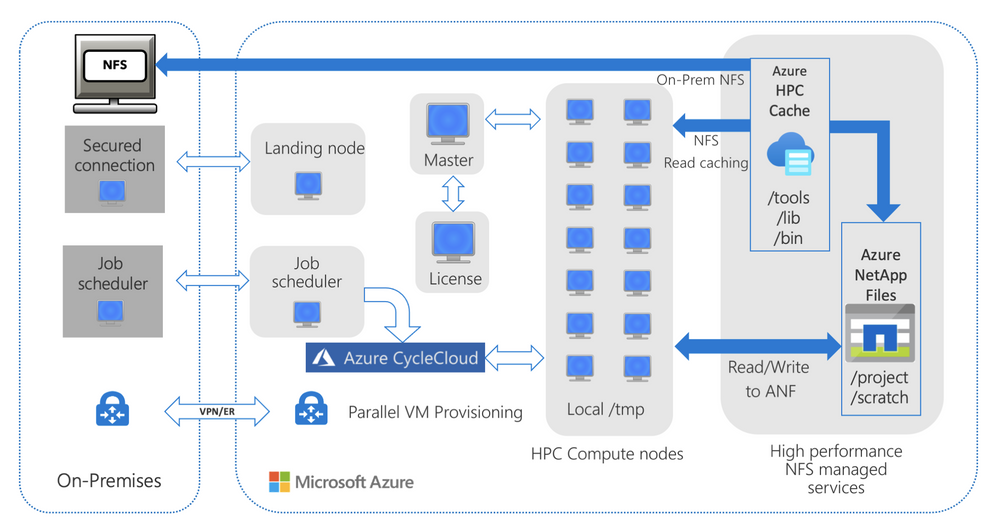

We'll introduce overall performance suggestions regarding reference architecture, client VMs, and network running your EDA applications on Azure NetApp Files.

## Gain a high-level understanding of your EDA workload by reviewing a reference architecture

The reference architectures below illustrate how you can use Azure NetApp Files for EDA workloads in both cloud-bursting (hybrid) and fully-on-Azure architectures.



## Update your Client VMs and NFS utility to the latest versions

It's always the best practice to run the latest OS patch version available, and updating the NFS utilities to their latest releases to get the newest bug fixes and feature functionality, to optimal performance and system stability.

```bash
sudo yum update
sudo yum update nfs-utils
```

## Enable Accelerate Networking and reside in the same VNET when applicable

It's always the best practice to enable Accelerated Networking on Azure Virtual Machines, if supported, to provide 30+ Gb/s in networking throughput.

Reside your client VMs and Azure NetApp Files to be in the same VNET when possible, so to reduce network latency in between.
