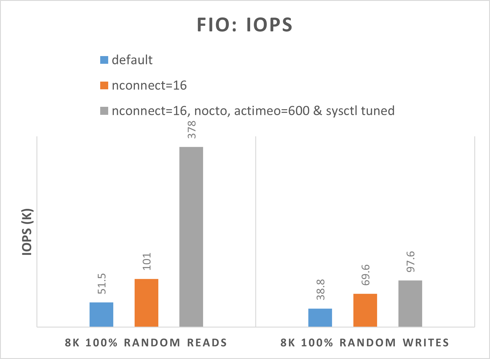

<!-- 1. Topic sentence(s) --------------------------------------------------------------------------------

    Goal: remind the learner of the core idea(s) from the preceding learning-content unit (without mentioning the details of the exercise or the scenario)

    Heading: do not add an H1 or H2 title here, an auto-generated H1 will appear above this content

    Example: "A storage account represents a collection of settings that implement a business policy."

    [Exercise introduction guidance](https://review.docs.microsoft.com/learn-docs/docs/id-guidance-introductions?branch=master#rule-use-the-standard-exercise-unit-introduction-format)
-->

# Goal

In this session, we will examine the benchmarking results to verify the performance tips we just discussed.

We will focus on using SPEC SFS® benchmark suite to spawn multi-threads, to simulate EDA production-like workloads. We will also show FIO results to examine some performance practice.

<!-- 2. Scenario sub-task --------------------------------------------------------------------------------

    Goal: Describe the part of the scenario covered in this exercise

    Heading: a separate heading is optional; you can combine this with the topic sentence into a single paragraph

    Example: "Recall that in the chocolate-manufacturer example, there would be a separate storage account for the private business data. There were two key requirements for this account: geographically-redundant storage because the data is business-critical and at least one location close to the main factory."

    Recommended: image that summarizes the entire scenario with a highlight of the area implemented in this exercise
-->

## Benchmarking Tools

SPEC SFS® suite is a standard industry benchmark for electronic design automation (EDA). Typical EDA workload consists of functional and physical phases. The functional phase predominately drives random I/O and filesystem metadata operations, while the physical phase drives large block sequential reads and writes.

FIO is an I/O tool which can generate consistent random or sequential read/write loads to benchmark IOPS and throughput of storage target.

<!-- 3. Task performed in the exercise ---------------------------------------------------------------------

    Goal: State concisely what they'll implement here; that is, describe the end-state after completion

    Heading: a separate heading is optional; you can combine this with the sub-task into a single paragraph

    Example: "Here, you will create a storage account with settings appropriate to hold this mission-critical business data."

    Optional: a video that shows the end-state
-->

## SPEC EDA benchmark

The graph below demonstrates the I/O and latency curves, examining some combinations of below performance practices comparing to "default" that none were applied.

- nocto,actimeo=600
- sysctl tuned
- nconnect=16

You will see the I/O (operations per second) will boost and still maintaining low latency (less than 1 millisecond) when all the above three were applied.


The graph below demonstrates that NFS3 performs much better than NFS 4.1


The graph below demonstrates that rsize=wsize=262144(256K) performs better than other settings.


## FIO benchmark

Below are the FIO commands to benchmark IOPS and throughput, respectively.

```bash
// FIO commands to benchmark IOPS:
// 8K Random Reads
fio --name=8krandomreads --rw=randread --direct=1 --ioengine=libaio --bs=8k --numjobs=4 --iodepth=128 --size=4G --runtime=600 --group_reporting
// 8K Random Writes
fio --name=8krandomwrites --rw=randwrite --direct=1 --ioengine=libaio --bs=8k --numjobs=4 --iodepth=128 --size=4G --runtime=600 --group_reporting

// FIO commands to benchmark throughput:
// 64K Sequential Reads
fio --name=64kseqreads --rw=read --direct=1 --ioengine=libaio --bs=64k --numjobs=4 --iodepth=128 --size=4G --runtime=600 --group_reporting
// 64K Sequential Writes
fio --name=64kseqwrites --rw=write --direct=1 --ioengine=libaio --bs=64k --numjobs=4 --iodepth=128 --size=4G --runtime=600 --group_reporting
```

The two graphs below demonstrate that when nocto,actimeo=600,nconnect=16 & sysctl tuned, Azure NetApp Files can achieve higher IOPS and throughput. 




<!-- 4. Chunked steps -------------------------------------------------------------------------------------

    Goal: List the steps they'll do to complete the exercise.

    Structure: Break the steps into 'chunks' where each chunk has three things:
        1. A heading describing the goal of the chunk
        2. An introductory paragraph describing the goal of the chunk at a high level
        3. Numbered steps (target 7 steps or fewer in each chunk)

    Example:
        Heading:
            "Use a template for your Azure logic app"
        Introduction:
             "When you create an Azure logic app in the Azure portal, you have the option of selecting a starter template. Let's select a blank template so that we can build our logic app from scratch."
        Steps:
             "1. In the left navigation bar, select Resource groups.
              2. Select the existing Resource group [sandbox resource group name].
              3. Select the ShoeTracker logic app.
              4. Scroll down to the Templates section and select Blank Logic App."
-->

<!-- 5. Validation chunk -------------------------------------------------------------------------------------

    Goal: Helps the learner to evaluate if they completed the exercise correctly.

    Structure: Break the steps into 'chunks' where each chunk has three things:
        1. A heading of "Check your work"
        2. An introductory paragraph describing how they'll validate their work at a high level
        3. Numbered steps (when the learner needs to perform multiple steps to verify if they were successful)
        4. Video of an expert performing the exact steps of the exercise (optional)

    Example:
        Heading:
            "Examine the results of your Twitter trigger"
        Introduction:
             "At this point, our logic app is scanning Twitter every minute for tweets containing the search text. To verify the app is running and working correctly, we'll look at the Runs history table."
        Steps:
             "1. Select Overview in the navigation menu.
              2. Select Refresh once a minute until you see a row in the Runs history table.
              ...
              6. Examine the data in the OUTPUTS section. For example, locate the text of the matching tweet."
-->

<!-- - - - - - - - - - - - - - - - - - - - - - - - - - - - - - - - - - - - - - - - -->

<!-- Do not add a unit summary or references/links -->
