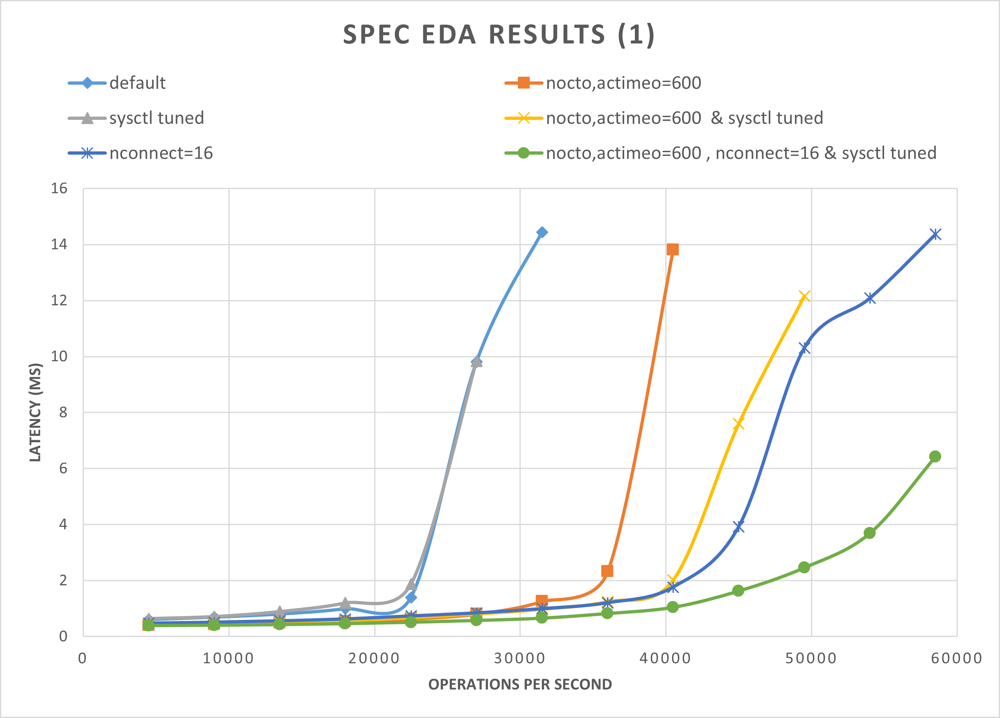

# Goal

In this session, we'll examine the benchmarking results to verify the performance tips we just discussed.

We'll focus on using SPEC SFS® benchmark suite to spawn multi-threads, to simulate EDA production-like workloads. We'll also show FIO results to examine some performance practice.

## Benchmarking Tools

SPEC SFS® suite is a standard industry benchmark for electronic design automation (EDA). Typical EDA workload consists of functional and physical phases. The functional phase predominately drives random I/O and filesystem metadata operations, while the physical phase drives large block sequential reads and writes.

FIO is an I/O tool, which can generate consistent random or sequential read/write loads to benchmark IOPS and throughput of storage target.

## SPEC EDA benchmark

The graph below demonstrates the I/O and latency curves, examining some combinations of below performance practices comparing to "default" that none were applied.

- nocto,actimeo=600
- sysctl tuned
- nconnect=16

You'll see the I/O (operations per second) will boost and still maintaining low latency (less than 1 millisecond) when all the above three were applied.



The graph below demonstrates that NFS3 performs much better than NFS 4.1.


The graph below demonstrates that rsize=wsize=262144(256 K) performs better than other settings.


## FIO benchmark

Below are the FIO commands to benchmark IOPS and throughput, respectively.

```bash
// FIO commands to benchmark IOPS:
// 8K Random Reads
fio --name=8krandomreads --rw=randread --direct=1 --ioengine=libaio --bs=8k --numjobs=4 --iodepth=128 --size=4G --runtime=600 --group_reporting
// 8K Random Writes
fio --name=8krandomwrites --rw=randwrite --direct=1 --ioengine=libaio --bs=8k --numjobs=4 --iodepth=128 --size=4G --runtime=600 --group_reporting

// FIO commands to benchmark throughput:
// 64K Sequential Reads
fio --name=64kseqreads --rw=read --direct=1 --ioengine=libaio --bs=64k --numjobs=4 --iodepth=128 --size=4G --runtime=600 --group_reporting
// 64K Sequential Writes
fio --name=64kseqwrites --rw=write --direct=1 --ioengine=libaio --bs=64k --numjobs=4 --iodepth=128 --size=4G --runtime=600 --group_reporting
```

The two graphs below demonstrate that when nocto,actimeo=600,nconnect=16 & sysctl tuned, Azure NetApp Files can achieve higher IOPS and throughput.


