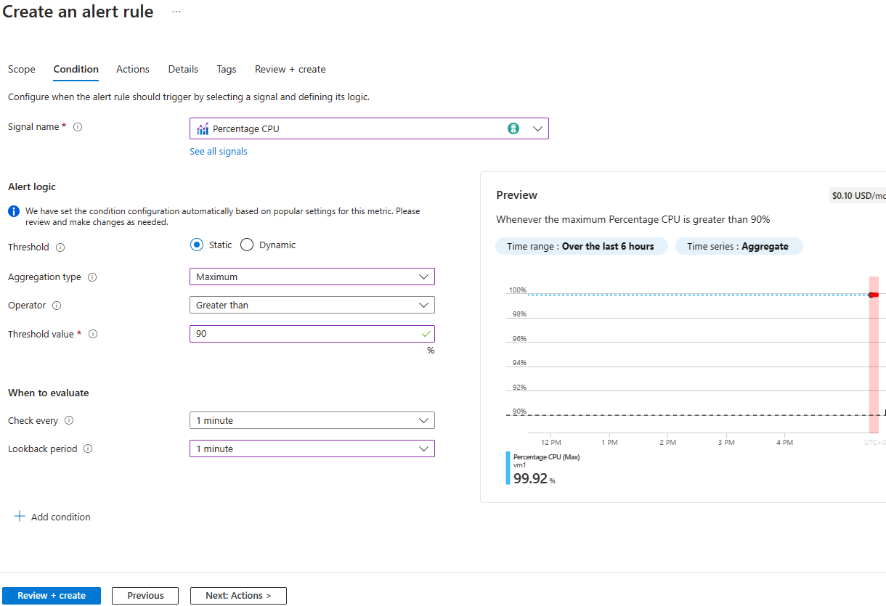
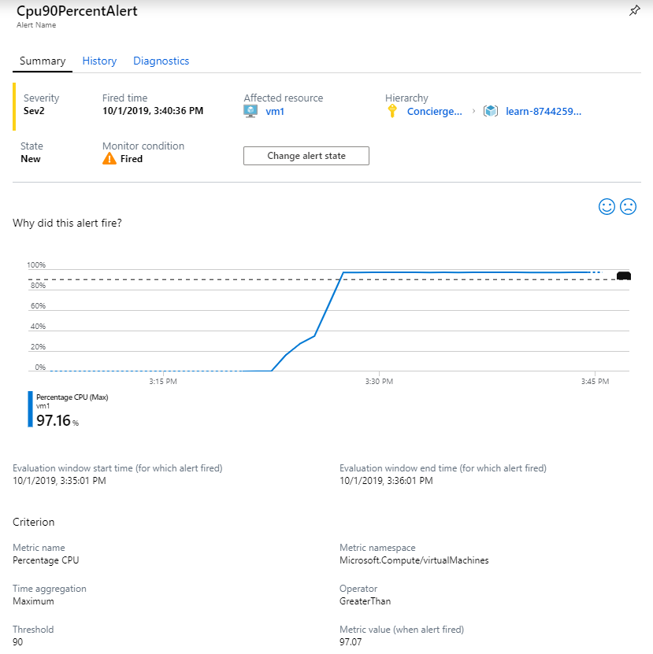

The shipping company that you work for wants to avoid any future issues with updates to its applications on the Azure platform. To improve the alert capabilities in Azure, you've chosen to use Azure metric alerts.

In this exercise, you'll create a Linux virtual machine (VM). This VM will run an app that will run the CPU at 100 percent utilization. You'll create monitoring rules in the Azure portal and in the Azure CLI to alert you on high CPU usage.

## Create the VM

This VM will run a specific configuration that stresses the CPU and generates the metric monitoring data needed to trigger an alert.

1. Start by creating the configuration script. To create the `cloud-init.txt` file with the configuration for the VM, run the following command in Azure Cloud Shell.

    ```bash
    cat <<EOF > cloud-init.txt
    #cloud-config
    package_upgrade: true
    packages:
    - stress
    runcmd:
    - sudo stress --cpu 1
    EOF
    ```

1. To set up an Ubuntu Linux VM, run the following `az vm create` command. This command uses the `cloud-init.txt` file that you created in the previous step to configure the VM after it's created.

    ```azurecli
    az vm create \
        --resource-group <rgn>[sandbox resource group name]</rgn> \
        --name vm1 \
        --image UbuntuLTS \
        --custom-data cloud-init.txt \
        --generate-ssh-keys
    ```

## Create the metric alert through the Azure portal

You use either the Azure portal or the CLI to create a metric alert. In this exercise we'll cover both, starting with the Azure portal.

1. Sign in to the [Azure portal](https://portal.azure.com/learn.docs.microsoft.com?azure-portal=true) by using the same account that you used to activate the sandbox.

1. On the Azure portal menu, select **More services**, and then select **Monitor**.

1. In the left panel, select **Alerts**.

1. Select **+ New alert rule**. The **Create alert rule** page appears.

    

1. Select **Select resource**. The **Select a resource** panel appears.

1. The **Filter by subscription** dropdown should already be populated with **Concierge Subscription**. In the **Filter by resource type** dropdown, select **Virtual machines**.

    Select the **vm1** virtual machine under the **<rgn>[sandbox resource group name]</rgn>** resource group. Then select **Done** at the bottom of the panel.

    

1. Next, you'll configure the conditional logic for this resource. From the **Create alert rule** page, under the **Condition** section, select **Select condition**. The **Configure signal logic** panel appears.

1. For **Signal type**, select **Metrics**. For **Monitor service**, select **All**.

    The list of available signals will change depending on the selected signal type. From the list of available signal types, select **Percentage CPU**.

    

1. In the **Configure signal logic** panel, configure the following settings:

    | Setting | Value |
    |---------|---------|
    | Threshold | Static |
    | Operator | Greater than |
    | Aggregation type | Maximum |
    | Threshold value | 90 |
    | Aggregation granularity (Period) | 1 minute |
    | Frequency of evaluation | Every 1 Minute |

    Select **Done**.

    

1. From the **Create alert rule** page, under the **Alert rule details** section, provide the following information:

    | Setting | Value |
    |---------|---------|
    | Alert rule name | Cpu90PercentAlert |
    | Description | Virtual machine is running at or greater than 90% CPU utilization |
    | Severity | Sev 2 |
    | Enabled rule upon creation | Yes |
    | | |

    

1. Select **Create alert rule**.

You have successfully created a metric alert rule that will trigger an alert when the CPU percentage on the VM exceeds 90 percent. The rule will check every minute and review one minute of data. It can take up to 10 minutes for a metric alert rule to become active.

## Create the metric alert through the CLI

You can set up metric alerts by using the CLI. This process can be quicker compared to using the portal, especially if you're planning to set up more than one alert.

Let's create a new metric alert similar to the one you set up in the Azure portal.

1. Run this command in Cloud Shell to obtain the resource ID of the virtual machine created earlier.

    ```bash
    VMID=$(az vm show \
            --resource-group <rgn>[sandbox resource group name]</rgn> \
            --name vm1 \
            --query id \
            --output tsv)
    ```

1. Run this command to create a new metric alert that will be triggered when the VM CPU is greater than 80 percent.

    ```azurecli
    az monitor metrics alert create \
        -n "Cpu80PercentAlert" \
        --resource-group <rgn>[sandbox resource group name]</rgn> \
        --scopes $VMID \
        --condition "max percentage CPU > 80" \
        --description "Virtual machine is running at or greater than 80% CPU utilization" \
        --evaluation-frequency 1m \
        --window-size 1m \
        --severity 3
    ```

## View your metric alerts in Azure Monitor

In the example, you set up an Ubuntu VM and configured it to stress test the CPU. You also created a metric rule to detect when the maximum CPU percentage exceeds 80 percent and 90 percent.

It might take 10 minutes before you see the alerts show up in your portal.

1. Return to the [Azure portal](https://portal.azure.com/learn.docs.microsoft.com?azure-portal=true).

1. On the Azure portal menu, select **Monitor**, and then select **Alerts** in the left panel.

   This step presents the alert summary page, where you can see the count of the number of alerts at each severity.

    

1. You configured your metric alerts with a severity of 2 and 3. Select one of the severity levels to show all the alerts for that level.

    

1. Selecting one of the alerts shows the details on the alert. After the issue is resolved, you can also change the alert state.

    
