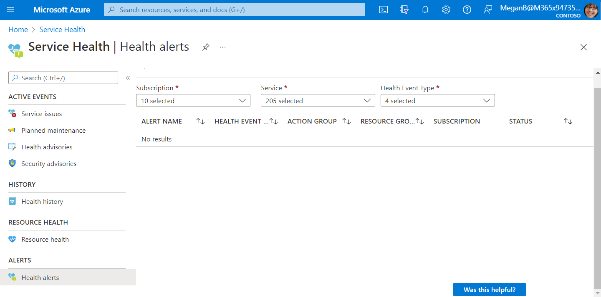
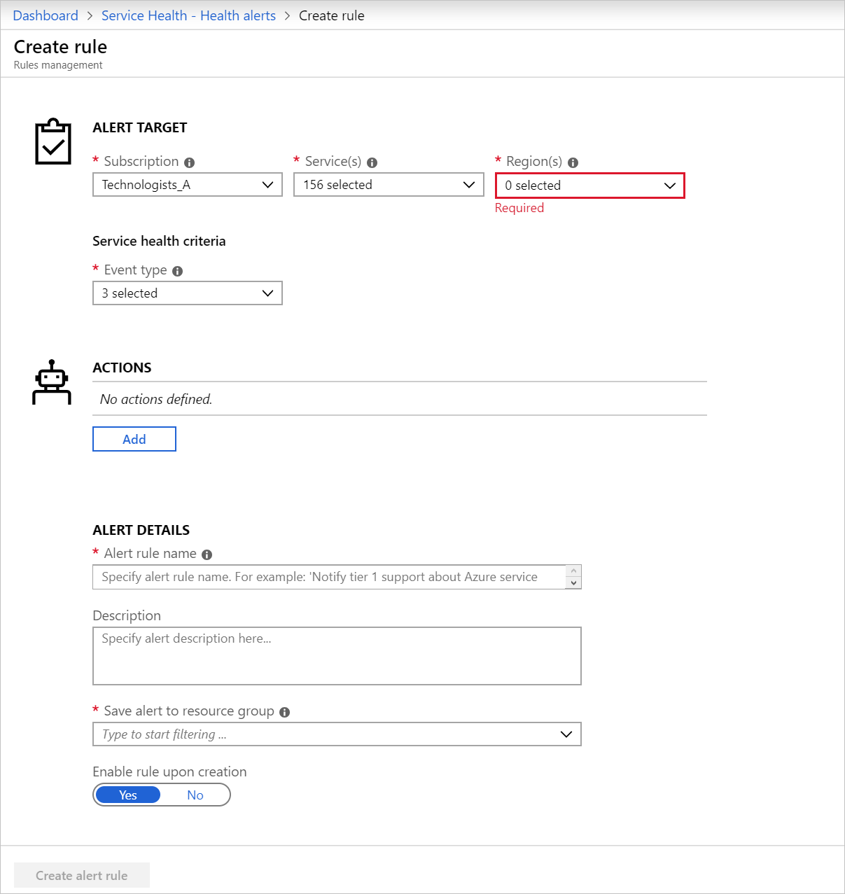

Activity log events allow you to be notified when a specific event happens on some Azure resource. For example, when someone has created a new VM in a subscription. An activity log can also include Azure service health alerts, enabling a company to be notified when service issues, or planned maintenance, happen on the Azure platform happen.

As an Azure solution architect, you want to explore the capability to monitor selected Azure resources within your subscription. You'll understand how the resources can be used to improve your team's responsiveness and the stability of your systems.

In this unit, you'll explore the two different kinds of active log alerts. Now that you've seen all the different kinds of alerts you can use in Azure Monitor, you'll see how you can trigger actions for your alerts, like sending an email or creating an ITSM support ticket.

## When to use activity log alerts

So far, you've seen two different types of alerting supported in Azure Monitor. Metric alerts are ideally suited to monitoring for threshold breaches or spotting trends, while log alerts allow for greater analytical monitoring of historical data.

Activity log alerts are designed to work with Azure Resources. Typically, you create this type of log to receive notifications when specific changes occur on a resource within your Azure subscription.

There are two distinct flavors of activity log alerts, and they are created different:

- **Specific operations**: apply to resources within your Azure subscription and often have a scope with specific resources or a resource group. You use this type when you need to receive an alert that reports a change to an aspect of your subscription. For example, if a virtual machine is deleted or new roles are assigned to a user.
- **Service health events**: include notice of incidents and maintenance of target resources.

## Composition of an activity log alert

It's important to note that activity log alerts will only monitor events in the subscription where the log alert was created.

Because activity log alerts are based on events, the best approach for defining them is to use Azure Monitor to filter all the events in your subscription - until you find the one that you want. You then select **Add activity log alert** to begin the creation process.

Like the previous alerts, activity log alerts have their own attributes:

- **Category**: you select from Administrative, service health, autoscale, policy, or recommendation
- **Scope**: Resource level, Resource Group level, or Subscription level
- **Resource group**: where the alert rule is saved
- **Resource type**: namespace for the target of the alert
- **Operation name**: operation name
- **Level**: Verbose, Informational, Warning, Error, or Critical
- **Status**: Started, Failed, or Succeeded
- **Event initiated by**: known as the "caller", this is the email address or Azure Active Directory identifier for the user

### Creating a resource-specific log alert

When you create your activity log alert, you choose **Activity Log** for the signal type. Then you'll see all the available alerts for the resource you choose. The above screenshot shows all the administrative alerts for Azure VMs. For example, trigger an alert when a VM is powered off.

Changing the monitor service will enable you to reduce the list of options, so choosing Administrative filters all the signals to show only admin-related signals.

### Creating a service health alert

Service health alerts are not like all the other alert types you've seen so far in this module. To create a new alert, you need to navigate to the **Service Health** section on the Azure portal, then select **Health alerts**. Once there, and after selecting **+ Create service health alert**, the steps to actually create the alert are similar to the steps you've seen to create other alerts.

 

The only difference is that you no longer need to select a resource, as the alert is for a whole region in Azure. What you can select is the kind of health event you want to be alerted on. It's possible to select service issues, planned maintenance, health advisories, or choose all of the events. The remaining steps of performing actions and naming the alerts are the same.

## Performing actions when an alert happens

When any event is triggered, you can create an associated action in, what Azure calls, an action group. Action groups allow you to define actions that will be executed. You can run one ore more actions for each triggered alert.

The current list of available actions are:

- Send an email
- Send an SMS
- Create an Azure app Push Notification
- Make a voice call to a number
- Call an Azure Function
- Trigger a Logic App
- Send a notification to a webhook
- Create an ITSM Ticket
- Use a runbook (to restart a VM, or scale a VM up or down)

You can also reuse action groups on multiple alerts, once you've created them. For example, after you've created an action to email your company's Ops team, you can add that action group to all the service health events.

You can add, or create, action groups at the same time your create your alert. Or you can edit an existing alert to add an action group after you've created it.