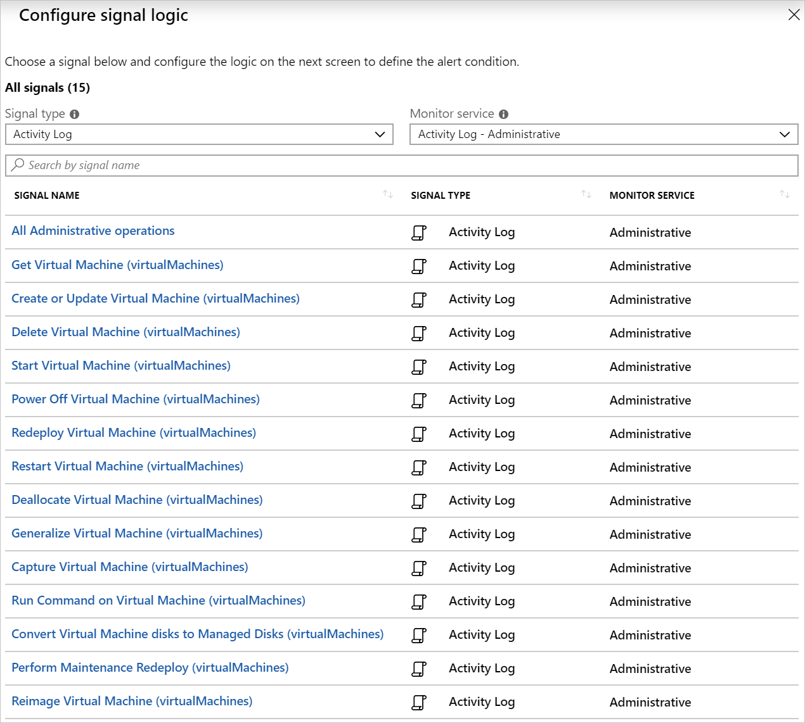

Activity log alerts enable you to be notified when a specific event happens on some Azure resource. For example, you can be notified when someone creates a new VM in a subscription. 

An activity log can also include alerts for Azure service health. A company can be notified when service issues or planned maintenance happens on the Azure platform.

As an Azure solution architect, you want to explore the capability to monitor selected Azure resources within your subscription. You'll understand how the resources can be used to improve your team's responsiveness and the stability of your systems.

In this unit, you'll explore the two different kinds of active log alerts. Now that you've seen all the different kinds of alerts you can use in Azure Monitor, you'll see how you can trigger actions for your alerts. Actions might include sending an email, or creating an IT Service Management (ITSM) support ticket.

## When to use activity log alerts

So far, you've seen two different types of alerts supported in Azure Monitor. Metric alerts are ideally suited to monitoring for threshold breaches or spotting trends. Log alerts allow for greater analytical monitoring of historical data.

Activity log alerts are designed to work with Azure resources. Typically, you create this type of log to receive notifications when specific changes occur on a resource within your Azure subscription.

There are two types of activity log alerts:

- **Specific operations**: Apply to resources within your Azure subscription, and often have a scope with specific resources or a resource group. You use this type when you need to receive an alert that reports a change to an aspect of your subscription. For example, you can receive an alert if a VM is deleted or new roles are assigned to a user.
- **Service health events**: Include notice of incidents and maintenance of target resources.

## Composition of an activity log alert

It's important to note that activity log alerts will monitor events only in the subscription where the log alert was created.

Activity log alerts are based on events. The best approach for defining them is to use Azure Monitor to filter all the events in your subscription - until you find the one that you want. To begin the creation process, you then select **Add activity log alert**.

Like the previous alerts, activity log alerts have their own attributes:

- **Category**: Administrative, service health, autoscale, policy, or recommendation.
- **Scope**: Resource level, resource group level, or subscription level.
- **Resource group**: Where the alert rule is saved.
- **Resource type**: Namespace for the target of the alert.
- **Operation name**: Operation name.
- **Level**: Verbose, informational, warning, error, or critical.
- **Status**: Started, failed, or succeeded.
- **Event initiated by**: Email address or Azure Active Directory identifier (known as the "caller") for the user.

### Create a resource-specific log alert

When you create your activity log alert, you select **Activity Log** for the signal type. You'll then see all the available alerts for the resource you select. The following image shows all the administrative alerts for Azure VMs. In this example, an alert is triggered when a VM is powered off.

Changing the monitor service will enable you to reduce the list of options. Selecting **Administrative** filters all the signals to show only admin-related signals.

### Create a service health alert

Service health alerts are not like all the other alert types you've seen so far in this module. To create a new alert, on the Azure portal, search for and select **Service Health**. Next, select **Health alerts**. After you select **Create service health alert**, the steps to create the alert are similar to the steps you've seen to create other alerts.

The only difference is that you no longer need to select a resource, because the alert is for a whole region in Azure. What you can select is the kind of health event that you want to be alerted on. It's possible to select service issues, planned maintenance, or health advisories, or to choose all of the events. The remaining steps of performing actions and naming the alerts are the same.

## Perform actions when an alert happens

When any event is triggered, you can create an associated action in an action group. Action groups enable you to define actions that will be run. You can run one or more actions for each triggered alert.

The available actions are:

- Send an email.
- Send an SMS message.
- Create an Azure app push notification.
- Make a voice call to a number.
- Call an Azure function.
- Trigger a logic app.
- Send a notification to a webhook.
- Create an ITSM ticket.
- Use a runbook (to restart a VM, or scale a VM up or down).

You can also reuse action groups on multiple alerts, after you've created them. For example, after you've created an action to email your company's operations team, you can add that action group to all the service health events.

You can add or create action groups at the same time that you create your alert. You can also edit an existing alert to add an action group after you've created it.