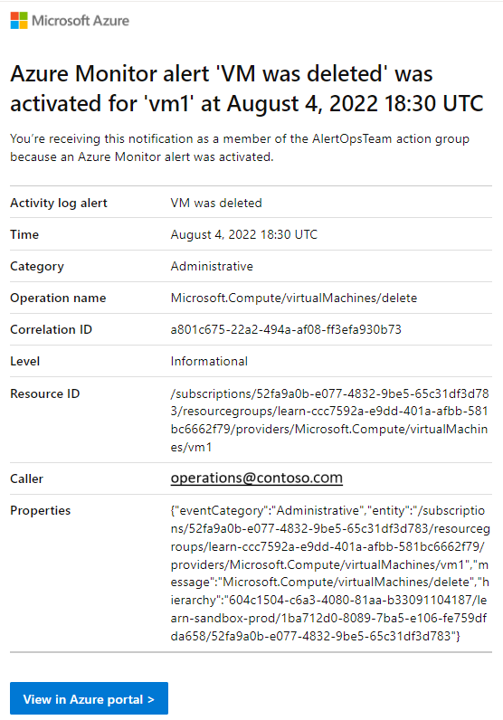

The shipping company that you work for wants to avoid any future issues with updates to its applications on the Azure platform. To improve the alerting capabilities within Azure, you'll use activity log alerts.

Your goal is to set up a Linux VM and create an activity log monitoring rule to detect when a VM is deleted. You'll then delete the VM to trigger this alert.

## Create the Azure activity log monitor

1. Sign in to the [Azure portal](https://portal.azure.com/learn.docs.microsoft.com?azure-portal=true) by using the same account that you activated the sandbox with.

1. On the Azure portal resource menu or under **Azure services**, select **Monitor**. The **Overview** pane for Monitor appears.

1. In the Monitor menu, select **Alerts**. The **Monitor | Alerts** pane appears.

1. On the command bar, select **Create +** and select **Alert rule**. The **Create an alert rule** pane appears with the **Scope** section open and the **Select a resource** pane open on the right.

1. In the **Select a resource** pane, the **Filter by subscription** field should already be populated with **Concierge Subscription**. In the **Filter by resource type** dropdown list, search for and select **Virtual machines**.

1. You want an alert when any virtual machine in your resource group is deleted. Select the **<rgn>[sandbox resource group name]</rgn>** resource group, and then select **Done**.

   :::image type="content" source="../media/7-alert-select-resource.png" alt-text="Screenshot that shows the 'Select a scope' pane, with the sandbox resource group selected.":::

1. The **Create an alert rule** pane reappears with the Scope target resource showing **All Virtual machines**. Select the **Condition** tab and the **Select a signal** pane appears.

1. In the **Search by signal name** box, enter **Delete**, and then select **Delete Virtual Machine (Microsoft.Compute/virtualMachines)**.

1. You want to receive alerts of all types. Leave **Alert logic** settings at their default of **All selected**.

## Add an email alert action

For the previous Azure Monitor alert, you didn't add any actions. You just viewed triggered alerts in the Azure portal. Actions enable you to send an email for notifications, to trigger an Azure function, or to call a webhook. You'll now add an email alert when VMs are deleted.

1. Select the **Actions** tab, and select **Create action group**. The **Create an action group** pane appears.

1. On the **Basics** tab, enter the following values for each setting.

    | Setting | Value |
    |---------|---------|
    | **Project details** |
    | Subscription | **Concierge Subscription** |
    | Resource group | From the dropdown list, name of your sandbox resource group |
    | **Instance details** |
    | Action group name | **Alert the operations team** |
    | Display name | **AlertOpsTeam** |

1. Select **Next : Notifications**, and enter the following values for each setting.

    | Setting | Value |
    |---------|---------|
    | Notification type | Select **Email/SMS message/Push/Voice** |
    | Name | **VM was deleted** |

1. Select the **Edit** pencil icon. The **Email/SMS message/Push/Voice** pane appears.

1. Select **Email**, and in the **Email** box, enter your email address, and then select **OK**.

1. Select **Review + create** to validate your input.

1. Select **Create**.

1. The **Create an alert rule** pane reappears. Select the **Details** tab, and enter the following values for each setting.

    | Setting | Value |
    |---------|---------|
    | Alert rule name | **VM was deleted** |
    | Description | **A VM in your resource group was deleted** |

1. Open the **Advanced options** section, and confirm that the following value is set.

    | Setting | Value |
    |---------|---------|
    | Enable alert rule upon creation | **Check - Yes**

   :::image type="content" source="../media/7-all-vm-alert-details.png" alt-text="Screenshot that shows a completed alert details section.":::

1. Select **Review + create** to validate your input.

1. Select **Create**.

Recipients added to the configured action group (operations team) will receive a notification:

- When they're added to the action group
- When the alert is activated
- When the alert is triggered

It can take up to five minutes for an activity log alert rule to become active. In this exercise, if you delete the virtual machine before the rule has been deployed, the alert rule might not be triggered. Because of this delay, you might not see the same results in the following steps after you delete the VM.

## Delete your virtual machine

To trigger an alert, you need to delete the Linux VM machine that you created in the previous exercise.

1. On the Azure portal menu or from the **Home** page, select **Virtual machines**. This action shows a list of the virtual machines.

1. Select the **vm1** virtual machine.

1. Select **Delete** from the menu bar.

1. To confirm the deletion, type **Yes** in the confirmation box and select **Delete**.

1. In the title bar, select the **Notifications** icon and wait until **vm1** is successfully deleted.

## View your activity log alerts in Azure Monitor

In the exercise, you set up an Ubuntu VM and created an activity log rule to detect when the VM was deleted. You then deleted a VM from your resource group. Let's check whether an alert was triggered.

1. You should have received a notification email that reads, **Important notice: Azure Monitor alert VM was deleted was activated...** If not, open your email program and look for an email from azure-noreply@microsoft.com.

    

1. On the Azure portal resource menu, select **Monitor**, and then in the **Monitor | Alerts** menu select **Alerts**.

1. You should see three verbose alerts that were generated by deleting **vm1**.

    

1. Select the name of one of the alerts (For example, **VM was deleted**). An **Alert details** pane appears that shows more details about the event.
