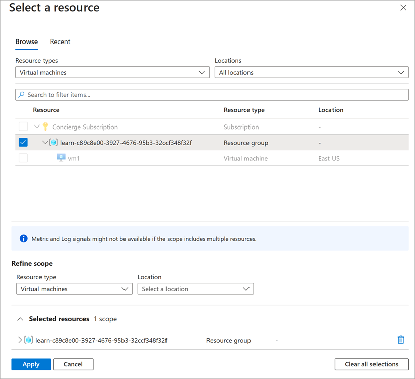

The shipping company that you work for would like to avoid any future issues with updates to its applications on the Azure platform. To improve the alerting capabilities within Azure, you'll use activity log alerting.

Your goal is to set up the Linux VM and create an activity log monitoring rule to detect when a virtual machine is deleted. You'll then delete the VM to trigger this alert.

## Create the Azure Activity Log Monitor

1. Sign into the [Azure portal](https://portal.azure.com/learn.docs.microsoft.com?azure-portal=true) using the same account you activated the sandbox with.

1. On the left, select **Monitor**, then select **Alerts** in the left panel.

1. Select **+ New alert rule**.

1. In the **RESOURCE** section, choose **Select**.

1. The **Filter by subscription** drop-down should already be populated with the **Concierge Subscription**. In the **Filter by resource type** drop-down select **Virtual machines**.

1. We want alerts when any virtual machin in our resource group is deleted. Select the **<rgn>[sandbox resource group name]</rgn>** resource group, then select **Done** at the bottom of the page.

    

1. In the **CONDITION** section, select **Add**.

1. On the **Configure signal logic** panel, type **Delete** in the **Search by signal name** box. Select **Delete Virtual Machine (Microsoft.Compute/virtualMachines)**.

    

1. We want to receive alerts of all types, leave **Alert logic** settings at their default of **All**, then select **Done**.

    

## Add an email alert action

For the previous Azure Monitor alert you didn't add any actions. You just viewed triggered alerts in the Azure portal. Actions allow you to send emails for notifications, trigger an Azure Function, or call a webhook. You'll now add an email alert when VMs are deleted.

1. Under **ACTIONS** select **Create action group**. Enter the following details, then select **OK**.

    | Setting | Value |
    |---------|---------|
    | Action group name | **Alert the operations team** |
    | Short name | **AlertOpsTeam** |
    | Subscription | **Concierge Subscription** |
    | Resource group | **<rgn>[sandbox resource group name]</rgn>** |
    | ACTION NAME | **Email the operations team** |
    | ACTION TYPE | Email/SMS/Push/Voice |
    | Email | **Your email address** |
    | | |

    

1. At the bottom of the **Add action group** pane, select **OK**.

1. Finally, you'll need to give the alert a name and a description.  In the **ALERT DETAILS** section, provide the following information:

    - Alert rule name: **VM was deleted**
    - Description: **A VM in your resource group was deleted**
    - Enabled rule upon creation: **Yes**

    

1. Now that you've defined the rule, select **Create alert rule**.

It can take up to five minutes for an activity log alert rule to become active.  In this exercise, if you delete the virtual machine before this time, the alert rule may not trigger.

Recipients added to the action group will receive a notification that they have been added to the action group, when the alert is activated, and when the alert is triggered.

## Delete your virtual machine

To trigger the alert, you need to delete the virtual machine you created earlier.

1. From the Azure portal, select **Virtual machines**. This action will display a list of the virtual machines.

1. Select the `vm1` virtual machine.

1. From the menu bar, select **Delete**.

1. Enter **yes** to confirm the deletion.

1. Select **Done** at the bottom of the page. You've now deleted a virtual machine.  

> [!NOTE]
> It can take a few minutes for the virtual machine to be deleted.

## View your activity log alerts in Azure Monitor

In the example, you set up an Ubuntu VM, and created an activity log rule to detect when the VM was deleted.  You've deleted a virtual machine from your resource group. You now need to check if an alert was triggered.

1. Open your email program, you should have received an email from azure-noreply@microsoft.com.

    

1. On the Azure portal, select **Monitor** and then **Alerts**.

1. You should see the Sev4 alerts generated from the deletion of the VM.

    

The alert list now shows an alert for the virtual machine you deleted. The affected resource column tells you which virtual machine was removed.
