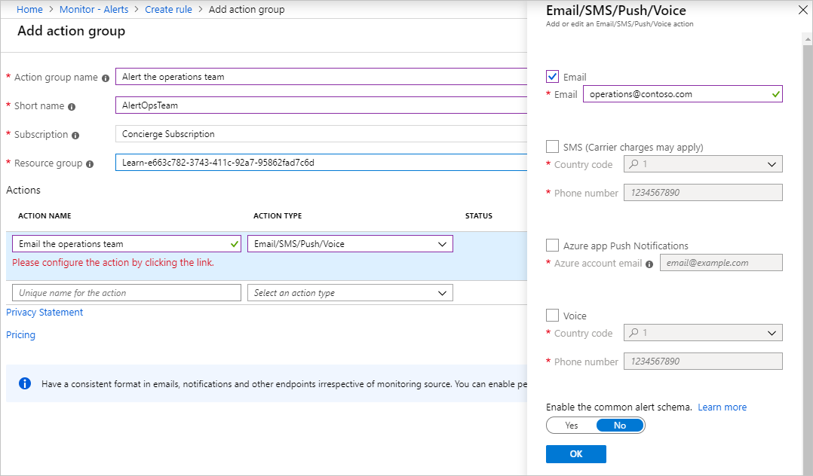
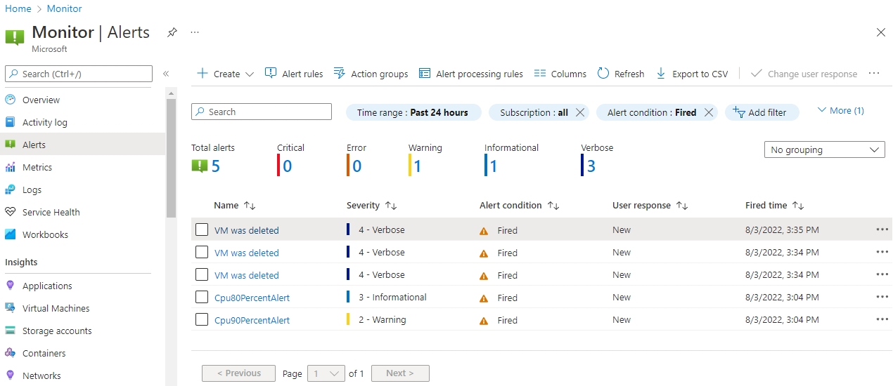

The shipping company that you work for wants to avoid any future issues with updates to its applications on the Azure platform. To improve the alerting capabilities within Azure, you'll use activity log alerts.

Your goal is to set up the Linux VM and create an activity log monitoring rule to detect when a virtual machine is deleted. You'll then delete the VM to trigger this alert.

## Create the Azure activity log monitor

1. Sign in to the [Azure portal](https://portal.azure.com/learn.docs.microsoft.com?azure-portal=true) by using the same account that you activated the sandbox with.

1. On the Azure portal menu, select **Monitor**. Then select **Alerts** in the left panel.

1. Select **+ New alert rule**.

1. In the **Scope** section, choose **Select resource**.

1. The **Filter by subscription** drop-down list should already be populated with **Concierge Subscription**. In the **Filter by resource type** drop-down list, select **Virtual machines**.

1. You want alerts when any virtual machine in your resource group is deleted. Select the **<rgn>[sandbox resource group name]</rgn>** resource group, and then select **Done** at the bottom of the page.

   <!--  -->

1. In the **Condition** section, select **Select condition**.

1. In the **Configure signal logic** panel, enter **Delete** in the **Search by signal name** box. Select **Delete Virtual Machine (Microsoft.Compute/virtualMachines)**.

    <!--  -->

1. You want to receive alerts of all types. Leave **Alert logic** settings at their default of **All**, and then select **Done**.

    <!--  -->

## Add an email alert action

For the previous Azure Monitor alert, you didn't add any actions. You just viewed triggered alerts in the Azure portal. Actions allow you to send emails for notifications, trigger an Azure function, or call a webhook. You'll now add an email alert when VMs are deleted.

1. Under **Actions**, select **Select action group**, then select **+ Create action group**. On the **Basics** pane, enter the following details.

    | Setting | Value |
    |---------|---------|
    | Subscription | **Concierge Subscription** |
    | Resource group | **<rgn>[sandbox resource group name]</rgn>** |
    | Action group name | **Alert the operations team** |
    | Display name | **AlertOpsTeam** |

    <!--  -->

   Select **Next: Notifications >**

1. For **Notification type**, select **Email/SMS/Push/Voice**. Select **Email**, enter your email address, then select **OK**.

1. For the **Name**, enter **VM was deleted**. Select **Review + create**, then select **Create**.

   <!--  -->

1. Now that you've defined the rule, select **Create alert rule**.

Recipients added to the action group will receive a notification when they're added to the action group, when the alert is activated, and when the alert is triggered.

It can take up to five minutes for an activity log alert rule to become active.  In this exercise, if you delete the virtual machine before this time, the alert rule might not be triggered. Because of this delay, you might not see the same results in the following steps after you delete the VM.

## Delete your virtual machine

To trigger the alert, you need to delete the virtual machine that you created earlier.

1. On the Azure portal menu or from the **Home** page, select **Virtual machines**. This action will display a list of the virtual machines.

1. Select the **vm1** virtual machine.

1. From the menu bar, select **Delete**.

1. Enter **yes** to confirm the deletion.

1. Select **Done** at the bottom of the page. 

## View your activity log alerts in Azure Monitor

In the example, you set up an Ubuntu VM, and you created an activity log rule to detect when the VM was deleted. You then deleted a virtual machine from your resource group. You now need to check if an alert was triggered.

1. Open your email program. You should have received an email from azure-noreply@microsoft.com.

    

1. On the Azure portal menu, select **Monitor** and then **Alerts**.

1. You should see the Sev4 alerts generated from the deletion of the VM.

    

The alert list now shows an alert for the virtual machine that you deleted. The affected resource column tells you which virtual machine was removed.
