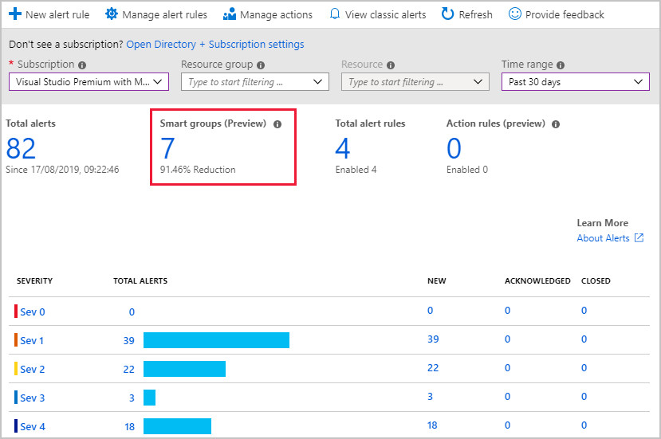
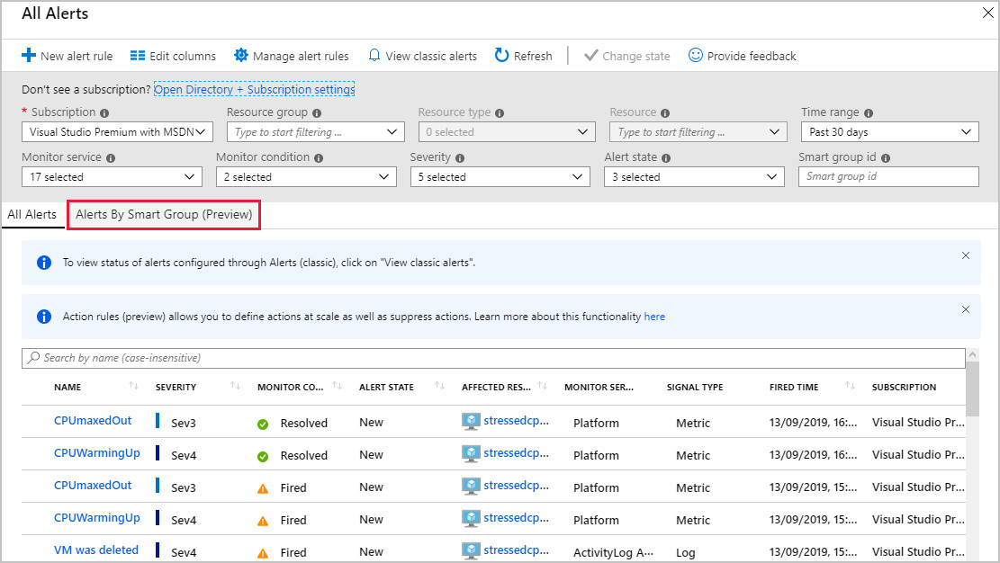
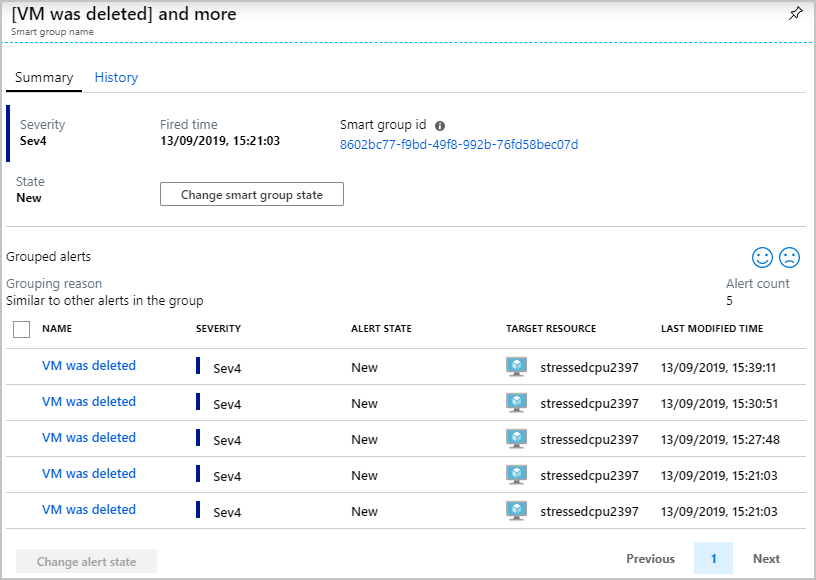

As an Azure solution architect, you realize that, by using metric, log, and activity log alerts, a large number of alerts are generated – this makes it difficult to identify the critical and essential issues. You want to explore the options available in Azure Monitor. Is there a mechanism that might reduce the alert noise and make the task of managing alerts easier?

In this unit, you'll investigate how to use smart groups, and see how they can help you manage alerts in Azure Monitor.

## What are smart groups?
Smart groups are an automatic feature of Azure Monitor. Using machine learning algorithms, it groups together alerts based on repeat occurrence or similarity. Smart groups allow you to address a group of alerts instead of each alert separately. 

## Smart group taxonomy
The name of the smart group – its taxonomy – is assigned automatically and is the name of the first alert in the group. The name of the smart group can't be changed or amended – this is why it's important to assign meaningful names to each alert that you create.

## When to use smart groups
Think of smart groups as a dynamic filter applied to all the alerts in Azure Monitor. Azure Monitor’s machine learning algorithm groups together alerts based on information such as historical patterns, similar properties, or structure. 

Using smart groups can reduce alert noise by more than 90%.
Presently, smart groups only apply to alerts from the same monitoring service within a subscription. 

The power of smart groups is that they show you all related alerts – giving improved analytics – and can often identify a previously unseen root cause.

## Managing smart groups
There are two ways to get to your smart groups – either through the **Alert Summary Page**

or from the **All Alerts** page, then select **Alerts by Smart Group**. 

Either method will result in a new page that displays all the smart groups. You can now resolve a smart group.

Selecting a smart group opens the details page, which is split into two sections: alerts and history.
- **Alerts** – lists all the alerts included in the smart group.
- **History** – provides a history of all the changes made to the smart group.

## Smart group states
Smart groups, like regular alerts, have their own smart group state. The smart group state shows the progress of the smart group in the resolution process. Changing the state of a smart group doesn't alter the state of the individual alerts. 

To change the state, select the **change smart group** state<!--CE:I think this needs a bold or quote mark recognition.--> as shown here.

The states are:
- **New**: the smart group has been created with an aggregation of alerts, but hasn't yet been addressed.
- **Acknowledged**: when an administrator starts the resolution process, the state should be changed to acknowledged. 
- **Close**: when the source of the alert has been fixed, the administrator will change the state to closed. 

**NOTE:** changing the state of the smart group doesn't affect the underlying alert. Each alert member shown in the smart group will need to be resolved individually. 

## Configure and set up smart groups
Smart groups are automatically created when a pattern of alerts is detected by Azure Monitor. Alerts are either added automatically to an existing smart group or a new smart group is created. 
