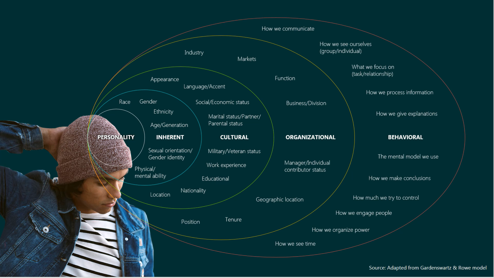

## What is inclusive marketing?
MJ DePalma, Head of Multicultural and Inclusive Marketing for Microsoft Advertising, defines “Inclusive Marketing as marketing that may highlight or solve for an aspect of diversity where exclusion exists. This is something that resonates with all of us—by amplifying a common human value like love, family, safety, opportunity, or enduring stories like the struggle of coming of age or the underdog overcoming all obstacles. Inclusive Marketing considers its products, services, or experiences in ways that deeply resonate with people and make them feel seen and accurately understood. Designing campaigns that embody diversity by including people from different backgrounds or relatable stories for unique audiences. While some inclusive campaigns make an effort to break stereotypes, others simply aim to reflect or embrace people in the real world.

Chris Caposella, Chief Marketing Officer of Microsoft, is pioneering Inclusive Marketing. He says, “All of our marketing should be Inclusive Marketing and all of our touchpoints should be inclusive since inclusion fuels growth.” 

## Diversity is integral 

> [!div class="mx-imgBorder"]
> 

This image beautifully illustrates the many layers and dimensions of what makes us diverse. Highlighting the infinite combinations of qualities that can make up who we are. From the internal aspects, inherent to our personalities, through to the more externally obvious behavioral qualities; this spectrum of dimensions makes us unique and able to identify with one group or another. Exemplifying that we are more than our appearance of race or gender, we are complex and multifaceted.  This awareness provides an opportunity for a richer conversation, beyond the obvious, providing us with moments to connect with audiences, be relevant and resonate. 

Diversity alone, without inclusivity, doesn't bring opportunity. Inclusivity and empathy are needed to bring about the true change that can lead to more significant and equitable benefits for all. Shonda Rhimes, American television producer, screenwriter, and author captures the idea of inclusivity perfectly by saying, “Inclusion isn’t about tokenism or trotting out tired and offensive stereotypes; it’s about giving characters from all backgrounds the opportunity to tell their story, without making it the story.”

Microsoft's commitment to Diversity & Inclusion (D&I) says that, "Only by actively engaging different perspectives can we challenge and stretch our thinking, enrich the experience of our employees, and empower every person and every organization on the planet to achieve more."

This means:
- Listening more than having all the answers. 
- Committing to dive deeper—to not just understand the barriers and challenges that exist today—but examine why they’re there, and then committing to removing them.
- Being inclusive in all aspects of what we do, how we show up, and the technologies we build. 
- Caring about every person as an individual, in their role, as part of a community. 
- Focusing on empowering others to be great, not concentrating on greatness for ourselves. 

## Why inclusive marketing is imperative 

Ultimately, people are what matter.  We want to show we care about customers  because we value and practice Inclusivity. We want to see every person and every community grow, innovate, and thrive. At Microsoft, we care about our customers by valuing and practicing inclusivity. We understand that the additional benefit can mean the difference between attracting a customer for a day or gaining their loyalty for life.

There are several reasons to use Inclusive Marketing:

- It increases consideration—54% of millennials say they’d choose an inclusive brand over a competitor. 
- It drives purchase intent—Brands with a purpose set on improving our quality of life outperform the stock market by 120%.
- It improves brand perception—86% of consumers believe that companies should take a stand for social issues and 64% of those who said it’s ‘extremely important’ for a company to take a stand on a social issue said they were ‘very likely’ to purchase a product based on that commitment.4

By using Inclusive Marketing to better understand and serve the diverse communities that make up our customer base, we’ve created campaigns and stories that connect more deeply with audiences, keeping them engaged with our products and services. Here’s a story that exemplifies this approach, related to girls and women exploring careers in technology. 

On International Women’s Day in 2016, we launched a campaign and program that offered women inventors support and mentorship—to protect their ideas and advance their future. The campaign centered around the fact that women hold only 7.5% of all patents. If girls don’t see any role models working in this field, those numbers aren’t likely to change, and impact the future of Science Technology Engineering and Math (STEM). The campaign not only inspired women and girls, it also received 14 million video views across social channels.

Inclusive marketing means looking at what your brand stands for through the lens of what people value.  Seek to better understand your customers by seeking unbiased data and research. Align customer interests with your organizations mission while ensuring your employee environment represents your customers well. Finally, create ways to have conversations with customers through marketing, focusing on what they care about most.
