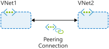
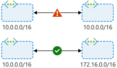

VNet peering lets you directly connect Azure virtual networks. By connecting VNets with peering, virtual machines in peered virtual networks can communicate with each other as if they are in the same network. Traffic between virtual machines (VMs) in peered virtual networks is routed through the Azure network, using only private IP addresses, and doesn't rely on Internet connectivity, gateways, or encrypted connections. The traffic is always private and takes advantage of the high-bandwidth and low latency offered by the Azure backbone network.

There are two types of peering connections but both are created in the same way:

- **VNet peering** is a connection between virtual networks in the same Azure region, such as two virtual networks in North Europe.
- **Global VNet peering** is a connection between virtual networks that are in different Azure regions, such as a virtual network in North Europe that's peered with a virtual network in West Europe.

Configuring VNet peering doesn't affect or disrupt any resources that you've already deployed to the VNets. There are some key features to consider when using VNet peering to connect virtual networks.

## Reciprocal connections

Creating a VNet peering connection in only one virtual network to a peer does not connect the networks together. To connect virtual networks using VNet peering, you create connections in each virtual network. Think of how you would connect two network switches together. You'd connect a cable to each switch and maybe do some configuration, enabling them to communicate between each other. For VNet peering to work, you need similar connections in each VNet, with reciprocal connections providing this functionality.

## Cross-subscription VNet peering

You can connect virtual networks using VNet peering even when both virtual networks are in different subscriptions. This might be required for mergers and acquisitions or to connect virtual networks in subscriptions managed by other departments in the same company. Virtual networks can be in different subscriptions using the same or different Azure AD tenants. For cross-subscription VNet peering, an administrator of one subscription may not be an administrator in the peer network's subscription, and might not be able to configure both ends of a connection. To create the VNet peering when both subscriptions are in different Azure AD tenants, the administrators of each subscription must grant the peer subscription's administrator the `Network Contributor` role on their virtual network.

## Transitivity

VNet peering is non-transitive. Communication is only permitted to VNets that are directly peered, you cannot communicate to VNets that are peers of a peered VNet. For example, if you have three virtual networks (A, B, C) that are peered A <-> B <-> C, resources in A cannot communicate to resources in C; the traffic is not allowed to transit through VNet B. If you need communication from virtual network A to virtual network C, you must create an explicit VNet peering between these VNets.

## Gateway transit

You can configure transitive connections for on-premises connectivity if you're using virtual network gateways as transit points. Using gateway transit enables on-premises connectivity without having to deploy virtual network gateways to all your virtual networks. This can reduce cost and complexity. With gateway peering, you can configure a single virtual network as a hub network. You can connect this hub network to your on-premises datacenter and share its virtual network gateway with peers. 

To enable gateway transit, you configure the **Allow gateway transit** option in the hub virtual network where you've deployed the gateway connection to your on-premises network. You must also configure the **Use remote gateways** option in any spoke virtual network(s).

> [!NOTE]
> If you want to enable the **Use remote gateways** option in a spoke network peering, you cannot deploy a virtual network gateway in the spoke virtual network. Additionally, gateway transit is currently not supported with Global VNet peering.

## Overlapping address spaces

In Azure, IP address spaces of connected networks within Azure and between Azure and on-premises cannot overlap, and this is true for peered VNets. This is an important consideration when planning your network design. Ensure that any networks you are connecting using VNet peering, VPN, or ExpressRoute, are assigned different, non-overlapping address spaces.

## Alternative connectivity methods

VNet peering is one way to connect VNets together and is the least complex option. There are alternatives to VNet peering, but these focus primarily on connectivity between on-premises and Azure networks rather than VNet-to-VNet connections.

It is possible to connect virtual networks with ExpressRoute by connecting each virtual network to the ExpressRoute circuit. ExpressRoute is a dedicated, private connection between an on-premises datacenter and the Azure backbone network. Virtual networks connected to the same ExpressRoute circuit are part of the same routing domain and can communicate between each other. ExpressRoute connections do not go over the public Internet, ensuring your communications with Azure services is as secure as possible.

VPNs use the Internet to connect your on-premises datacenter to the Azure backbone over an encrypted tunnel. You can use VPN gateways to connect virtual networks together using a site-to-site configuration. VPN gateways have higher latency than VNet peering, are more complex to manage, and in some scenarios can have a higher cost.

In either case, when VNets are connected both through a gateway and VNet peering, traffic will flow through the peering configuration.

## Choosing VNet peering

VNet peering is a great choice in many scenarios for enabling network connectivity between services in different virtual networks. With it's ease of implementation, ease of deployment, and cross-region and cross-subscription capabilities, it should be your first choice to integrate Azure virtual networks.

In cases where you have existing VPN or ExpressRoute connections or services behind Azure Basic Load Balancers that would be accessed from a peered VNet, peering may not be the best option, and you should further research the best choice for your scenario.