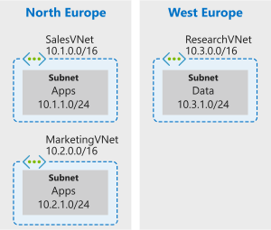

Let's say your company is now ready to implement virtual network peering. You want to connect systems that are deployed in different virtual networks. To test out this plan, you'll start by creating virtual networks to support the services your company is already running in Azure. You need three virtual networks:

- The **Sales** virtual network is deployed in **North Europe**. Sales systems use this virtual network to process data that's added after a customer is engaged. The Sales team wants access to Marketing data.
- The **Marketing** virtual network is deployed in **North Europe**. Marketing systems use this virtual network. Members of the Marketing team regularly chat with the Sales team. To share their data with the Sales team, they must download it because the Sales and Marketing systems aren't connected.
- The **Research** virtual network is deployed in **West Europe**. Research systems use this virtual network. Members of the Research team have a logical working relationship with Marketing, but they don't want the Sales team to have direct access to their data.



You'll create the following resources:

| Virtual network | Region | Virtual network address space | Subnet | Subnet address space |
| ---- | ------ | ------------------ | ------ | -------------------- |
| SalesVNet | North Europe | 10.1.0.0/16 | Apps | 10.1.1.0/24 |
| MarketingVNet | North Europe | 10.2.0.0/16 | Apps | 10.2.1.0/24 |
| ResearchVNet | West Europe | 10.3.0.0/16 | Data | 10.3.1.0/24 |

## Create the virtual networks

1. In Cloud Shell, run the following command to create the virtual network and subnet for the **Sales** systems.

    ```azurecli
    az network vnet create \
        --resource-group <rgn>[sandbox resource group name]</rgn> \
        --name SalesVNet \
        --address-prefix 10.1.0.0/16 \
        --subnet-name Apps \
        --subnet-prefix 10.1.1.0/24 \
        --location northeurope
    ```

1. Run the following command to create the virtual network and subnet for the **Marketing** systems.

    ```azurecli
    az network vnet create \
        --resource-group <rgn>[sandbox resource group name]</rgn> \
        --name MarketingVNet \
        --address-prefix 10.2.0.0/16 \
        --subnet-name Apps \
        --subnet-prefix 10.2.1.0/24 \
        --location northeurope
    ```

1. Run the following command to create the virtual network and subnet for the **Research** systems.

    ```azurecli
    az network vnet create \
        --resource-group <rgn>[sandbox resource group name]</rgn> \
        --name ResearchVNet \
        --address-prefix 10.3.0.0/16 \
        --subnet-name Data \
        --subnet-prefix 10.3.1.0/24 \
        --location westeurope
    ```
    
## Confirm the virtual network configuration

Let's take a quick look at what you created.

1. In Cloud Shell, run the following command to view the virtual networks.

    ```azurecli
    az network vnet list --output table
    ```

1. You should see an output like this:

    ```output
    Name           ResourceGroup                              Location    NumSubnets   Prefixes    DnsServers   DDOSProtection   VMProtection
    -------------- ------------------------------------------ ----------- ------------ ----------- ------------ ---------------- --------------
    MarketingVNet <rgn>[sandbox resource group name]</rgn> northeurope 1            10.2.0.0/16              False            False
    SalesVNet     <rgn>[sandbox resource group name]</rgn> northeurope 1            10.1.0.0/16              False            False
    ResearchVNet  <rgn>[sandbox resource group name]</rgn> westeurope  1            10.3.0.0/16              False            False
    ```

## Create virtual machines in each virtual network

Now you'll deploy some Ubuntu virtual machines (VMs) in each of the virtual networks. These VMs simulate the services in each virtual network. In the final unit of this module, you'll use these VMs to test connectivity between the virtual networks. 

1. In Cloud Shell, run the following command to create an Ubuntu VM in the **Apps** subnet of **SalesVNet**. In the command, replace `<password>` with a password that meets the [requirements for Linux VMs](https://docs.microsoft.com/azure/virtual-machines/linux/faq?azure-portal=true#what-are-the-password-requirements-when-creating-a-vm). Note this password for later use.

    ```azurecli
    az vm create \
        --resource-group <rgn>[sandbox resource group name]</rgn> \
        --no-wait \
        --name SalesVM \
        --location northeurope \
        --vnet-name SalesVNet \
        --subnet Apps \
        --image UbuntuLTS \
        --admin-username azureuser \
        --admin-password <password>
    ```

    > [!NOTE]
    > The `--no-wait` parameter in this command lets you continue working in Cloud Shell while the VM is building.

1. Run the following command to create another Ubuntu VM in the **Apps** subnet of **MarketingVNet**. Replace `<password>` with a password that meets the [requirements for Linux VMs](https://docs.microsoft.com/azure/virtual-machines/linux/faq?azure-portal=true#what-are-the-password-requirements-when-creating-a-vm). Note this password for later use.

    ```azurecli
    az vm create \
        --resource-group <rgn>[sandbox resource group name]</rgn> \
        --no-wait \
        --name MarketingVM \
        --location northeurope \
        --vnet-name MarketingVNet \
        --subnet Apps \
        --image UbuntuLTS \
        --admin-username azureuser \
        --admin-password <password>
    ```

1. Run the following command to create an Ubuntu VM in the **Data** subnet of **ResearchVNet**. Replace `<password>` with a password that meets the [requirements for Linux VMs](https://docs.microsoft.com/azure/virtual-machines/linux/faq?azure-portal=true#what-are-the-password-requirements-when-creating-a-vm). Note this password for later use.

    ```azurecli
    az vm create \
        --resource-group <rgn>[sandbox resource group name]</rgn> \
        --no-wait \
        --name ResearchVM \
        --location westeurope \
        --vnet-name ResearchVNet \
        --subnet Data \
        --image UbuntuLTS \
        --admin-username azureuser \
        --admin-password <password>
    ```

    The VMs might take several minutes to reach a running state.

1. To confirm that the VMs are running, run the following command. This uses the Linux `watch` command which will refresh every five seconds.

    ```bash
    watch -d -n 5 "az vm list \
        --resource-group <rgn>[sandbox resource group name]</rgn> \
        --show-details \
        --query '[*].{Name:name, ProvisioningState:provisioningState, PowerState:powerState}' \
        --output table"
    ```

    A **ProvisioningState** of **Succeeded** and a **PowerState** of **VM running** indicates a successful deployment. When your VMs are running, you're ready to move on. Press `Ctrl-c` to stop the command and continue on with the exercise.
